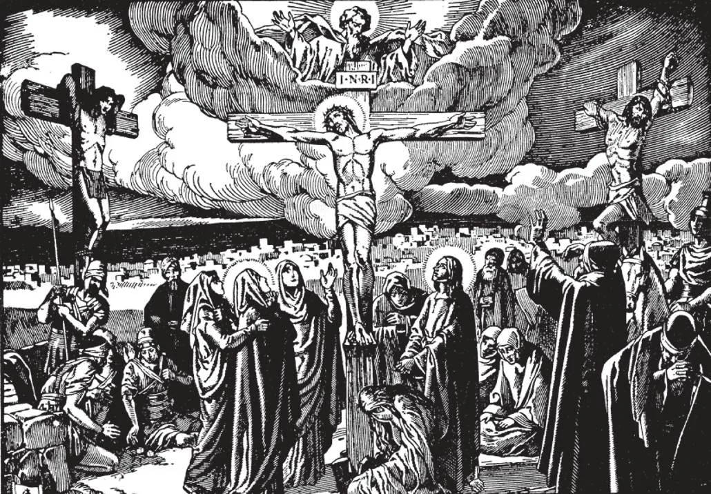
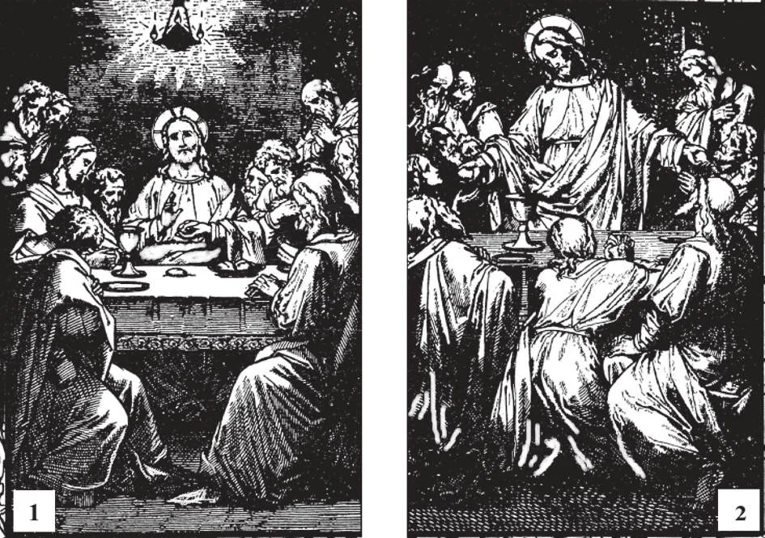

# 131. The New Sacrifice

*The death of Christ on the cross was a true sacrifice. He offered Himself to His heavenly Father to expiate the sins of the world. As a Victim, He suffered first. Then He died, crying, "It is consummated!" thus completing the sacrifice. On Calvary, Christ Himself was the High-priest, and at the same time the Victim. This sacrifice reconciled God with man. Since the Jewish sacrifices were only a foreshadowing of Our Lord's sacrifice, they ceased when His was offered, as foretold by the prophets.*

**What is the Mass?**

— The Mass is the sacrifice of the New Law in which Christ, through the ministry of the priest, offers Himself to God in an unbloody manner under the appearances of bread and wine.

> In the early days of the Church, Mass was called the Breaking of Bread, the Lord's Supper, the Sacrifice, the Eucharist, the Holy Liturgy, the Solemnity of the Lord.

1. The sacrifices of old were far from perfect; sheep and goats were unworthy offerings to God in acknowledgement of His power and glory. Even in the time of the Old Law of the Jews, God had expressed His purpose to institute a new sacrifice.

> In the words of His prophet Malachias, "From the rising of the sun even to the going down, my name is great among the Gentiles, and in every place there is sacrifice, and there is offered to my name a clean oblation" (Mal. 1:10-11). These words referred to the Sacrifice of the Mass, in which the Victim is Jesus Christ the Son of God, than Whom there can be no worthier, no cleaner, no more perfect sacrifice.

2. The Church has always taught that the Mass is a true sacrifice. St. Paul implies this when he says: "We have an altar from which they have no right to eat who serve the tabernacle (meaning the Jews)" (Heb. 13:10).

> The prophet Malachias foretold the universality of the sacrifice of the Mass. Since there are Catholic priests and churches all over the world, this prophecy is today accomplished literally, for in all places the "clean oblation", Holy Mass, is offered.

3. The sacrifice of the Mass is offered to God alone. However, it may be offered to God in honour of the saints and angels, especially on their feasts.

*Christ instituted the Holy Sacrifice of the Mass at the Last Supper. After praying, He blessed bread and wine, and changed them into His Body and Blood, saying to the Apostles: "Take and eat; this is my body ... All of you drink of this; for this is my blood of new covenant, which is being shed for many unto the forgiveness of sins" (Matt. 26:26, 28). These words are known as the words of consecration of Mass, by which bread and wine become the Body and Blood of Jesus Christ.*

**Who said the first Mass?**

— Our Divine Saviour said the first Mass, at the Last Supper, the night before He died.

1. At the Last Supper, Jesus Christ offered Himself up as a sacrifice to the Eternal Father, under the appearances of bread and wine.

> "And while they were eating, Jesus took bread, and blessing it, he broke and gave it to them, and said, 'Take; this is my body.' And taking a cup and giving thanks, he gave it to them, and they all drank of it; and said to them, 'This is my blood of the new covenant, which is being shed for many'" (Mark 14:22-25).

2. The following day, Jesus Christ consummated that Sacrifice by freely submitting Himself to His Passion and death by crucifixion at the hands of the Jews.

> The two acts, that of the Last Supper, and that of the cross, were only two parts of the one supreme sacrifice that Our Lord offered to God the Father.

> After the first act, having offered Himself under the appearances of bread and wine, Christ turned to His Apostles and said, "Do this in remembrance of me" (Luke 22:19). By those words, He told them to do as He had done, offer in sacrifice to God His body and blood under the appearances of bread and wine; he commanded them in those words to say Mass, as the perfect sacrifice to God.

3. The Mass is a real sacrifice for in it a Victim is offered up for the purpose of reconciling man with God. Our Lord caused His passion and death to enter into the institution of the Mass, thereby joining them as one.

> At the Last Supper, Our Lord evidently meant to institute a visible sacrifice. He chose for the act the very time when the old sacrifice of the Paschal lamb was celebrated. The very words used by Christ in instituting the sacrifice of the Mass, the "new covenant" or "new testament", were almost identical with those used in the institution of the sacrifice of the Old Law.
