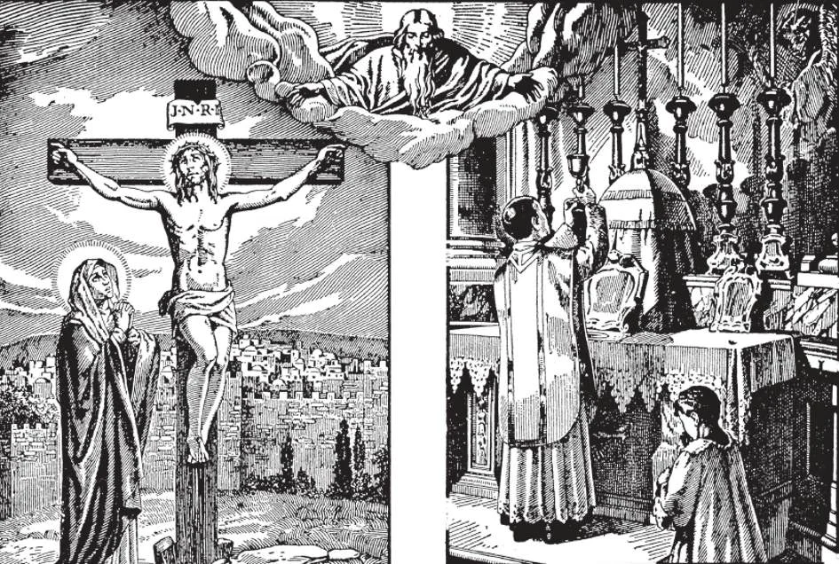

# 132. The Mass and Calvary

The Mass is the chief and central act of Catholic worship, the greatest act of worship that can be offered to God, an infinite ocean of graces for the living and the dead.

**Why is the Mass the same sacrifice as the sacrifice of the cross?**

— The Mass is the same sacrifice as the sacrifice of the cross, because in the Mass the victim is the same, and the principal Priest is the same, Jesus Christ. 1. The Mass is the very same sacrifice which was offered up at the Last Supper, and consummated on Calvary; it is the living renewal of the sacrifice on the Cross.

> As Christ offered Himself up on Calvary, so as the Victim He is offered in the Mass. As on the cross, His body was mangled and torn, so at the Consecration He places Himself as the Victim on the altar, with His body and blood under the separate forms of bread and wine. At the Communion, when the species of bread and wine are consumed, the sacrifice is accomplished, as it was on the cross, when at the moment of death Our Lord cried out, "It is consummated!"

2. The Mass is no mere remembrance or memorial of Calvary; it actually renews, in the separate consecration of the bread and wine, the death of the Lord, the separation of His Body and Blood.

> At the Last Supper, after Christ had changed the bread and wine into His Body and Blood, He said: "Do this in remembrance of me" (Luke 22: 19). And St. Paul adds: "For as often as you shall eat this bread, and drink the cup, you proclaim the death of the Lord, until he comes" (1 Cor. 11: 26). At the Last Supper, Christ instituted a visible sacrifice, the Mass, in order to renew the bloody sacrifice which He consummated on the cross.

3. The principal priest in every Mass is Jesus Christ, who offers to His heavenly Father, through the ministry of His ordained priest. His body and blood which were sacrificed on the cross.

> In both the Sacrifice of the Cross and the Mass, the same officiating High-Priest offers up the same Sacrificial Victim: Jesus Christ Our Lord. The priest saying the Mass is only Christ's minister and representative. He utters the words of consecration in the name and person of Christ, saying. "This is My Body. This is My Blood" and not, "This is Christ's Body, etc."

The illustration shows religious preparing wine from grapes for consecration. special ceremonies attended by the bishop are held when the grapes are to be pressed.

**Is there any difference between the sacrifice of the cross and the Sacrifice of the Mass?**

— The manner in which the sacrifice is offered is different: On the cross, Christ physically shed His blood and was physically slain, while in the Mass there is no physical shedding of blood nor physical death, because Christ can die no more. On the cross, Christ gained merit and satisfied for us, while in the Mass, He applies to us the merits and satisfaction of His death on the cross. 1. Christ was immolated on Calvary, once and for all; He is now in glory, and can die no more. How then can we say He is sacrificed on our altars at Mass, and not only sacrificed once, but continually? The Mass is the realization, in an un bloody manner, of the very sacrifice offered up on Calvary in a bloody manner.

> On Calvary, Christ physically shed His blood; in the Mass, although the separate consecration re-enacts Christ's death, there is no physical shedding of blood.

2. Christ continues to offer Himself as a sacrifice in the Mass, in order: to unite us with Himself, to give us a gift worthy to be offered to God, and to make us share in the merits of His sacrifice on the cross. Through the Mass, the merits of the sacrifice on the cross are applied to our souls.

> The Mass, according to the will of Christ Himself, is to apply through all time the fruits of the Redemption, made possible by the sacrifice on Calvary, which paid the full price of our redemption. The Mass, then, is in the truest sense the continuation of the redeeming sacrifices of Christ. It is the Mass that gives to us the fullest efficacy of Calvary; it brings Calvary within the reach of all souls in every time and every age. Because of the Mass, here and now we may offer up repeatedly God as our Victim to God, partake of Him for ourselves as a Gift from the Blessed Trinity, and live in constant and intimate union with Him.

3. The sacrifice on Calvary was offered up by Christ Himself to the Eternal Father; the sacrifice of the Mass is offered up by Him united with us, as by our Baptism we became members of His Mystical Body.

> Christ gave us the Mass as a visible sacrifice to continue His sacrifice on the cross until the end of time. The Mass is not a mere remembrance of Calvary; it actually renews Christ's death, continues His sacrifice, and is in itself His very Sacrifice.
