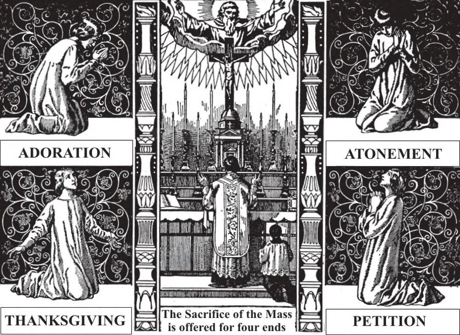

# 133. Ends and Fruits of the Mass

Holy Mass may be offered to God with a fourfold intention: by way of adoration, thanksgiving, petition, and atonement. It is for the spiritual and temporal welfare of the living, and for the eternal repose of the dead. Every day of the year, Holy Mass is offered, except Good Friday and Holy Saturday.

**What are the purposes for which the Mass is offered?**

— The purposes for which the Mass is offered are: 1. To adore God as our Creator.

> The Mass is the only worthy gift we can offer God; in it we offer to Him His own Son. Having a perfect sacrifice in the Mass, Christians need, and have, no other sacrifice to offer to God but this one.

2. To thank God for His many favours.

> In the Mass, Jesus Christ the Son of God speaks for us to His eternal Father; we have an advocate with Him. Can we fail but speak well, having this instrument of thanksgiving?

3. To ask God for His blessings.

> Holy Mass may be offered for the living of whatever creed. It may be offered for departed Catholics. The priest may not prefer Mass publicly for departed non- Catholics, but the persons hearing the Mass may do so. Persons hearing Mass may have their own private intentions for offering it, aside from the intention of the priest. Mass may be offered for any intention except that which is in itself bad.

4. To satisfy the justice of God for the sins committed against Him.

> The Mass reconciles man with God, as we learn from the words of Christ uttered at the Last Supper, "This is my blood, which is being shed for many unto the forgiveness of sins" (Matt. 26: 28). We are not redeemed all over again by the Mass, for we were redeemed once on the cross; but the Mass applies to our souls the fruits of redemption gained for us on the cross. As a perfect propitiatory sacrifice, the Mass satisfies the justice of God.

**What fruits are derived from Holy Mass?**

— By means of the Mass, the fruits of the sacrifice of the cross are applied to our souls.

> The sacrifice on the cross, the passion and death of Christ — is the goldmine of graces; Holy Mass is the machinery that takes the gold out for us. At Mass, a torrent of graces flows from the altar of God to enrich men. God makes use of other means of grace, such as prayer; but in no other means are graces applied to us so generously.

There are different kinds of Masses: (a) low Mass, read or recited by the priest; (b) high Mass, sung by priest and choir; and (c) solemn high Mass, with deacon and subdeacon assisting the celebrant. These are not really different; they differ only in the elaborateness of the ceremonies used. A pontifical Mass is a high Mass said by a bishop. A bishop puts on his vestments and takes them of fat the altar, unlike the priest, who vests himself in the sacristy. Above is a pontifical Mass.

1. At Holy Mass we particularly obtain: (a) Grace to repent of mortal sin.

> It is not necessary to be in the state of grace to hear Mass; the sinner does not commit a fresh sin by doing so; on the contrary, he obtains the grace of conversion. Upon the cross Christ cried: "Father, forgive them;" at Mass He utters the same prayer on behalf of those present.

(b) Forgiveness of venial sins for those who are in the state of grace.

> St. Augustine said that one "Our Father" prayed with devotion would expiate the venial sins of a whole day; how much more effective would be the Mass, which is the supreme prayer offered to God.

(c) Remission of the temporal penalty due to sin.

> The penitent thief, who was present at the Sacrifice of the Cross, was quickly admitted into heaven, with all penalties due his sins forgiven.

2. We are sure that our prayers are heard in the Mass, because in it, Our Lord Himself prays for us. The fruits of the Mass are granted to the person hearing it devoutly, not only in answer to his prayers, but directly, in virtue of the Sacrifice itself, through which the merits of Christ are applied to his soul.

> We may obtain eternal rewards provided we are in the state of grace. We also obtain temporal blessings, such as help in our work, and protection.

3. The whole Church on earth and in purgatory participates in the general fruits, for the Mass is offered for all. The special fruits benefit:

> (a) The priest who celebrates the Mass. (b) The person or persons for whom it is offered. (c) Those who assist at the Mass. (d) Those for whom the faithful present pray and offer the Mass in union with the priest.
