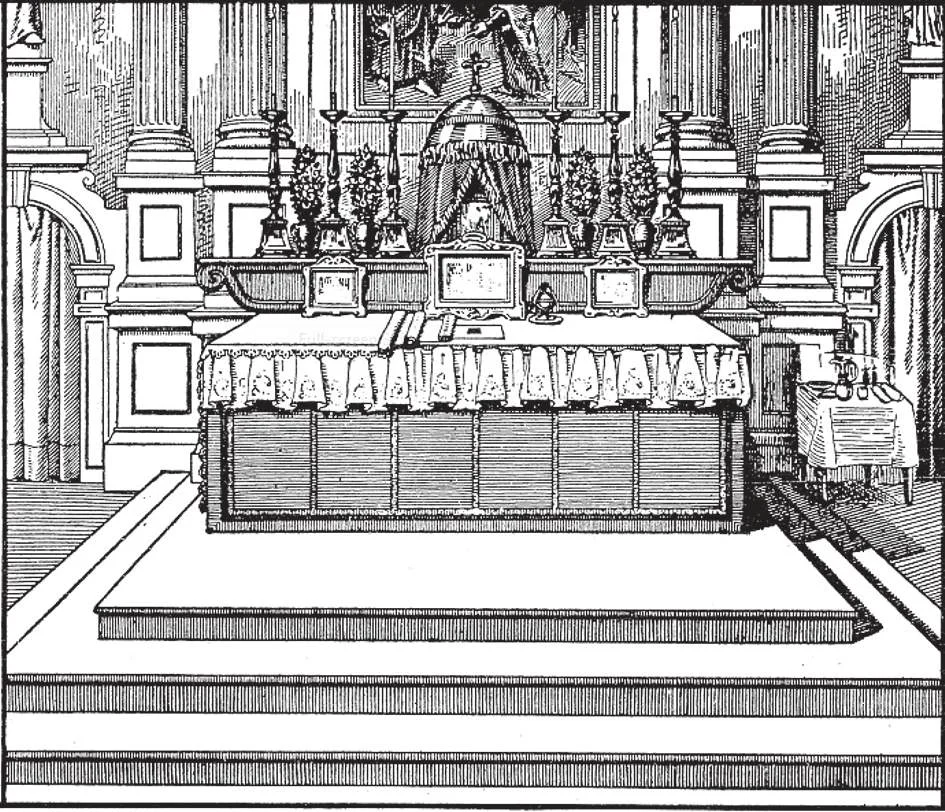
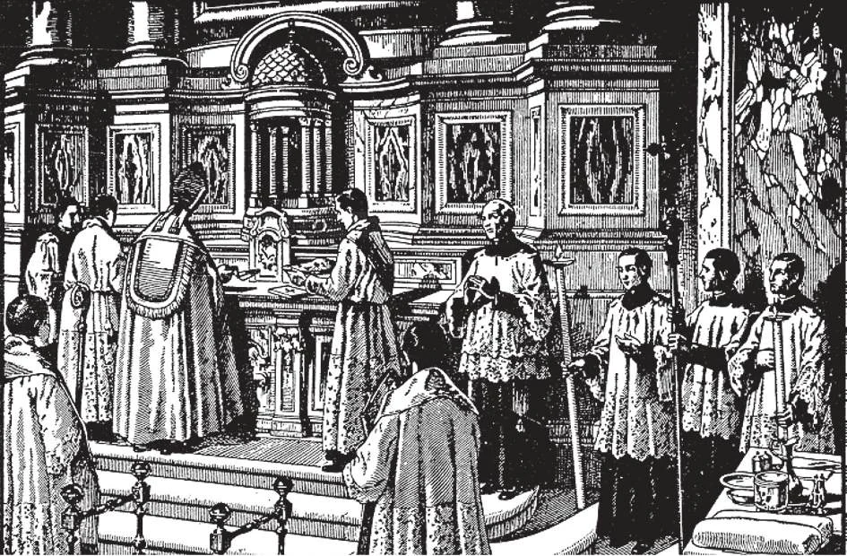

# 135. The Altar

*The altar cards contain some of the Mass prayers for the priest's convenience. Flowers may be used on the altar except during the penitential seasons, and at Masses for the dead. Along the whole front of the altar, when ready for Mass, is hung a rich and ornamented cloth called the antipendium, with colour varying according to the colour used for the Mass, in vestments, etc.*

**Where is the sacrifice of the Mass offered?**

— The sacrifice of the Mass is offered on a consecrated altar.

1. The Apostles offered the holy sacrifice on a table in a dwelling-house.

> In the New Testament, there are references to meeting places of worship: churches are as old as the Church. For perhaps the first three centuries, Christians who were constantly persecuted used homes for their meeting places for worship. A table was used for an altar because it was on a table that Christ instituted the Mass on Holy Thursday. Another reason was that a table could be easily hidden in times of persecution; also because Mass was generally offered in private homes.

2. In Rome, during the great persecutions, Mass was celebrated on the tombs of martyrs in the catacombs beneath the city, where the Christians fled for safety. The catacombs were underground galleries, of which it is said Rome had about 400 miles.

> This is the origin of the rule of having Mass said over the relics of saints. At the beginning of the Mass, the priest kisses the place. By this, too, we profess our communion with the saints in heaven. The lights which today we burn on the altar during Mass also had their origin during the times of persecution, when the Christians had to hear Mass in dark passages underground. They may be taken to symbolize divine grace.

3. When the persecutions were over, the Holy Sacrifice was offered in churches upon altars of stone. Stone altars date from the sixth century.

> The altar, then as now, was often erected so that the priest and the faithful faced the east, the source of light, as God is the Source. In those days, the baptistery used to be a separate building.

*In the building and furnishing of the altar, everything is laid down by law. The greatest exactness is observed. Above, we see the bishop consecrating an altar; he is placing the holy relics into the centre part in front of the tabernacle. It is on this part that at Mass, the chalice and host are laid.*

**How is the altar made and furnished?**

— The altar must be made of stone, marble, or wood, and spread with three linen cloths that have been blessed by bishop or priest. The three cloths remind us of the linen cloth in which Our Lord was wrapped for the sepulchre. They are placed on the altar also to absorb any drops of the Precious Blood that may accidentally be spilled from the chalice. The uppermost one must reach to the *predella* or platform.

1. When the altar is of wood, an oblong slab of stone is set into the top, large enough to hold the chalice and the paten: This altar stone is set in the centre of the altar, so that Mass is always offered on stone or marble.

> This stone is marked by crosses at the corners and the centre; in it relics of saints are cemented. It signifies that Christ is the foundation and cornerstone on which the Church rests. The altar or altar stone is consecrated by the bishop, with special ceremonies. In cases when permission to have Mass said outside of the church is obtained, a portable altar blessed by the bishop, is used. It is a square stone slab, large enough for chalice and paten.

2. Every altar must have a crucifix to symbolize the cross on which Our Lord died. Of the candles on the altar, two must be of pure wax. At a high Mass, at least six candles must be used. A sanctuary lamp of oil is kept burning day and night whenever the Blessed Sacrament is in the tabernacle.

> The credence table is a table or shelf at the Epistle side of the sanctuary, holding the materials for Mass. On it are the cruets, (one with wine and another with water), the basin, and the finger towel for the priest's hands.

3. The tabernacle (or "tent") is a kind of safe, made of wood, marble, or metal, having a door with lock and key, in which the Blessed Sacrament is reserved. Early tabernacles took various forms, such as a silver dove suspended over the altar.

> The tabernacle is above and behind the centre of the altar, and covered with a curtain when the Blessed Sacrament is inside. It recalls the tent of the Ark of the Covenant. A veil envelops the tabernacle, and is a sign of the presence of the Blessed Sacrament. Its colour is either white or matches the vestments. Christians who live their Faith realize that the tabernacle is the heart of the church, for day and night it houses Jesus Himself, the Incarnate Son of God. If we are so eager to give the best we can to our earthly guests, how much more concerned should we be to furnish a suitable dwelling place for our Divine Redeemer, Who comes to live in our midst! The tabernacle should be as rich as we can afford to furnish, and of an artistic design.
