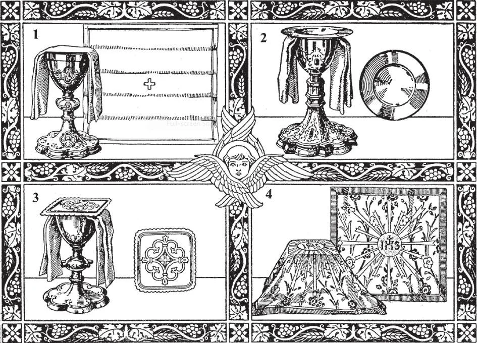

# 136. Sacred Vessels and Altar Linens

1. Chalice and Purificator 3. Pall, with Chalice 2. Paten and Chalice 4. Veiled Chalice

**What are the sacred vessels used for the altar?**

— The chief sacred vessels used for the altar are the chalice, paten, ciborium, and monstrance or ostensorium,

> Once consecrated, sacred vessels may not be touched by persons who are not in holy orders, except in cases of necessity. Those given charge of the care of the vessels should use a small linen cloth when handling them, so that they do not actually touch them. They are to be handled with reverence.

1. The chalice is the most sacred of all the vessels. It is the cup which holds the wine for consecration; after consecration, it contains the precious blood of Christ.

> The chalice must be of gold or silver. If this is not possible, at least the inside must be always gilt. The chalice represents the chalice in which Our Lord at the Last Supper first offered His blood; it also symbolizes the chalice of the Passion; and lastly, it stands for the Heart of Jesus, from which flowed His blood for our redemption.

2. The paten is the small plate on which the host is laid. It is made to fit the chalice.

> It is of the same materials as the chalice, at least gilt. Both chalice and paten must be consecrated by a bishop. In Holy Communion, our hearts become living chalices, our tongues other patens on which the priest lays Our Lord. May He ever find them welcoming Him!

3. The ciborium resembles the chalice, except that it has a cover. (See page 282.)

> It is used to hold the small hosts distributed for the communion of the faithful.

4. The monstrance or ostensorium is the large metal container used for benediction or exposition of the Blessed Sacrament. In many churches, it is of gold, and decorated with jewels. (See page 282.)

> The sacred Host used for Benediction is reserved in a luna or lunette, which is placed in the glassed portion of the monstrance. (See page 282.)

5. Burse and Corporal 6. Veiled Chalice and Burse

5. Other things, such as the Missal, veil, cruets, and incense, are used at the altar.

> The Missal is the book which contains the prayers and ceremonies of the Mass. The veil is a square cloth of the same material and design as the vestments of the Priest. It is used to cover the chalice, paten, and pall before the Offertory and after the Ablution. The cruets are the vessels from which the acolyte or sacristan pours water and wine into the chalice held by the celebrant. Incense is a perfume burned on certain occasions, as at high Mass and Benediction; it is a symbol of prayer.

**What linens are used for the Holy Sacrifice?**

— The corporal, purificator, pall, and finger towel are used.

> These linens, except the finger towel, are called the "holy cloths". All are made of white linen. No special significance is placed on the finger towel. It is of linen, used by the priest after washing his fingers before the consecration.

1. The corporal is a square of fine linen, with a small cross worked in the centre. Sometimes it has a border of lace. It is folded *7. Missal with Stand 8. Cruets and Bell* in three from both sides, and kept in a burse. The corporal is the most important of the holy cloths. The priest spreads it on the altar. On it, he places the chalice and the Host after consecration.

> With the purificator, the corporal symbolizes the linen in which Our Lord was laid away in the sepulchre. Because of their close contact with the sacred species, neither purificator nor corporal after use may be handled by lay people without special permission. The priest first purifies them before others wash them.

2. The purificator is an oblong piece of linen, folded thrice, placed over the chalice.

> It is used by the priest to wipe the inside of the chalice before putting in the wine and after the Ablution; he also wipes his mouth with it after the Ablution.

3. The pall is a small square piece of linen starched stiff, used to cover the chalice.

> It represents the stone which the Roman soldiers rolled against the entrance of Christ's sepulchre.

1. A mice 3. Cinture 2. Alb 4. Maniple 5. Stole 7. Surplice and cassock 6. Chasuble 8. Cope
