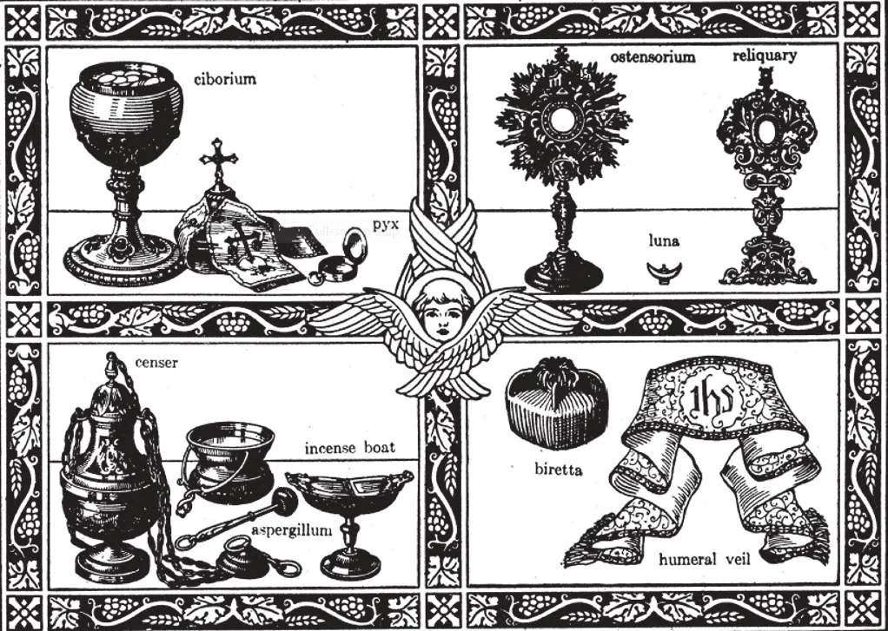
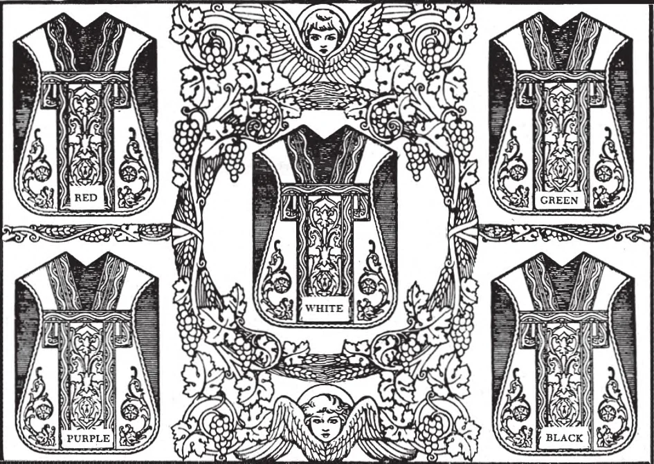
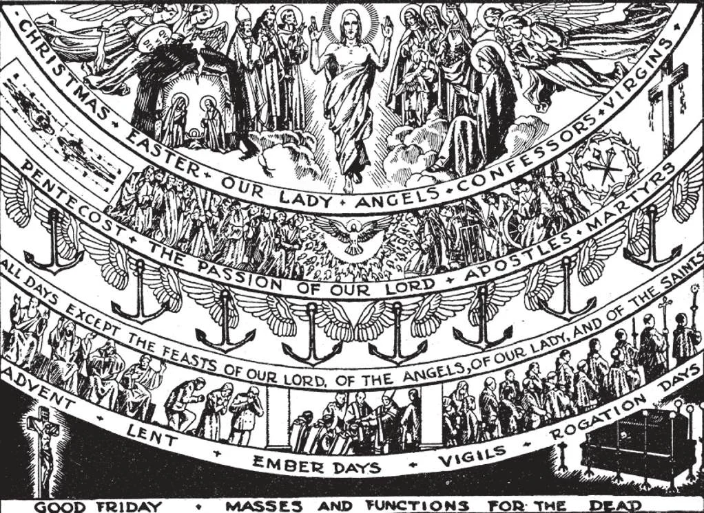

# 138. Liturgical Colours

**What colours are used at Mass?**

— At Mass various colours are used, according to the season and event being commemorated, these colours being: white, red, green, purple, and black.

> In the early days of the Church, the vestments were of one colour, white, though black was also used for mourning. In our times, not only the priest's vestments, but the tabernacle curtain, veil, and antependium are in the prescribed colour.

1. White vestments are worn on the festivals of Our Lord, except those of His Passion: they are also used for the feasts of Our Lady, and of Virgins and Confessors.

> White symbolizes purity and joy; hence its use for Our Lord and virgins. Gold may also be used to replace white, red or green. It is used to express great royalty.

2. Red vestments are used at Pentecost, in commemoration of the descent of the Holy Spirit in the form of tongues of fire; red is likewise used on the feasts of martyrs and Apostles, and on the feasts of the Holy Cross.

> Red is the colour of fire and blood; hence its use for Pentecost and for martyrs is very appropriate.

3. Green vestments are prescribed on Sundays after the Epiphany and after Pentecost, that is, outside Lent and Advent, except when some special festival requires another colour. Gold may be substituted on solemn feasts for white, red, and green.

> Green is the symbol of hope and growth; hence its use for the greater part of the year.

4. Purple, or violet vestments are worn during Advent and Lent, as well as for Vigils, Rogation Days, and Ember days.

> Vigils are the days preceding great festivals. As purple is a penitential colour, it is fitting to use it during the seasons of special penance, Advent and Lent. Rose, a lighter violet, is used on the fourth Sunday of Advent and also the fourth Sunday of Lent. There is a little rejoicing *(Laetare or Gaudete)* on these two Sundays as we approach the day of our redemption.

5. Black vestments are used at ceremonies for the dead, and on Good Friday. However, at the funerals of children who die before the age of reason, white vestments are used, to express the joy we should feel at the knowledge that an innocent one is Home.

