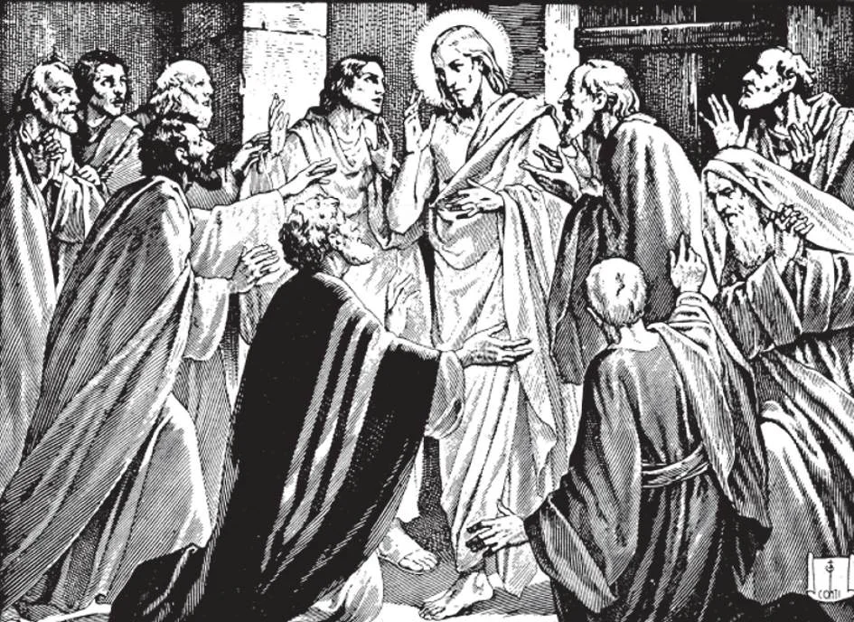

# 144. The Sacrament of Penance

*The picture shows Our Lord instituting the sacrament of Penance on the first Easter Sunday night. He breathed on the Apostles and said: "Whose sins you shall forgive, they are forgiven them; and whose sins you shall retain, they are retained" (John 20:23). Our Lord had previously promised Peter the right to forgive sins, saying: "And I will give thee the keys of the kingdom of heaven; and whatever thou shalt bind on earth shall be bound in heaven, and whatever thou shalt loose on earth shall be loosed in heaven" (Matt. 16:19).*

**What is the sacrament of Penance?**

— Penance is the sacrament by which sins committed after Baptism are forgiven through the absolution of the priest.

> Penance prompts the sinner to detest his sins, and incites him to offer satisfaction for them, and to amend his life in the future.

1. Penance has the three essentials of a sacrament. (a) It is a sensible sign;

i.

e. the words of absolution with the act of confession.

> Our Lord promised to give Peter the power to forgive sins, saying to him, "And whatever thou shalt bind on earth shall be bound in heaven, and whatever thou shalt loose on earth shall be loosed in heaven" (Matt. 16:19). Christ later made the same promise to the other Apostles, saying, "Amen, I say to you, whatever you bind on earth shall be bound also in heaven; and whatever you loose on earth shall be loosed also in heaven" (Matt. 18:18).

(b) It was instituted by Jesus Christ on the first Easter Sunday night.

> On the first Easter Sunday night, Our Lord fulfilled His promise to give His Apostles the power to forgive sins. Jesus appeared to His Apostles and said: "Peace be to you. As the Father has sent me, I also send you." When He had said this, He breathed upon them and said to them: "Receive the Holy Spirit; whose sins you shall forgive, they are forgiven them; and whose sins you shall retain, they are retained" (John 20:21-23).

(c) It confers grace. It is the way by which after Baptism sanctifying grace is restored to the penitent who has committed mortal sin. It increases this grace in the penitent who already possesses it. It also gives actual graces.

> When one cannot go to confession, he should make an act of perfect contrition at once for the forgiveness of his sin.

2. The priest forgives sins with the words: "I absolve thee from thy sins in the name of the Father and of the Son, and of the Holy Ghost. Amen!"

> This is called the "absolution," and is said by the priest over the penitent, with uplifted hand, when he forgives the sins confessed. It is pronounced while the penitent is saying an Act of Contrition.

3. On the part of the penitent, the sacrament of Penance includes three distinct acts: (a) contrition or sorrow for his sins; (b) confession or telling them to the priest; and (c) satisfaction or performance of the penance imposed by the priest.

> A penitent is absolved if he confesses his sins with sorrow and a resolution to atone for them and amend his life.

**Why must we receive the sacrament of Penance?**

— We must receive the sacrament of Penance, because our Lord Jesus Christ commanded it, when He said to the Apostles and to their successors in the priesthood: "Whose sins you shall forgive, they are forgiven them; and whose sins you shall retain, they are retained."

> "Is any one among you sick? Let him bring in the presbyters of the Church, and let them pray over him . . . and if he be in sins, they shall be forgiven him" (Jas. 5:14, 15).

1. The power to forgive sins was not given to the Apostles alone, but also to their successors, the bishops and priests of the Church, until the end of time.

> The forgiveness of sins was surely not granted only to those people living at the time of the Apostles, but for all who, to the end of the world, should need forgiveness,

2. These words of Christ oblige us to confess our sins, because the priest cannot know whether he should forgive or retain our sins unless we tell them to him. In order to be able to give a just decision the priest must know the facts of each case. Thus the penitent must tell his sins. He is his own accuser and his own witness.

> Even in a civil court, the judge makes no decision without knowing the facts of the case. A trial is conducted with accusers and witnesses against the person accused. The priest is the judge, and he must learn from the penitent himself whether he should give absolution and what would be a just penance to impose.

3. The Church commands us to confess at least once a year. All Catholics, including the Pope, cardinals, bishops, etc., are subject to this law. Good Catholics confess at least once a month, or even once a week. If we are so unfortunate as to have committed a mortal sin, we should go to confession at once.

> What would you think of a person who met with an accident at New Year and is near death if he says: "No, do not call the doctor. I shall go to him at Easter?"

4. The practice of confessing to a priest has been continuous in the Church from the time of the Apostles. We read in Holy Scripture that in the time of the Apostles, the Christian converts came to them, and openly confessed their practices (Acts 19:18).

> In the writings of the Fathers and Doctors of the Church, in the very first centuries of the Christian era, the faithful are often advised and exhorted to confess their sins. St. Augustine says, "It is not enough that one acknowledge his sins to God, from whom nothing is hidden; he must also confess them to a priest, God's representative."

St. John said in encouragement: "My dear children, these things I write to you in order that you may not sin. But if anyone sins, we have an advocate with the Father, Jesus Christ the just" (1 John 2:1).

**Can all priests administer the sacrament of Penance?**

— No; only those priests authorized to do so can administer the sacrament of Penance.

1. The bishop gives authority (called "the faculties") to hear confessions in his diocese. Certain grave sins are reserved to the Pope or the bishop for absolution. These are called "reserved cases": as when one joins Masonry, gets married before a non-Catholic minister, or desecrates a sacred Host.

> A priest authorized in one diocese must get the faculties in order to hear confessions in any other diocese. Priests are like civil magistrates, who cannot pass sentence on all cases, but only on those for which they have jurisdiction.

2. Every Catholic priest, however, even if suspended or excommunicated, has power to absolve all the sins of a dying person.
