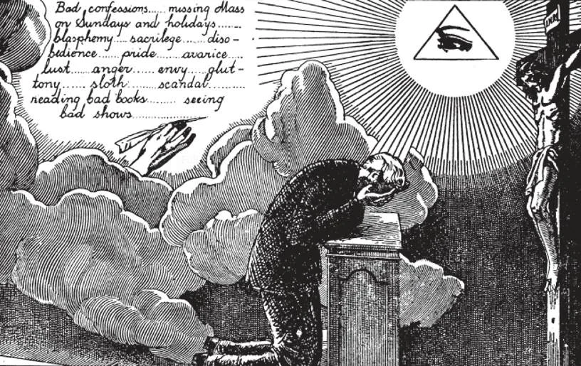

# 145. Examination of Conscience

*In our examination of conscience, we must make a careful scrutiny, as if we were to appear at that moment before the judgement seat of God. We must not, however, be scrupulous, remembering that God is a just and merciful God, who does not expect what is beyond our power. By the examination we learn to know ourselves, our weaknesses, our temptations, our sins. During the examination of conscience we should decide how we are to tell our sins, so that we may be clear and brief.*

**What must we do to receive the sacrament of Penance worthily?**

— We must:

1. Examine our conscience.

> By the examination of conscience we recall the sins committed since our last good confession.

2. Be sorry for our sins.

> By contrition or sorrow for sins, we express to God our grief that we have disobeyed Him, that we have been His unfaithful children.

3. Have a firm purpose not to sin again.

> By this purpose of amendment we sincerely promise God not to fall again into the sins we confess.

4. Confess our sins to the priest.

> The act of telling our sins to the priest is called Confession.

5. Be willing to perform the penance the priest gives us.

> The performance of the penance after confession is called satisfaction, for by that act we try to repair the damage our sins have done.

To receive the sacrament of Penance worthily, we must imitate the Prodigal Son;

> (1) He thought over the evil he had done, and acknowledged it (examination of conscience). (2) He realized his ingratitude towards his good father, and grieved with all his heart (contrition). (3) He made up his mind to return to his father and from thenceforth to change his ways (purpose of amendment). (4) Upon his return, he fell at his father's feet, confessed the evil he had done, and begged pardon for it (confession). (5) He implored his father not to treat him as a son, but as a mere servant (satisfaction).

**What is an examination of conscience?**

— An examination of conscience is a sincere effort to call to mind all the sins we have committed since our last worthy confession.

1. Before our examination of conscience we should ask God's help to know our sins and to confess them with sincere sorrow. Without His grace, we can neither know our sins nor feel sorrow for them.

> "As I live, saith the Lord God, I desire not the death of the wicked, but that the wicked turn from his way and live" (Ex. 33: 11).

2. The examination of conscience is important, for by it we learn to know ourselves, and so find means of improvement. How many men there are who know innumerable things about nature, science, literature, and law, and yet have never even peered into their own souls!

> Self-knowledge is a gift of God, that we implore in prayer. If we have self-knowledge, we shall be sure of avoiding the self-complacency that is the obstacle to a sincere examination of conscience.

**How can we make a good examination of conscience?**

— We can make a good examination of conscience by calling to mind the commandments of God and of the Church, and the particular duties of our state of life, and by asking ourselves how we may have sinned with regard to them.

1. We should make as careful an examination as if we were on our deathbed, considering in what way we have sinned in thought, desire, word, deed, or omission. We must recall how often we have committed mortal sins.

> "I will meditate on Thy commandments and I will consider Thy ways" (Ps. 118: 15).

2. We need not be too anxious about examining ourselves on venial sins, as it is not necessary to confess them; but it is better to do so, in order to amend ourselves, and to obtain greater graces.

> In our examination of conscience, let us beware, lest, in searching out small sins we may cover the large ones. Let us not imitate the Pharisees, to whom Our Lord said, "Blind guides, who strain out the gnat, but swallow the camel!" (Matt. 23: 24).

3. In our examination, we should recall all the circumstances that might change the nature of the sins we wish to confess.

> For example, if a man has stolen a ciborium from the church, it is not enough for him to confess, "I stole." Stealing sacred vessels, besides being theft, is moreover sacrilege.

4. We should determine exactly what we are going to confess, and how we are going to express it, avoiding random talk.

**When is the examination of conscience careless?**

— The examination of conscience is careless when we make it too hastily, and thus fail to remember all our sins.

1. Some careless people rush into the confessional after one or two minutes' preparation. They seem to make confession a mere stop over between two points of outside interest.

> We receive greater graces from confession the better we know ourselves, our sins, our weaknesses, and the greater is our contrition and the stronger our purpose of amendment. These important dispositions cannot be effected by a hasty examination.

2. One who omits confessing a mortal sin through deliberate carelessness in examination does not make a good confession.

> A good rule is to prepare for each confession as if it were to be the last we shall make in this life. The chief reason for our falling into the same sins time and again is our want of earnest preparation for confession, and the resulting lack of conviction of the need of amendment.

**When is the examination of conscience too scrupulous?**

— The examination of conscience is too scrupulous when we make ourselves miserable by minute and prolonged examination, fearing that we may not do it well.

1. Some scrupulous persons spend a half hour or more examining themselves with the minutest detail for a weekly confession.

> This is too long. A good examination for a weekly confession can be made in five minutes and for a monthly confession in ten or fifteen minutes, especially if one has not neglected to make his daily examination of conscience.

2. Our Lord certainly did not institute confession to be a means of torture, but a means of forgiveness and relief. In preparing for confession, many give too much time to the examination of conscience, and too little to exciting true sorrow for the sins.

> It is unnecessary to count the exact number of our temptations or distractions. It is unnecessary to worry over what we cannot remember. What scrupulous persons need is good common sense.

3. A good rule is to examine our conscience every evening, spending a few moments looking over the day's actions.

> Then when the time comes for confession, we have only to recall the sins our nightly examinations revealed to us. A good examination of conscience is an assurance of a good confession. We can neither confess nor feel sorry for what we do not recall. "If we say that we have no sin, we deceive ourselves, and the truth is not in us" (1 John 1: 8).
