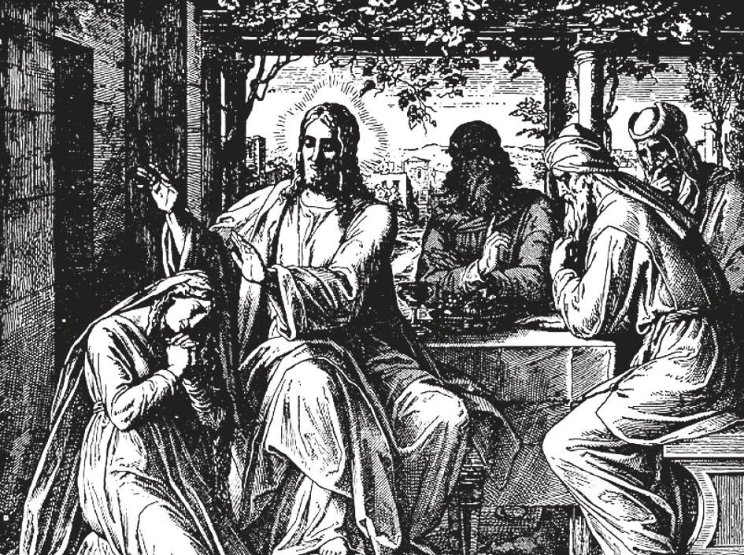

# 147. Perfect and Imperfect Contrition

Perfect contrition implies a fervent love of God. We are sorry for our sins because they offend God Who is so good. Mary Magdalen had perfect contrition. Her contrition was so perfect that she never sinned again, followed Our Lord and was at the foot of the cross when He was crucified. Her perfect contrition and love were greatly rewarded, for He appeared to her on Easter morning. We should all try to imitate Mary Magdalen's contrition, arising from sorrow at offending God.

**When is our contrition perfect?**

— Our contrition is perfect when we are sorry for our sins because sin offends God, Whom we love above all things for His own sake.

> "Wherefore I say to thee, her sins, many as they are, shall be forgiven her, because she has loved much. But he to whom little is forgiven, loves little." And he said to her 'Thy sins are forgiven.' And they who were at table with him began to say within themselves, 'Who is this man, who even forgives sins?' But he said to the woman, 'Thy faith has saved thee; go in peace' " (Luke 7: 47-50).

1. This contrition arises from a pure and perfect love of God. If we have a perfect love of God, our contrition for sins will be perfect.

> Thus we shall be sorry, not only because we fear punishment or dread the loss of His gifts, but because we offend the good God, to Whom nothing is more evil than sin.

2. It ought not to be difficult for us to have a perfect love of God. We generally love our parents not for the food and clothes they give us, but for themselves, because we see their self-sacrifice and unselfishness and other good qualities.

> If we can love our parents spontaneously, not for any reward we expect or punishment we wish to avoid, why can we not love God, Who is infinitely more lovable than our parents? If we love God spontaneously, because He is lovable in Himself, our love is perfect.

**Is it easy to make an act of perfect contrition sincerely?**

— It is easy, if we sincerely wish to love God. 1. We can excite ourselves to it by thinking of the Passion, of how good God is, how many favours He has granted us, and how ungrateful we have been to Him in return for His goodness.

> By thinking of God's gifts, we realize a little the goodness of God and His worthiness to be loved for His own sake. We then feel sorry for having offended our Benefactor by the sins we have committed.

2. An act of perfect contrition takes away sin immediately. Our sins however grievous are forgiven before we confess them, although the obligation to confess as soon as we can remains.

> Thus, if one makes an act of perfect contrition after having committed a mortal sin. and then dies before being able to go to confession, he is saved from hell by the act he made. Let us remember the penitent thief: "And he said to Jesus, 'Lord, remember me when thou comest into thy kingdom.' And Jesus said to him, 'Amen I say to thee, this day thou shalt be with me in paradise' " (Luke 23: 40-43).

However, we may not receive Holy Communion after committing a mortal sin, if we merely make an act of perfect contrition; one who has sinned grievously must go to confession before receiving Holy Communion.

> The act of perfect contrition means salvation if we die, but without confession it does not give a right to the sacraments.

3. If we happen to be assisting at a deathbed, and no priest is available, we should help the dying person make an act of perfect contrition.

> The father of a family met with an accident and was at the point of death. The youngest child, who had recently made his first communion, saw that his father would die before the priest could arrive. He therefore took a crucifix from the wall, and holding it before his father's eyes repeated aloud an act of contrition. Tears filled the dying man's eyes. He died before the priest arrived, but his act of contrition washed his soul clean of sin.

4. We should form the habit of making an act of perfect contrition as often as possible.

> It is only necessary to raise our hearts to God in pure love, and say some such words as: "O my God, I am sorry I ever offended Thee, because Thou art so good, and I love Thee."

**When is our contrition imperfect?**

— Our contrition is imperfect when we are sorry for our sins because they are hateful in themselves or because we fear God's punishment.

1. Imperfect contrition is called ***attrition***. The fear of hell is a common motive of attrition. It is a good motive, but it is imperfect, because it arises from fear of God's punishments, and not from pure love for Him.

> A mother sent her three young sons to take a big jar of honey to their grandmother. On the way the boys stopped to play. They stumbled over the jar, breaking it and spilling the honey. They all began to weep. The first said, "Mother will surely spank us!" The second cried, "She ...will be so displeased she will give us no cookies!" And the third wept, "Mother will surely be sad!"

> The first two boys had attrition: one had the fear of punishment, and the second had sorrow at the loss of reward. The third child had perfect contrition, for he thought only of the sadness and offence he caused to one he loved.

2. Imperfect contrition, or attrition, is sufficient for a worthy reception of the sacrament of Penance; an act of attrition cannot obtain forgiveness of mortal sin without the absolution of a priest.

> However, even if we feel only attrition for our sins, we can easily develop it into perfect contrition by remembering what we should be without God. We should always try to have perfect contrition in the sacrament of Penance, because perfect contrition is more pleasing to God, and because with His help we can always have it.

3. A purely servile fear of God is not sufficient for imperfect contrition. That is one which makes a person avoid sin only because of punishment; so that, if there were no punishment, he would not be sorry, but ready and resolved to sin, regardless of the laws of God.

> We call this fear "servile" because it is the fear of slaves, afraid of a hard taskmaster; they would quickly disobey his commands were they not afraid of his whips. Shall we look upon God thus?

To receive the sacrament of Penance worthily, purely servile fear would not be sufficient.

> Servile fear does not make the sinner turn away from his sin. The "fear of God" that produces attrition is called filial fear. It is a fear of God's punishments that makes the sinner turn away from his sin and return sincerely to God; it is the fear that a good son who has offended his father seriously feels when he begs forgiveness.
