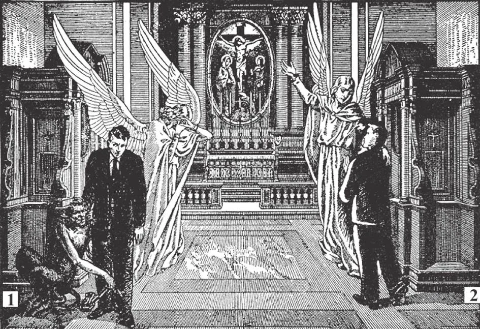

# 149. Sacramental Confession

1. One makes a bad confession who wilfully conceals a mortal sin. Far from being forgiven any of his sins, he thus commits a new mortal sin, sacrilege. If one is ashamed to confess his mortal sins before his ordinary confessor, he is always at liberty to go to another priest, one who does not know him. But by no means must he conceal a mortal sin. "He that hides his sins shall not prosper" (Prov. 28: 13). 2. If we make a good confession, our souls are cleansed, and we are restored to sanctifying grace, to the friendship of God. We also receive actual graces which help us in our struggle against evil.

**What is confession?**

— Confession is the telling of our Sins to an authorized priest for the purpose of obtaining forgiveness.

> "If we acknowledge our sins, he is faithful and just to forgive us our sins" (1 John 1: 9).

The chief qualities of a good confession are three: it must be humble, sincere, and entire.

**When is our confession humble?**

— Our confession is humble when we accuse ourselves of our sins with a conviction of guilt for having offended God.

> Our confession is humble when we show by our manner that we are truly sorry, and listen meekly to the priest's correction and advice. One who continually interrupts the priest with, "But you do not know me. Father! I am not like that!" would give the impression that he does not make a humble confession. One who complains that the penance imposed is too heavy for his sins is not humble.

**When is our confession sincere?**

— Our confession is sincere when we tell our sins honestly and frankly. 1. Our confession is sincere when we tell our sins just as they are, without excusing or exaggerating them.

> One who confesses that he stole because his companions told him to, or that the temptation was too strong, is excusing himself.

2. We should confess exactly as if we were telling our sins to God Himself; He knows them perfectly, with all circumstances.

> Our confession must be clear, so that the confessor may not waste his time asking us questions. We should also be very careful not to mention by name anyone in confession.

3. In confession, we are to tell our own sins, not those of others. Too many make of the confessional a place for gossiping about the faults of others.

> The story is told of a woman who went to confession and complained bitterly of the faults of her son. In giving the penance, the priest said, "Say two Hail Marys for your sins and ten rosaries for those sins of your son which you have confessed." He was trying to teach her a needed lesson.

**When is our confession entire?**

— Our confession is entire when we confess at least all our mortal sins, telling their kind, the number of times we have committed each sin, and any circumstances changing their nature.

> A story is told of an old farmer who came into the confessional quaking and quivering with nervousness. He said, "Father, I have stolen a rope!" and stopped. Sensing that the confession was not entire, the priest asked, "How long was the rope?" The farmer answered, "About three yards long, Father!" But he was still very nervous, and so the priest asked, "Was there anything else you stole?" The farmer trembled, and finally gasped: "There was a cow at the end of the rope. Father!"

1. We must tell the exact nature or kind of the mortal sins we have committed.

> For example, it is not enough for one to accuse himself of grievous lying. He should specify what kind of lie he told, whether it was to protect himself or to tell a calumny.

2. We must mention the circumstances that change the nature of our sins.

> For instance it is not enough to say merely, I stole five dollars," if they were stolen from a blind beggar, or from the collection plate at church. Ordinarily, taking five dollars from your rich father may be a venial sin. From a beggar, it becomes mortal; from the church it is a sacrilege.

3. We must tell how many times we committed a mortal sin. The more often it has been committed, the greater the guilt. If we cannot remember the exact number of times we should tell it as nearly as possible, by telling how long a habit has lasted.

> However, we must not waste time unnecessarily in this, but be as simple as possible. Instead of saying: "I was disobedient to my father twice, to my mother three times, and to my teacher five times," a young person should merely say: "I was disobedient ten times."

**Is it necessary to confess every sin?**

— It is necessary to confess every mortal sin which has not yet been confessed and forgiven; it is not necessary: to confess our venial sins, but it is better to do so. 1. We must confess all our mortal sins, God surely can forgive us without Confession; but He has not promised to do so, whereas He very clearly promised to forgive those whom His priests forgive.

> God is free to put whatever conditions He wishes on the reception of His gifts. He is certainly within His justice to impose on us the condition of Confession, that we may have our mortal sins forgiven.

2. It is well to confess venial sins, though we are not obliged to do so. Many Christians do not commit mortal sin; they would have only venial sins to confess.

> Venial sins do not exclude from heaven. Without confession they may be forgiven in many ways, such as by prayer, good works, and the frequenting of the sacraments. It is advisable, when confessing only venial sins, to accuse ourselves of some sin of our past life, even in general terms, such as: "I also accuse myself of the sins of my past life, especially those I committed against the Fourth Commandment,"

3. The priest refuses absolution when he thinks the penitent does not have the necessary dispositions. He may also postpone absolution, if he thinks it best to do so.

> The confessor is a judge in the confessional; he must act as a judge, looking not only into the sins being confessed, but also into the purpose of amendment, into the sincerity of contrition of the penitent, and the satisfaction to be imposed.

**What must a person do who has knowingly concealed a mortal sin in confession?**

— A person who has knowingly concealed a mortal sin in confession must confess that he has made a bad confession, tell the sin he has concealed, mention the sacraments he has received since that time, and confess all the other mortal sins he has committed since his last good confession.

> He must confess not only the sin concealed, but all the sins confessed in all his unworthy confessions, for none of them was forgiven.

Some conceal mortal sins in confession out of shame. They must remember that unless they confess all mortal sins, they get no absolution for even one and moreover commit a new sin, sacrilege.
