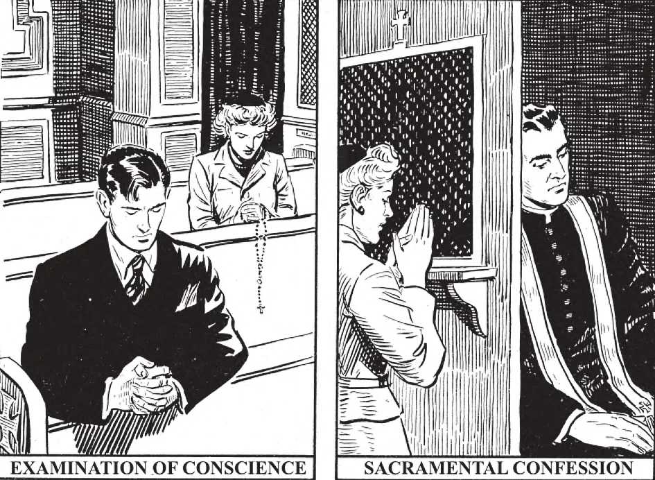

# 150. How to Make a Good Confession

1. Before confessing to the priest, we must first 2. In Confession, we tell our sins to the priest make a very good examination of conscience. as clearly as possible. We speak in a low voice, Then we should repent of our sins, say an act of and avoid any waste of time in random talk. We contrition, and kneel in the confessional for our must tell all mortal sins; we may also mention confession. whatever venial sins we wish to state.

**How should we prepare ourselves for a good confession?**

— We should prepare ourselves for a good confession by taking sufficient time not only to examine our conscience, but especially to excite in our hearts sincere sorrow for our sins, and a firm purpose not to commit them again.

> When hearing confession, the priest uses a purple stole. The colour purple signifies sorrow and penance. In former days, priests used the stole continually as part of their habit, but today they use it only when on duty; the Pope alone uses the stole continually. It is the badge of the priesthood.

1. After we have made a good examination of conscience and excited ourselves to true repentance, we should say an act of contrition. The act of contrition should precede the confession. We should make it after the examination of conscience, before going into the confessional. The priest cannot pardon us if we are not repentant.

> An act of contrition made any time during the day on which we go to confession is sufficient. We should renew the act of contrition at the moment that the priest is giving us absolution after our confession.

2. We then approach the confessional to await our turn. We should never crowd and fight to get first place. Some persons are so eager to be first that they even go up near the one actually confessing. This is a serious fault, especially if by so doing the person hears the confession going on.

> Roger Brooke Taney was one day awaiting his turn to confess, in line with some negro workmen. He was then Chief Justice of the Supreme Court of the United States, a position second only in dignity to that of the President. Seeing him, the priest came out and said, "Come in next, Mr. Taney: the time of the Chief Justice is too precious to spend waiting." But the Chief Justice replied, "Not Chief Justice here, Father, only a prisoner at the bar." And he kept his place in line, awaiting his turn.

3. When our turn comes, we kneel in the confessional and wait till the priest leans towards the opening.

**How should we confess our sins to the priest?**

— We should confess our sins in this manner: 1. Making the sign of the cross, we say to the priest: "Bless me Father, for I have sinned"; and then we tell how long it has been since our last confession. 2. We then state our sins as clearly and briefly as possible, telling all mortal sins, including those that may have been forgotten in previous confessions, with the nature and number of each; we may also confess any venial sins we wish to mention. We must not waste time at any random talk.

> If we cannot remember the exact number of our mortal sins, we should tell the number as nearly as possible, or say how often we have committed the sins in a day, a week, a month, or a year. When we have committed no mortal sin since our last confession, we should confess our venial sins, or some sin told in a previous confession, for which we are again sorry, in order that the priest may give us absolution.

3. Having finished, we say: "For these and all the sins of my past life I am truly sorry, especially for . ." and then it is well to tell one or several of the sins which we have previously confessed, and for which we are particularly sorry.

**What should we do after confessing our sins?**

— After confessing our sins, we should answer truthfully any question the priest asks, seek advice if we feel that we need any, listen carefully to the spiritual instruction and counsel of the priest, and accept the penance he gives us.

> If we do not understand the penance, we must ask the priest to repeat it. If we cannot perform that particular penance, we should state our reasons to the priest, and have him change it. We should wait and listen attentively all the time that the priest gives advice and imposes penance.

1. When the priest is giving us absolution, we should say from our heart the act of contrition in a tone to be heard by him, and make the sign of the cross.

> The words of absolution are said in Latin: "I absolve you from your sins, in the name of the Father and of the Son and of the Holy Ghost. Amen." We must not leave the confessional until the priest gives some sign, as by saying, "God bless you," or "go in peace." It is best to wait till he has closed the little window.

2. After leaving the confessional, we should return thanks to God for the sacrament we have received, beg Our Lord to supply for the imperfections of our confession, and promptly and devoutly perform our penance.

**What are we to do if without our fault we forget to confess a mortal sin?**

— If without our fault we forget to confess a mortal sin, we may receive Holy Communion, because we have made a good confession and the sin is forgiven; but we must tell the sin in confession if it again comes to our mind.

> A doubtful sin is one of which we are not sure whether it is a sin or not a sin. We are not obliged to confess a doubtful sin, but it is better to do so. The confessor can then advise us and we shall have greater peace of mind.

**What is a general confession?**

— A general confession is a repetition of all previous confessions, or at least of some of them.

> Housewives sweep and dust the house every day; nevertheless they also give it a thorough general cleaning once or twice a year. A general confession is the equivalent of this general house cleaning.

1. It is a good practice to make a general confession of the whole year once a year, especially after a retreat or mission. These are called confessions of devotion.

> Scrupulous persons, however, who only torture themselves, should avoid general confessions. Even if mortal sins are omitted purposely in a general confession of devotion, it is worthy, provided those sins have previously been confessed and absolved.

2. It is usual to make a general confession of our whole life when we are about to change our state of life, as before marriage or before entering the priesthood or a religious order. A general confession is necessary when one has been making unworthy confessions.

> A general confession is to be recommended as conducive to greater self-knowledge, to more genuine humility, and increased peace of mind.
