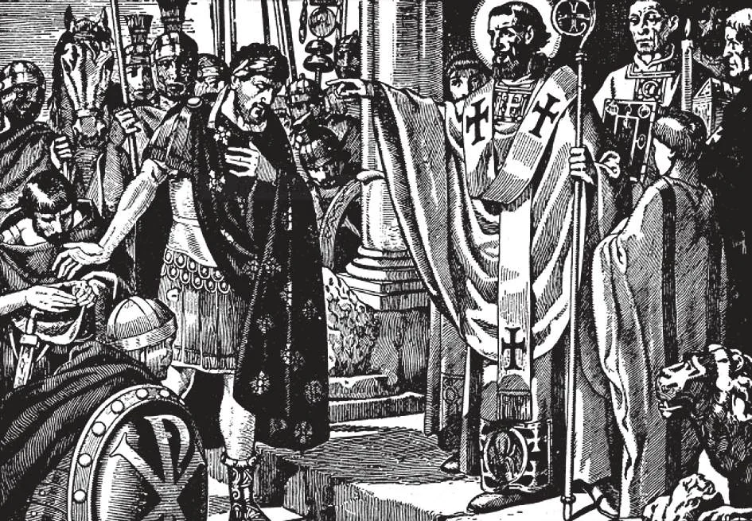

# 151. Satisfaction for Sin

*Theodosius the Great Roman Emperor, although a just ruler, once ordered the massacre of about 7000 people of Thessalonica in revenge for a tumult that they had caused in the year 390. St. Ambrose, then Archbishop of Milan, thereupon forbade the emperor's entrance into the church. Theodosius acknowledged his sin, and humbly stated that King David had likewise sinned. St. Ambrose rebuked him, answering that the emperor must then imitate David in his penance. Theodosius made reparation to the Thessalonians and did eight months of severe canonical penance.*

**Why does the priest give us a penance after confession?**

— The priest gives us a penance after confession, that we may make some atonement to God for our sins, receive help to avoid them in the future, and make some satisfaction for the temporal punishment due to them.

1. The penance is satisfaction for sin, some penitential work imposed by the priest as a reparation to God for the offence offered to Him by sin.

> In the early days of the Church, public or canonical penance was imposed for public sins. One who apostatized for fear had to do penance for seven years, during which time he was excluded from Holy Communion, and was required to fast on certain days.

2. Justice requires that an injury done to another should be repaired. One who steals must restore the stolen property. God forgave Adam's sin, but his penance lasted his whole life. In the same way our guilt is forgiven in confession, but we must make satisfaction for our sins. Our eternal punishment is forgiven, but not our temporal punishment. Temporal punishment is the punishment or penance that we have to suffer for our sins either here on earth or in Purgatory.

> One who breaks the civil law is not let off even if he is sorry. He is given a penalty imposed by the judge. How much more should the priest, the spiritual judge, impose a penalty or penance to satisfy for the offence offered to God when we commit sin.

3. Today the most common form of satisfaction is the saying of certain prayers imposed. If the sin calls for material reparation, restoration of property or a public apology is also sometimes imposed.

> One should not complain if the penance given by the confessor is more than other confessors usually impose. One should instead thank God for the opportunity to make some satisfaction here on earth, thus shortening his purgatory.

4. If the penance consists of prayers, we should say it if possible as soon as we leave the confessional. It is wrong to put off the performance of a penance too long. One who intentionally omits the penance commits sin, although the sins that were forgiven do not return. To omit a penance for venial sins would be a venial sin; a serious penance for mortal sins, would be grievous.

> If we cannot perform the penance imposed, we may request our confessor to change it. We may not on our own authority substitute another penance for the one imposed.

**What kinds of punishment are due to sin?**

— Two kinds of punishment are due to sin: the eternal punishment of hell, due to unforgiven mortal sins, and temporal punishment, lasting only for a time, due to venial sins, and also to mortal sins after they have been forgiven.

1. Even if Our Lord by His death fully atoned for all our sins, we need to do penance for them. He made salvation available, on condition that we do our part.

> In a similar way, a physician prescribes medicine. If one refuses it, he is not cured.

2. If there were no need of penance, the most hardened sinners would receive the same treatment as the most saintly men, a condition impossible to the justice of God. Christ Himself wills that as we are to share in His glory, we must first share in His sufferings.

> "Heirs indeed of God and joint heirs with Christ; yet so, if we suffer with Him, that we may also be glorified with Him" (Rom. 8: 17).

3. The punishment for sin prescribed by God is clear:

> (a) For mortal sin, eternal punishment in hell. This punishment we can escape by the sacrament of Penance, or, at the moment of death, if we are not able to receive the sacrament of Penance, by an act of perfect contrition. (b) For mortal sins which have been forgiven, and venial sin not completely atoned for, temporal punishment,

4. The sacrament of Penance, worthily received, always takes away all eternal punishment; but it does not always take away all temporal punishment.

**Why does God require temporal punishment for sin?**

— God requires temporal punishment for sin to satisfy His justice, to teach us the great evil of sin, and to warn us not to sin again.

1. Temporal punishment is due even forgiven sins, because human contrition is often imperfect. This temporal punishment is an atonement made to divine sanctity and justice. After confession, our contrition generally requires more satisfaction than the few prayers given as penance.

> "Nathan said to David: The Lord hath taken away thy sin, thou shalt not die; nevertheless, because thou hast given occasion to the enemies of the Lord to blaspheme, for this thing the child that is born to thee shall surely die" (2 Kings 12).

2. Temporal punishment, as the word implies, lasts for only a time. It has a definite end. Holy Scripture furnishes us many examples of temporal punishment having been imposed by God.

> Mary, the sister of Moses, was pardoned the sin she committed by murmuring against her brother. Nevertheless, God inflicted on her the temporal penalty of leprosy, and of seven days separation from the people (Num. 12).

3. We pay the debt of our temporal punishment either in this life or in purgatory.

**What are the chief means of satisfying the debt of our temporal punishment, besides the penance imposed after confession?**

— They are: prayer, attending Mass, fasting, alms-giving, the works of mercy, the patient endurance of sufferings, and indulgences.

> "But Zacchaeus stood and said to the Lord, 'Behold, Lord, I give one-half of my possessions to the poor, and if I have defrauded anyone of anything, I restore it fourfold' " (Luke 19: 8-9).

Devout persons will not be satisfied with doing the penance imposed by the priest. They will do voluntary work of charity and mortification, in atonement; - they will, besides, bear patiently all ills sent by God.

> The penance we perform, and the sufferings we bear patiently, not only reduce the temporal punishment due our sins, but also contribute to the increase of our eternal happiness. This is what we call gaining merits for heaven.
