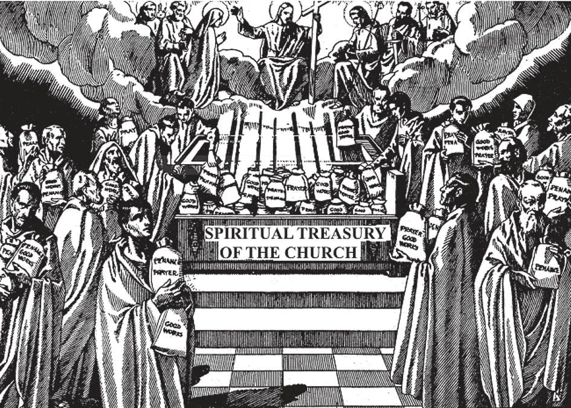

# 153. Indulgences

The Church has a Spiritual Treasury made up of the infinite merits of Our Lord, and the superabundant merits of the Blessed Mother and the Saints. The Passion and Death of Our Lord and the penances and sufferings of the Blessed Mother who did not need to do penance, and of the Saints, have created this Spiritual Treasury, which Christ left for the use of the Communion of Saints. In this way, a penitent who gains an indulgence receives from his Mother the Church some of the wealth gathered in the Spiritual Treasury from the merits of Our Lord, Mary, and the Saints.

**What is an indulgence?**

— An indulgence is the remission granted by the Church of the temporal punishment due to sins already forgiven. 1. Our Lord gave the Apostles and their successors the power to deliver men from every obstacle that might separate them from heaven. Thus He said to St. Peter:

> "Whatever thou shalt bind on earth shall be bound in heaven, and whatever thou shalt loose on earth shall be loosed in heaven" (Matt. 16: 19).

2. The Church can remit temporal punishments due to forgiven sins in virtue of her divine commission. If she has the power and right to forgive sins on earth, free men from hell and lead them to heaven, she must also have the power of loosing every bond or obstacle that constricts the soul and prevent it from entering heaven.

> A civil ruler who has the right to pardon criminals is empowered to choose in what manner he will grant the pardon. The Church exercises a similar right and power in granting indulgences.

3. An indulgence is not a permission or license to sin. It is simply a forgiveness or release from temporal punishment, the guilt and its eternal pains being previously remitted by the Sacrament of Penance. In fact, one, who is not in the state of grace, cannot gain an indulgence. To be in the state of grace is secured by the Church by the fact that she imposes the condition of Confession.

> An indulgence relates to temporal punishment due to sins of the past, and cannot be gained for future sins.

**How does the Church by means of indulgences remit the temporal punishment due to sin?**

— The Church by means of indulgences remits the temporal punishment due to sin by applying to us from her spiritual treasury part of the infinite satisfaction of Jesus Christ and of the superabundant satisfaction of the Blessed Virgin Mary and of the saints. 1. In the Church, there is a spiritual treasury made up of the superabundant merits of our Lord, the Blessed Mother, and the Saints. The merits of the passion and death of Our Lord are infinite, for He is God. All these He left to His Church.

> The superabundant satisfaction of the Blessed Virgin Mary and of the Saints which are united with those of Christ, “I make up in my flesh what is lacking to the sufferings of Christ, on behalf of His body, the Church," (Coloss. 1: 24) is that which they gained during their lifetime, but did not need, and which the Church applies to their fellow-members of the Communion of Saints. (see page 148).

2. When the Church grants an indulgence, it does not really cancel any expiation due to God. It only supplies for our deficiencies by drawing on the spiritual treasury of the Church.

> A mother had many sons and daughters. Some of them acquired great riches, and upon dying, bequeathed their possessions to their mother, to be used as she pleased. Now the mother had younger children who needed support and education. Once in a while therefore the mother withdrew money from the bank, where she had deposited the riches left her, and used this money for her other children.

3. Divine justice requires an exact reparation for all sins we have committed. Usually the small penance of a few prayers imposed by the confessor is not sufficient to make satisfaction for our sins, which have outraged the holiness of God.

> Besides, we are often careless, and have only imperfect contrition for our sins. Therefore, even after our sins are forgiven, there usually remains some temporal punishment which we have to suffer either here or in purgatory. If we make use of indulgences, we draw upon the spiritual treasury of the Church, and thus balance our account with God.

**Has the Church always exercised its right to grant indulgences to the faithful?**

— The Church has always exercised its right to grant indulgences. 1. The Apostles granted indulgences.

> St. Paul writes of a Corinthian who had shown such signs of true repentance that his penance had been remitted. "Whom you pardon anything, I also pardon. Indeed, what I have forgiven — if I have forgiven anything I have done for your sakes, in the person of Christ" (Cor. 2: 10).

2. During the time of the great persecutions, the confessors and martyrs remained constant and were cast into prison, and many were put to death. Others denied their faith to escape persecution; on these, the Church imposed severe penances.

> However, if the confessors and martyrs interceded in behalf of the apostates, their time of penance was shortened by the Bishop. In other words, an "indulgence" was granted to them by the proper authority, in view of the superabundant merits of those who interceded for them.

3. As the centuries passed, the Church moderated its severe penances. There was danger that, if penances continued to be very severe, many would be unable to fulfil them. In order, therefore, to save as many souls as possible, the Church made the penances lighter. Public penances ceased to be imposed; the penitent was permitted to make atonement by means of alms-deeds, crusades, or pilgrimages.

> Hence the wider use of indulgences came about; and they were granted for works comparatively easy of accomplishment.

4. More and more indulgences came to be granted, as today they are granted, for reciting certain prayers, for visiting certain holy places, for fasting and almsgiving, for using certain sacred objects.

> Thus, when the Holy Land came into the power of the Turks, and pilgrimages could no longer be made to Jerusalem, Pope Boniface VIII granted a plenary indulgence to all who, during the year 1300, should for 15 successive days visit the basilica of the Apostles in Rome. This was the origin of the Jubilee indulgence.

**What are some of the advantages of indulgences?**

— Some of the advantages are: 1. They cancel or lessen our temporal punishment.

> Thus those who neglect the practice of gaining indulgences may be likened to a traveller who prefers a long and difficult road although a short and pleasant one is offered to him.

2. They console us in our fear of God's judgement for our past sins, and give us hope for the future.

> When we sin, they encourage us to make our peace with God, for a state of grace is necessary before we can gain any indulgence.

3. They encourage us to go frequently to the sacraments, and to do good works.

> Indulgences can also be gained for the holy souls of the faithful departed by way of suffrage. Thus, they enable us to practice charity towards the holy souls in Purgatory.
