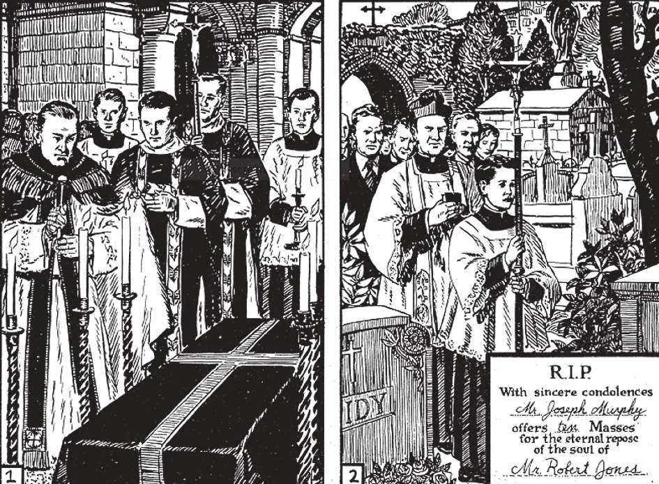

# 158. Christian Burial

1. The ceremonies for burial include services in the church. They vary from the very elaborate to the simplest. Holy water and lighted candles express our desire to see the departed cleansed and admitted into the kingdom of light. Incense symbolizes our wish to have prayers ascend to God.

2. The body of the departed Catholic is borne in procession to the cemetery. At a funeral, it is wrong to laugh or converse; we should pray for the repose of the soul departed. A small card of condolences announces a good offering one can make to a bereaved family: Holy Masses for the departed.

**How should the body of a dead person be prepared for burial?**

— For burial, the body of a dead person should be washed, dressed modestly, and laid out neatly. 1. Lay out the body in a dignified and becoming manner, but leave out all worldly vanity that savours of paganism. Remember that that body is sacred; it was the temple of the Holy Ghost.

> What a mockery of Christian ideals do we find only too often today, when everything possible is done to eliminate thoughts of death! The face of the deceased is rouged and retouched; the lips are painted berry red; the body is perfumed and powdered; the nails are varnished. Are we or are we not Christians? Do we honestly believe that cosmetics can help our beloved dead, that at that moment must already be suffering in purgatory?

2. After the body is washed and clothed, place a crucifix between the folded hands on the breast. Set one or two lighted candles at each side of the coffin. The room should be as quiet as possible, in order that friends who can call may be able to pray.

> It is well to ponder on the truth, as we look at a dead face without cosmetics, that we too will some day have to arrive at our journey's end, and stand before the throne of God divested of all worldly decorations and masks.

**How should funerals be conducted?**

— Funerals should be conducted with dignity and devotion; they should not be extravagant and beyond the means of the family. 1. Some have the tendency to have pompous funerals for dead members of their families, asserting that it is the last thing they can give for their dead. This feeling is understandable; but it certainly shows a lack of proportion if this generous feeling results in the payment of large amounts of money for grand funeral coaches and footmen, while the offering of prayers and especially of Masses is neglected.

> If a family has means, suitable offerings should be given to the priest who attended the deceased during his illness, and adequate fees paid for the funeral services. Donations should be made to the Church and alms given to the poor, for the repose of the soul of the deceased; charity and Masses will avail the dead person's soul more than gold coaches and truckloads of wreaths.

2. There are very solemn services accompanied by many ceremonies. There are also very simple services. God will hear the prayers during the simple as during the elaborate ceremonies, according to the devotion of those who pray.

> The body should be taken to the church for the blessing, and if possible should be present at a Requiem Mass. The ceremony of the Church for funerals is touching and significant, and rightly understood will benefit the living as well as the dead. It is not an empty show designed to glorify the dead and express sympathy to the living; it is a devotion calculated to help the departed soul attain its eternal reward, as well as to teach salutary lessons to those, left behind.

3. Those who accompany a funeral to the cemetery should observe great recollection, and a serious demeanour. The playing of ''jazz'' pieces by a band during the funeral is to be condemned.

> Unfortunately some people follow funerals as if they were in a worldly function, talking aloud and gossiping. A salutary thought would be to reflect that they might be the next to go that way to the cemetery.

4. Catholics should be buried in a Catholic cemetery if there is one; at least the grave should be blessed. Some day the bodies will rise in glory, and be united with their souls in heaven; is it befitting their high destiny to bury them like animal carcasses in un consecrated ground?

> Over the place of burial a large cross should be erected. Generally, the letters R.I.P. (Re qui esc at in pace: May he rest in peace) are engraved on the headstone. And here a word about graves and mausoleums. The holy St. Monica, mother of St. Augustine, said: "Bury this body wherever you please. One thing only I ask of you, and that is, remember me at the altar of the Lord." A simple grave, an elaborate mausoleum, — it is all the same to those departed. It is of course natural for those who can afford it to build mausoleums where all the members of the family can be buried together. What is to be avoided is the erection of ostentatious structures that appear more like gaudy show houses than sepulchres of Christians. The cross should be prominent: the inscriptions should be liturgical and not taken from popular songs or sentimental rhymes.

5. Non-Catholics, Freemasons, those excommunicated as deliberate suicides, duellists, and those who ordered their bodies cremated, are denied Christian burial.

> Let us remember: to spend money on showy mausoleums while holding the purse strings tight against charity would be contrary to right reason. Surely splendid structures cannot avail the dead. Unfortunately, they continue to be built to satisfy the vanity of the living; meanwhile, these living relatives forget to pray, to have Masses said or to give alms to the poor, as an offering for the departed soul.

**From whom should we seek consolation when someone dear to us dies?**

— When someone dear to us dies, we should seek consolation from God, Who is our eternal Healer, Comforter, and Friend. 1. Nothing on earth can give lasting comfort to bereaved hearts. But if we live our faith, the death of a beloved one should not drive us into despair; for one who goes in God's grace, "to die is gain," to die is to attain eternal union with God. For the just who die, death is truly no more.

> "But the just man, if he be prevented with death, shall be in rest" (Wis. 4: 7). As Our Lord assures us: "I am the resurrection and the life; he who believes in me, even if he die, shall live; and whoever lives and believes in me, shall never die" (John 11: 25-26).

2. To the bereaved, God in His infinite mercy extends, through our Mother Church, the consoling assurance of Purgatory. This knowledge bridges the chasm yawning between us and our dear departed; it makes us feel that death has not cut the bonds of love uniting us with them. Instead of desolation for our loss, we find decrease of sorrow, and a practical expression of our affection in prayers and good works offered to God in behalf of our beloved dead, who may still be in purgatory.

> This is one reason for the necessity of understanding thoroughly the doctrine of purgatory (see pages 156- 159). As St. Paul said, "We would not, brethren, have you ignorant concerning those who are asleep, lest you should grieve, even as others who have no hope" (1 Thess. 4: 13).
