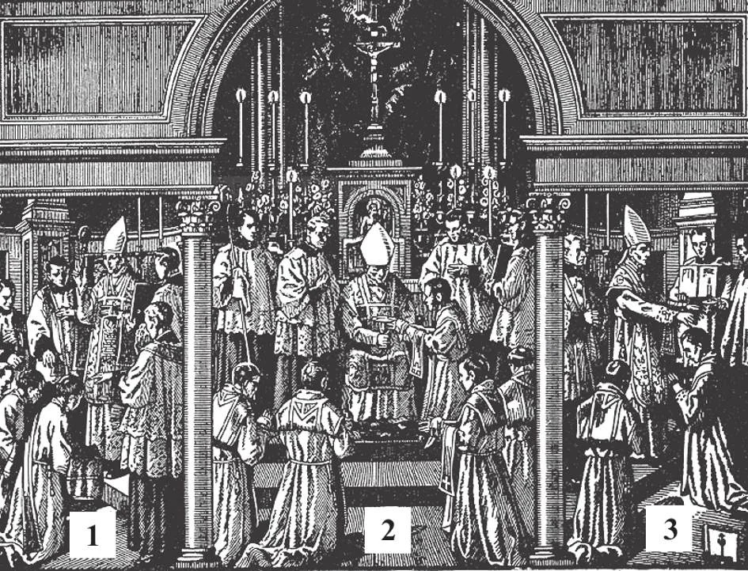

# 159. The Sacrament of Holy Orders

Ordination to the priesthood takes place during the celebration of Mass, After the candidates have prostrated themselves on their faces before the altar, the Bishop lays his hands on the head of each, the priests present doing the same. He puts on them the sacerdotal vestments (1). The Holy Ghost is invoked. He then anoints the hands of each with sacred chrism in the form of a cross. He makes each touch the chalice and paten, to show that the power to offer Mass is conferred (2), The new priests say Mass with the Bishop, After Communion, the Bishop again lays his hands on the head of each (3) and says: "Receive ye the Holy Ghost; whose sins ye shall forgive. . ."

**What is Holy Orders?**

— Holy Orders is the sacrament through which men receive the power and grace to perform the sacred duties of bishops, priests, and other ministers of the Church. 1. Our Lord Jesus Christ instituted this sacrament. At the Last Supper He gave the Apostles and their successors the power to say Mass. He said, after consecrating His Body and Blood:

> "Do this in remembrance of me" (Luke 22: 19). Thus He gave the Apostles the power to offer the Sacrifice of the Mass.

2. On the day of the Resurrection Our Lord gave the disciples power to forgive sins. He breathed on them and said:

> "As the Father has sent me, I also send you. . . . Receive the Holy Spirit; whose sins you shall forgive, they are forgiven them, and whose sins you shall retain, they are retained" (John 20: 21-23).

3. Finally, before the Ascension, Christ gave His disciples the mission to preach the Gospel.and dispense the sacraments.

> "All power in heaven and on earth has been given to me. Go, therefore, and make disciples of all nations, baptising them in the name of the Father and of the Son and of the Holy Spirit, teaching them to observe all that I have commanded you; and behold, I am with you all days, even unto the consummation of the world" (Matt. 28; 18-20).

4. The Apostles, in compliance with the wishes of Christ, administered the sacrament of Holy Orders.

> They consecrated Paul and Barnabas Bishops with prayer and the imposition of hands. In the same way St. Paul ordained Timothy. When the Apostles established churches, upon their departure, they ordained and appointed successors (bishops) to whom they gave full powers, and other ministers (priests) to whom they transmitted part of their powers. "For this reason I admonish thee to stir up the grace of God which is in thee by the laying on of my hands" (2 Tim. 1: 6) .

**What are some of the requirements for a man, to receive Holy Orders worthily?**

— Some of the requirements are: an excellent character, the prescribed age and learning, the intention of devoting his life to the sacred ministry, and a state of grace.

> It is not necessary, in order to become a worthy priest, to receive a direct call from God; it is likely that of those who are now in the priesthood, not one had a visible apparition to inform him of his vocation to the priesthood. So long as you feel a spiritual attraction to the life of a priest, if you admire heroic priests and saints, then that is enough of a call, if joined with the other qualifications for entering the priesthood.

1. A man must be of excellent character. This implies good will and virtuous conduct, as well as good sense.

> Good sense is needed if a priest is to do good to souls. The delicate functions exercised by a priest, especially as a Judge of souls, would exclude from priesthood a person of an unbalanced disposition, or one who is wanting in prudence.

2. He must have finished a seminary course successfully, and must have completed his twenty-fourth year. In the minor seminary, the course usually consists of four or five years of Latin and Greek, together with secondary school subjects. In the major seminary, the course includes philosophy and other collegiate subjects for two or three years, then four years of theology, with Holy Scripture, Church History, Canon Law, Liturgy, Sociology, etc.

> A man must have a good mind in order to make successfully the studies for the priesthood. Besides, here in our country as elsewhere the priest is almost always compelled to defend the doctrines of the Church from attacks of its enemies. One without a good mind cannot well answer such attacks. Moreover, such a priest would cause a lack of respect among the laity towards the priesthood.

3. He must be sincere in the intention to devote his entire life to the sacred ministry. This includes willingness to bear whatever burdens and difficulties the priesthood may bring, for the love of God. It presupposes a right intention for entering the priestly state.

> No one should enter the priesthood because his parents have forced it on him. On the other hand, no one should abandon a desire to become a priest just because other people oppose it. One must enter the priesthood of his own free will, because he loves God and believes it is the best way to save his own soul, and other souls for Christ. It would be very wrong to become a priest just to assure oneself of a living.

4. Holy Orders is a sacrament of the living; therefore the recipient must be in the grace of God. In general if a boy has good will, good health, a good mind, good sense, and a desire to dedicate himself to the service of God, he has the qualifications necessary for the priesthood.

> A priest needs good health because of the many responsibilities of his office; he may be sent to distant and undeveloped missions where food is difficult to get, where sanitary conditions are bad.

**Who is the minister of the sacrament of Holy Orders?**

— The bishop is the minister of the sacrament of Holy Orders.

> Three bishops consecrate a new bishop.

1. The candidate must be called to Holy Orders by his Bishop. Before ordination, the bishop must be satisfied that the applicant has the virtue and physical and mental fitness required of a priest, and that he is free from any canonical irregularity.

> By Baptism all Christians are endowed with the spiritual "priesthood" of laymen, by which they have the obligation to offer up to God spiritual sacrifices of prayers and mortification and acts of faith, hope, and charity. But only those men who receive the Sacrament of Holy Orders are priests, ministers of God, in the full sense of the word.

2. The sacrament of Holy Orders is administered by means of ceremonies that vary with the kind of orders conferred. It consists in the sign of the imposition of hands by the bishop, together with the accompanying words of ordination, varying with, the order being conferred.

> "You have not chosen me, but I have chosen you" (John 15: 16). "He who receives you, receives me; and he who receives me, receives him who sent me" (Matthew 10: 40).
