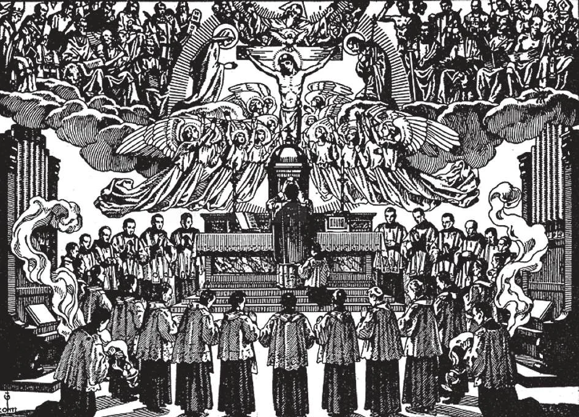

# 162. Dignity of Priesthood

Priesthood is the highest dignity on earth. The dignity of a priest surpasses that of emperors, and even of angels. No angel can convert bread into the Body of Christ by the mere power of his word; nor can any angel forgive sin. The priest stands between God and man. He is God's representative, God's ambassador. Therefore whatever honour we pay to the priest, we render to God Himself. St. Francis of Assisi said that if he met an angel and a priest at the same time, he should salute the priest first.

**Why should Catholics show reverence and honour to the priest?**

— Catholics should show reverence and honour to the priest because he is the representative of Christ Himself, and the dispenser of His mysteries. 1. The dignity of a priest is higher than any earthly dignity, for he is the representative of God, He has power that the most powerful civil rulers do not possess. The humblest priest by his word can call down God upon the altar and convert bread and wine into the Body and Blood of Christ. He can say to the sinner, "I absolve thee," and the sinners' soul is saved from hell. What earthly dignity can compare with this? Not even the Blessed Virgin possessed the power to forgive sins, to grant absolution that erases the very guilt of sin.

> Even the pagan conqueror, Alexander the Great, respected the ministers of God, recognizing their dignity as His representatives. In one of his military expeditions he came to Jerusalem. The people were in a state of great fear, and offered prayers to obtain divine protection. The high priest with the rest of the clergy, clad in their ceremonial vestments, finally went to meet the king, to beg for mercy. When Alexander saw the high priest, he bowed down low before him, while all present were filled with surprise. Upon later being asked by one of his generals why he had so humbled himself before one whom he had conquered, the king replied, "I did not pay reverence to the man, but to God, Whose priest he is."

2. We owe the priest reverence due to his dignity as representative of Christ. Even if a priest's life does not correspond with the requirements of his office, we should give respect; this we offer to his office.

> The priest is "alter Christus" — another Christ, Our Lord calls him "a city built upon a hill," the "salt of the earth." He is in the world, but not of it. St. Francis of Sales said of priests: "I will close my eyes to their faults, and only see in them God's representatives."

The bugia is the candlestick a bishop uses at Mass. He uses a special basin and ewer for washing his hands at the altar. He wears a pectoral cross and uses the crosier on solemn occasions such as when administering Confirmation. His ring, an amethyst stone, is kissed by the faithful in sign of respect. He wears the mitre of Pontifical Masses, as well as gloves, silk stockings, and sandals to match his vestments. The pallium is sent by the Pope to an archbishop after he has taken possession of his metropolitan see. It is worn on the shoulders. The fanon is a shoulder cape which the Pope alone may wear. It has a gold cross embroidered in front, and is used when the Holy Father says solemn High Mass. He is the only one that is entitled to use the tiara, a triple crown surmounted by a cross.

3. When we meet a priest, we should salute him: women and girls should bow, and men and boys should raise their hats.

> We should not gossip about the priest, even if we should notice something we do not like in him; to calumniate a priest is sacrilege. One who lays violent hands on a priest is excommunicated.

4. In recognition of his dignity and the respect and support we owe him, we should not neglect to help our priest, with money or other means, such as teaching catechism, attending to the cleanliness and decoration of the church, and helping with expenses. A good way of helping the priest is to join the parochial organizations he forms, such as Catholic Action and Confraternity of Christian Doctrine units, sodalities, leagues, etc.

**Is there need of priests?**

— There is great need of priests everywhere, for Christianity is impossible without priests. 1. Many countries have only a few priests. Only about one-third of the world population is Christian, chiefly because there are not enough priests.

> There are good Catholics who know their religion, but cannot practice it properly and receive the sacraments as often as they would, because there is no priest to administer to them. Many are indifferent, or have joined false churches; they have not had sufficient instruction, for lack of priests.

2. We need priests to go as missionaries to non-Christian lands. We ought to show our gratitude for the grace of faith by helping to spread it among people less fortunate.
