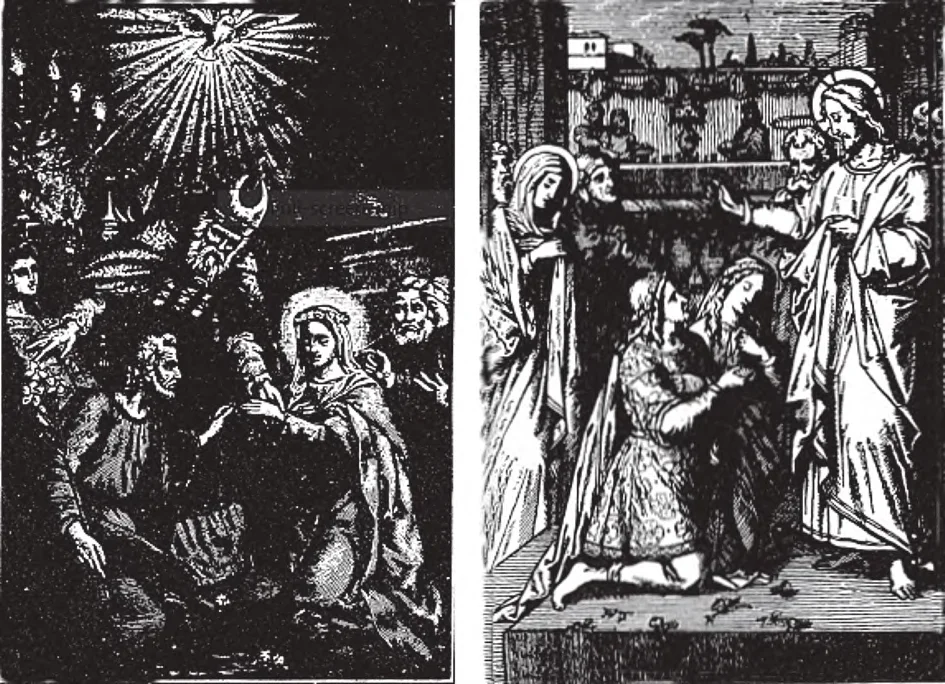

# 163. Sacrament of Matrimony

*1. Christian marriage unites one man and one woman for life. Every couple should imitate the peace and love that reigned in the home of the Blessed Virgin and St. Joseph, the models of Christian spouses.*

2. Christ raised marriage to the dignity of a sacrament. It was at the wedding feast of Cana that He worked His first miracle, thus honouring the occasion, and proclaiming the holiness of the married state.

**What is the sacrament of Matrimony?**

— Matrimony is the sacrament by which a baptised man and a baptised woman bind themselves for life in a lawful marriage, and receive the grace to discharge their duties.

1. God instituted matrimony in the Garden of Eden, when He created Adam and Eve. "Wherefore a man shall leave father and mother, and shall cleave to his wife, and they shall be two in one flesh. (Gen. 2:24). Before the coming of Christ, matrimony was a sacred contract, but not a sacrament. Our Lord raised matrimony to the dignity of a sacrament.

> At the marriage feast at Cana Christ worked His first miracle, thus manifesting the holiness of the married state. In the marriage contract, God has made a natural relation a means of grace for Christians. Our Lord instituted special sacraments for two states of life: the Priesthood and Matrimony; from this fact we may deduce the importance He attached to these states of life. By the sacrament of Matrimony, God grants the contracting parties grace to bear the difficulties of the married state, and to sanctify their common life for God's glory and the salvation of their souls.

2. The sacrament of matrimony consists in the mutual expression by both contracting parties of their free consent to take each other as husband and wife.

> This is the main act in the marriage ceremony. Without it, no marriage takes place. After this mutual consent is expressed, even if something should interrupt the rest of the ceremonies, the couple are validly married.

3. The ministers of the sacrament of matrimony are the contracting parties themselves, the groom and the bride. The priest is the witness authorized by the Church to be present and bless the union.

> This is because marriage is a contract and they who make the contract therefore must perform the marriage. In Baptism, the one who baptises, and in the other sacraments, the bishop or priest, is the minister, but in matrimony the bride and groom are the ministers.

**Why is every true marriage between a baptised man and a baptised woman a sacrament?**

— Every true marriage between a baptised man and a baptised woman is a sacrament, because Christ Himself has raised every marriage of this kind to the dignity of a sacrament.

1. A marriage between baptised non-Catholics, if contracted in a valid way, is always a sacrament, and is so recognized by the Church. It can be broken only by the death of one of the parties.

> The Church does not recognize the "marriage" of divorced baptised non-Catholics whose previous partners are still alive. Such unions are a sin, and not true marriage.

2. A marriage between two unbaptised persons, although not a sacrament, if contracted validly, is recognized valid by the Church, and is indissoluble. In the case of a marriage between two unbaptised persons, if one were later baptised in the Church, the marriage can be dissolved by the "Pauline privilege."

> The conditions are: if the unbaptized party refuses to live with the Catholic, or to dwell peacefully with the Catholic, the baptised one may have the marriage dissolved and be free to marry a Christian. This power of the Church is based on St. Paul: "If any brother has an unbelieving wife and she consents to live with him, let him not put her away. And if any woman has an unbelieving husband and he consents to live with her, let her not put away her husband. ...But if the unbeliever departs, let him depart. For a brother or sister is not under bondage in such cases" (1 Cor. 7:12-15).

**What is necessary to receive the sacrament of Matrimony worthily?**

— To receive the sacrament of Matrimony worthily, it is necessary to be in the state of grace, to know the duties of married life, and to obey the marriage laws of the Church.

1. The parties to a marriage should be in the state of grace, because matrimony is a sacrament of the living. They should receive Holy Communion at their Nuptial Mass, to implore God's blessing on their union.

> As matrimony is an important step, the contracting parties should make a general confession of their whole lives, as a fitting preparation for the responsibilities of their new state. If matrimony is received in a state of mortal sin, the sacrament is truly received, but the graces it brings are suspended.

2. The contracting parties should understand well the purpose of the state which they are about to enter. The first purpose of God in instituting matrimony was to populate the earth, and raise up souls who would fill heaven with saints. He said to Adam and Eve: "Increase and multiply and fill the earth" (Gen. 1:28).

> In matrimony, a man and his wife take part in the work of the Creator, giving life to a deathless soul. If the married would ponder this fact, they surely would not neglect their duties towards their children, to "rear them in the discipline and admonition of the Lord" (Eph. 6:4). "As the sapling is bent, so is the tree inclined." Even wild beasts take the utmost care of their young, but certain modern parents in the pursuit of amusements neglect the proper upbringing of their offspring.

**What are the chief effects of the sacrament of Matrimony?**

— The chief effects of the sacrament of Matrimony are:

1. An increase of sanctifying grace.

> Matrimony is a sacrament of the living and must be received in the state of grace. But it increases the sanctifying grace already possessed by the recipient, so that he becomes more pleasing to God.

2. The special help of God for husband and wife to love each other faithfully, to bear with each other's faults, and to bring up their children properly. This is the special sacramental grace obtained from the reception of the sacrament of Matrimony.

> Besides the aim of bringing children into the world, God also instituted marriage for the mutual support of husband and wife. Before Eve was created, God said: "It is not good for man to be alone; let Us make him a help like unto himself." (Gen. 2:18). In Matrimony grace is needed — and grace given — for the proper exercise of its many functions: the begetting and bringing up of children, mutual exchange of love, fidelity, and comfort, maintenance of the family. For all these and other duties of the married, Matrimony is an unending source of grace.

God created Eve's body from the body of Adam. This was to show the perfect equality and union that should exist between husband and wife, who by marriage become "two in one flesh."
