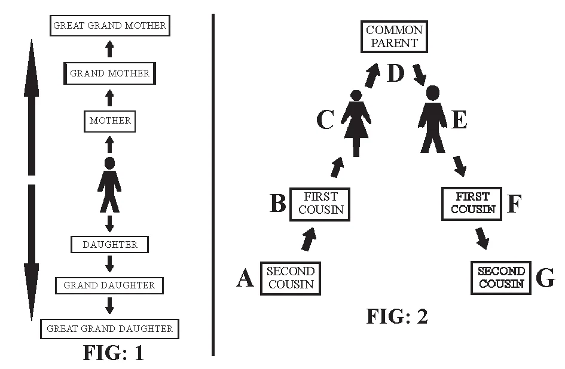

# 167. Impediments to Matrimony

This table shows the line, and degree of relationship in connection with the person to be married. In the direct line (Fig 1) None of these can marry each other. In the collateral line (Fig. 2) the diriment impediment is up to the 4th degree. The degrees of relationship are counted through the common parent. For instance C to E are 2 degrees. They cannot marry. A to F is the 5th degree and can therefore marry. C to G would be 4 degrees only and therefore cannot marry.

**What are impediments to matrimony?**

— Impediments to matrimony are obstacles to the validity or lawfulness of a marriage. 1. Impediments to matrimony are certain restrictions imposed by the law of God or of the Church which render a marriage contract invalid or unlawful, if such restrictions are violated when entering into the marriage. Such obstacles are called "impediments", since they obstruct sacramental sanctity.

> Whenever circumstances incompatible with the sacrament or contract of Matrimony exist, the Church has established impediments for reasons, such as, the general welfare of society, the protection of the sanctity of the matrimonial bond and the good of the offspring.

2. When impediments exist, the Church either completely forbids the administration of the sacrament, or requires a special matrimonial "dispensation" which assures that the dangers against the goods of marriage (the faith, the children, the sacraments) be reduced as far as possible. 3. There are two kinds of impediments: (a) Diriment (also called annulling or nullifying) impediments render an attempted marriage altogether null and void, invalid. Dispensations are only rarely granted for diriment impediments. Should an attempt at marriage be made without dispensation, there is no marriage.

> Such an invalid marriage must be either dissolved, or the impediment removed by a dispensation, and the marriage performed validly. If a marriage is dissolved, the contracting parties are free to marry other partners, if they so wish.

(b) Prohibitive (also called impedient or hindering) impediments render a marriage unlawful, illicit, but valid. In this case, the couple are married, though unlawfully. The marriage cannot be dissolved.

> Prohibitive impediments are easily dispensed, but good Catholics should prefer to comply with the wishes of the Church, which put these impediments for the good of her children.

**Which are the chief diriment impediments?**

— The chief diriment impediments are: 1. An existing marriage. One who is already married cannot marry again while the other party is still living. This impediment is never given a dispensation.

> Should someone, believing his spouse dead, contract another marriage, he must immediately leave the second spouse if the first be discovered living.

2. Coercion, In marriage, the contracting parties must give their consent freely. If undue stress is brought to bear on either party, so that he is forced to marry against his will, through abduction, violence, fear of bodily injury, of being disinherited, etc. the impediment is annulling, and there is no marriage.

> Parents and others who use coercion to force someone into a marriage against his will are grievously guilty before God. However, the marriage is valid if in spite of his dislike for the other party a person freely consents to marry, for other motives.

3. Lack of age. Boys before the completion of his sixteen years of age and girls before the completion of her fourteen years of age cannot enter into a valid marriage. As to the lawfulness of marriage one has to see the age fixed by the Episcopal Conference in a particular place or region.

> One has to consider as well as to whether such marriage is recognized by the civil law or celebrated in accordance with it. The Church severely prohibits marriages which do not obtain their civil effects or are in violation of the civil law especially if there is a sanction of penalty. Marriage of minors must have the parental consent and the permission of the Ordinary of the place.

4. Blood relationship or consanguinity.

> The Church forbids the marriage of close relatives, in order to enforce the respect due to blood relations, and to increase the number of families bound together in friendship, thus promoting union among men. The prohibition also aims to prevent the birth of physically and mentally defective children, often found resulting from such marriages. As foreseen by the current Church law, no marriage is possible between those related by consanguinity in all degrees of the direct line, whether ascending or descending, legitimate or natural. (see fig. A and B.)

5. Close affinity. This means relationship by marriage. The survivor cannot marry the blood relations of his dead spouse in any degree of the direct line. (see Fig 1)

6. Holy orders or Religious Profession. Men who have received major orders, monks and nuns who have taken a public perpetual vow of chastity even a simple vow (not solemn), cannot contract a valid marriage. 7. Disparity of worship. This is marriage between a Catholic and an unbaptised person. It is a diriment impediment which, without dispensation, renders an attempted marriage invalid.

> Examples of the unbaptized are: Mohammedans, Jews, Buddhists, Shintoists, infidels, etc.

8. Spiritual affinity. Without dispensation, a lay person who baptised another cannot marry that other, or sponsors in Baptism cannot marry their godchildren.

> This is no longer an impediment. Nevertheless on the account of tradition rooted in serious reasons, the parentage even spiritual must remain above carnal concupiscence. 9. Legal relationship. In the case of adoption, the impediment is always diriment in the direct line and in the collateral line up to second degree, for example; between brother and adopted sister. 10. Other impediments. Among other diriment impediments are crime, error, impotency, public propriety, abduction. These must be investigated by the priest.

**Which are the chief prohibitive impediments?**

— The chief prohibitive impediments are: 1. Forbidden times (see page 349). 2. Private vows The Ordinary of the place, the priest who is to assist the marriage and the confessor have the power to dispense in danger of death. As the public temporary vows, the religious is dispensed ipso jure by the indult of secularization given by the Superior General of the Institute of pontifical right, or by the Bishop of the place for the Institute of diocesan right. 3. Mixed religion. The marriage of a Catholic to a baptised non-Catholic is a prohibitive impediment. Being valid, the marriage cannot be dissolved. With a dispensation, all requirements of the Church are complied with, all illicitness is removed.

> Non-Catholics can marry validly among themselves, since the Church enforces its laws only among these under its care. If baptised non-Catholics marry validly, their marriage cannot be dissolved.
