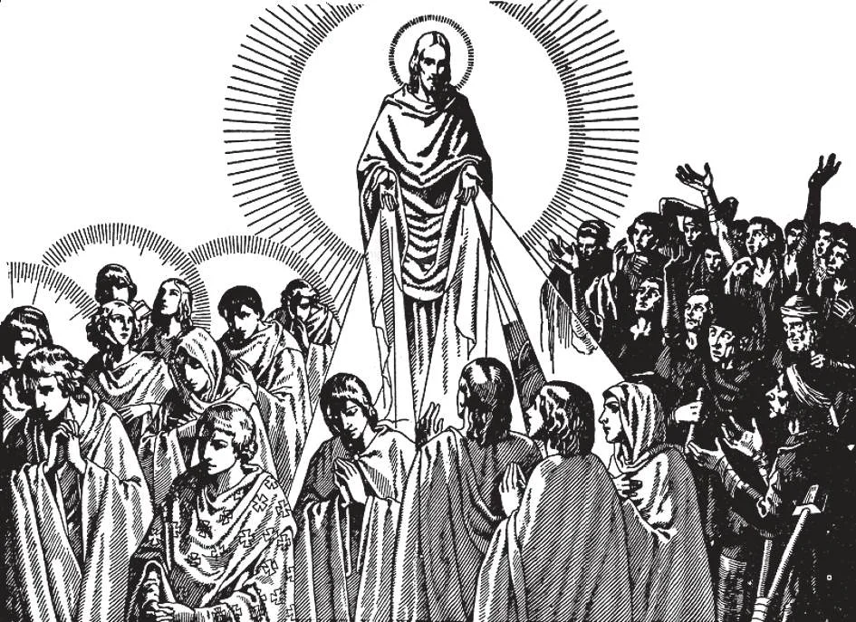

# 173. General Means of Perfection

Christ is the source of all graces. His merits give effect to the means of perfection which we use. This is why frequent confession and communion are especially helpful. They serve to keep us humble. If we continuously accuse ourselves, we are likely to form a delicate conscience. God will give us abundant graces, for confession and communion are sacraments and sources of grace.

**What are the general means of perfection?**

— After the observance of the Commandments of God and of the Church, the general means of perfection are: (a) faithfulness in small things; (b) self-control and self-denial; (c) order and regularity; (d) a habit of prayer; (e) a frequent recourse to solitude; (f) reading spiritual books and meditation; and (g) frequentation of the sacraments.

> These are general means of perfection, because they are suited to every one in every state and condition of life.

1. By faithfulness in small things, we obtain greater graces and avoid grave sins more easily. As in the natural order, so in the spiritual, great things come from apparently insignificant things. We should be careful to avoid venial sins in order to be saved from mortal sins.

> We should avoid hurting anyone, telling little lies, fault-finding, complaining, etc. "He that contemneth small things shall fall by little and little" (Ecclus. 19: 1). How small is a seed, yet it may grow up into a great tree! "He who is faithful in a very little thing is faithful also in much; and he who is unjust in a very little thing is unjust also in much" (Luke 16: 10). Our Lord promises to reward those who are thus faithful, saying: "Well done, good and faithful servant, because thou hast been faithful over a few things, I will set thee over many" (Matt. 25: 21).

2. Self-control and self-denial are acts of mortification: keeping down anger, and abstaining even from things which are permitted, but above all avoiding even the least yielding to what is forbidden. Self- control is the mark of the true Christian. If we deny ourselves some things which are permitted, we shall find it easier to avoid what is forbidden. Self-control gives us a strong will. Self-denial is the mark of the human being made to the likeness of God; a beast does not say "No" to himself.

> Christ said: "If anyone wishes to come after me, let him deny himself" (Mark 8: 34). One may deny oneself by avoiding what is not necessary, such as splendid dress, rich food, costly houses and cars, excessive entertainments, curiosity, etc., and above all by doing cheerfully whatever duties come, and accepting with resignation all trials.

3, We observe order and regularity by having a fixed time for everything: for rising, retiring, eating, work, recreation, etc.

> We should imitate the order that God has placed in the whole universe, regulating everything by law. Recreation is not against the practice of Christian perfection; it is a need that God wishes us to satisfy in the proper manner. It should however, not interfere with our duties, or take up too much time.

4. By prayer we shall avoid temptations and obtain blessings. We should especially make a habit of ejaculatory prayer.

> We should sanctify our every action by offering it to God. A good plan is to make a general offering every morning, with our morning prayers. In this way, all we do work, prayer, and even sleep becomes a prayer to God.

5. Solitude helps us grow in virtue. The noise and bustle of the world are distractions. We should once in a while imitate Our Lord and withdraw into solitude, to see our faults better, and go closer to God.

> Good Catholics spend a few days every year in a Mission or spiritual retreat, to resort to this valuable solitude.

6. We should have some regular spiritual reading and meditation even if for only ten minutes every day, as food for our souls.

> Meditation on the truths of faith, the life of Christ, and the lives of the saints, will inflame our hearts to great virtue.

7. God instituted the sacraments as effective means of grace. We should have recourse to the sacraments of Penance and Holy Eucharist as often as we reasonably can. Can we get more grace than from God Himself, coming in Holy Communion?

> If we could only see the effects of Confession and Holy Communion on the soul! But let us see with the eyes of faith, and exclaim with the Saints, "It is enough for me, O God, that Thou hast revealed it."

**What are the three principal degrees in self-denial?**

— They are: 1. A habitual disposition to lose all things, even life itself, and suffer all things rather than commit a mortal sin. This first degree of self-denial is necessary for all in order to be saved.

> Our Lord said, "Whosoever doth not carry his cross, and come after me, cannot be my disciple." Our ordinary cross, the cross of all mortals, is our human tendency to weakness and concupiscence, to fall into sin; against this tendency we must all do valiant battle, to acquire the first degree of perfection, of self-denial. Jesus exacts absolute self-denial in everything that is an obstacle to eternal salvation, life not excepted. "For he who would save his life (at the expense of what he owes God) will lose it; but he who loses his life for my sake and for the gospel's sake will save it" (Mark 8: 35).

2. A habitual disposition to lose and suffer all, rather than commit a deliberate venial sin. This second degree is a mark of affection towards God: we avoid even small faults because they displease Him.

> It is those in this second disposition that are very active in good works, trying to do all they can for the glory of God, out of love for God, and for their fellow men for God's sake. They set a good example to others by their good works, according to the words of Scripture: "A city set on a mountain cannot be hidden. So let your light shine before men in order that they may see your good works, and give glory to your Father in heaven" (Matt. 5: 14, 16). They are far from those hypocritical worldlings who do good works in order to obtain praise and honour; of these Our Lord, said, "Take heed not to practice your good before men in order to be seen by them; otherwise you shall have no reward with your Father in heaven" (Matt. 6: 1).

3. A habitual disposition to prefer being poor, forgotten, despised, and suffering, with Jesus on the Cross, in order to resemble Him more, as a proof of love, rather than rich, honoured and praised, full of delights and consolations. This third degree is the acme of perfection; it is sanctity.

> By this disposition, one becomes a fool for Christ's sake. Suppose that God has given you wealth, honours, talents, and all other worldly blessings, and assures you that with them all, enjoying them all, you can still reach the same place in heaven that you can without them. And yet, just to resemble Jesus, who was poor and despised and tortured, you joyfully choose to give up all your worldly blessings. Is this not folly in the eyes of the world? And yet it is of such people that Our Lord spoke: "The kingdom of heaven has been enduring violent assault, and the violent have been seizing it by force" (Matt. 11: 12).
