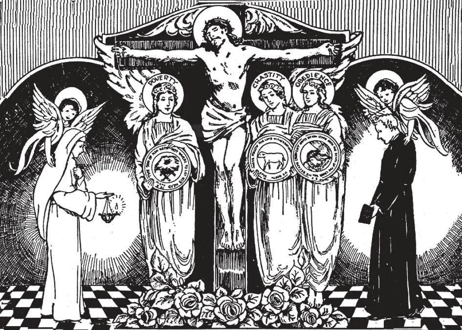

# 175. The Religious State

The illustration shows a young man and a young woman making their offerings to Jesus Crucified, to live in the religious state bound by the vows of poverty, chastity, and obedience.

**What is the religious state?**

— The religious state is a permanent way of community life, by which the faithful bind themselves to observe the evangelical counsels by vows of poverty, chastity, and obedience.

> The first religious order developed under St. Anthony the Great, who assembled around him in the desert a number of disciples living in separate cells. In the year 348 A. D. St. Pachomius gathered the anchorites under a common roof, and gave them a fixed rule; this was done on an island near the mouth of the Nile River in Egypt. From there the monastic life spread to Palestine and Syria, and thence to Asia Minor. In the 5th and 6th centuries, the monastic life was propagated in the West by St. Martin of Tours and St. Benedict.

1. The religious state is called the state of perfection because those who embrace it have the obligation, through faithfulness to their vows, of aiming at evangelical perfection.

> Those who are in the state of perfection are not necessarily all perfect; but they are expected to aim at perfection. Many people in the world are actually more holy than some in the religious state. It is however easier to strive after perfection in the religious state, where there are more aids and means than in the world with its distractions,

2. The call to the religious state is only an invitation: ''Not all can accept this teaching, but those to whom it has been given" (Matt. 19: 11).

> Members of religious orders or congregations are bound by the vows of poverty, chastity, and obedience. They are devoted to the exclusive service of God, "without distractions" (1 Cor. 7: 35).

**Who may be admitted into the religious state?**

— Any Catholic who is free from impediment, who has a right intention, and who is fitted to fulfil the duties of the religious life may be admitted into the religious state. 1. Impediments are: an existing marriage, lack of age (being less than 15 years of age), debts that must be paid or parents who need one's support.

> The mere opposition of parents who do not need one to support them is not an obstacle. Many Saints had to meet parental objections firmly before they could join religious orders.

2. If one has a firm desire and resolution to enter a religious community out of a good motive, to serve God better, he has the right intention for the religious state.

> One who may intend to join a religious congregation just to assure himself of a certain living, or in the hope of obtaining honours, has not the right intention.

3. Among the things needed to fulfil the duties of a religious life are; virtue, sufficient health, and adequate education for the work of the particular congregation to be joined.

> In general, the qualifications for a vocation are good will, good health and good sense.

**What steps should be taken in embracing the religious state?**

— Before any definite decision is made, a competent spiritual director should be consulted. 1. The zealous director of souls will give counsel regarding both spiritual and practical matters.

> One need not be strongly attracted to the religious state before deciding to embrace it. Feelings generally have nothing to do with the matter; what is most needed is will. Feelings pass, but day after day one needs a strong will to remain faithful to the vows taken in a religious congregation.

2. One should apply for admission into the religious community chosen. If one is refused and has to return home, he should not feel disgraced. The novitiate is precisely a trial, to find out one's qualifications.

> Sometimes, even if one is refused in a certain community, he should not think that he cannot become a religious. He should persevere and try another community. Several great Saints were at first refused, or even sent out, by the congregations they had at first chosen. Those who are sent out should recognize the trial as permitted by God, and offer it up to Him.

3. Once accepted and permitted to take the vows, all one has to do is to persevere to live according to the vows, and try day by day to attain to the highest perfection.

**How should parents behave if their child chooses a religious vocation?**

— Parents should give special praise and thanksgiving to God for the blessing, if their child chooses a religious vocation.

> Mrs. Colonel Vaughan, an English mother, prayed every day that all her children might become priests and nuns. In time, of her eight sons one became a cardinal, a second an archbishop, another a bishop, and three priests; all of her five daughters became Sisters.

1. As no one should be forced, so no one should be prevented from becoming either a Priest or a Sister. It is a sin for parents to oppose or prevent their child's religious vocation. It is stealing him from the service of God, Who has called him.

> Our Lord promised, "Everyone who has left house, or brothers, or sisters, or father, or mother, or wife, or children, or lands, for my name's sake, shall receive a hundredfold, and shall possess life everlasting" (Matt. 19: 29).

2. It is a great honour for a family to have even one of its members dedicated to the special service of God, as a priest, a brother or a nun. Christian parents should pray that God may give their child a religious vocation.

> Our Lord said: "If anyone comes to me and does not hate his father and mother, and wife and children, and brothers and sisters, yes, and even his own life, he cannot be my disciple" (Luke 14: 26). By this "hate" does not mean to break God's commandment of love; it means only to give up for God's sake, to detach oneself from what is good, in order to be fully attached to the one infinitely Perfect Good, God. "Every one of you who does not renounce all that he possesses, cannot be my disciple" (Luke 14: 33).

**What is the dowry?**

— The dowry is a sum of money required by congregations of women, payable upon the profession of a novice as member of the community. 1. The purpose of the dowry is to provide the person with some support should she leave the community at the end of her temporary vows, or after a dispensation, or upon dismissal.

> In case one leave the community, the dowry is returned to her intact. Meanwhile, during her stay in the community, the interest on the dowry is used for her maintenance.

2. Those who cannot give a dowry may be dispensed with the consent of the Holy See.

> Applicants who have completed their education are more easily dispensed.
