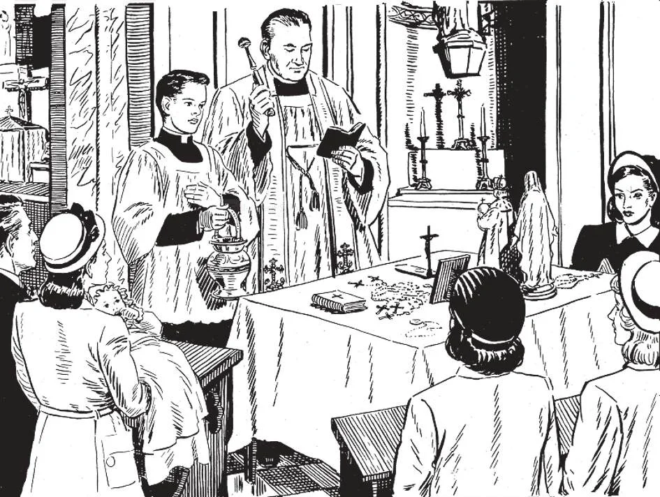

# 177. Sacramentals

The Church has blessings for persons, places, and things. A mother after childbirth-is blessed. Anybody may ask a priest to bless him. Houses and places of business, fields and crops, may be blessed. Devotional articles, such as medals, rosaries, crucifixes, images and holy pictures, may be blessed. In certain places if is a custom fo wear blessed dresses. All these blessings and objects blessed are sacramentals. We use them to obtain favours from God.

**What are sacramentals?**

— Sacramentals are holy things or actions of which the Church makes use to obtain for us from God, through its intercession, spiritual and temporal favours. 1. The term sacramental is applied both to the blessing or consecration given by the Church, and to the objects blessed or consecrated. Sacramentals are so called because of their resemblance to the sacraments. As in the sacraments, visible signs are used in the sacramentals, such as holy water, the sign of the cross, sacred oils, etc., together with a form of words.

> Whatever visible signs are used by the Church in the worship of God or the promotion of devotion are sacramentals. By these visible signs the benediction of Almighty God is invoked on persons, places, or things, through the intercessory prayer of Holy Mother Church. The prayers of the Church have great efficacy, for they are united to the prayers of Our Lord Jesus Christ and of all the saints.

2. Our Lord sanctioned the use of sacramentals; He blessed the loaves and fishes, the young children, and the Apostles before the Ascension. He gave the Apostles power over evil spirits, to cast them out and to heal all kinds of diseases.

> In the Old Testament we read of God's blessing our first parents, of Noe blessing his two sons, of Isaac blessing Jacob, of Jacob blessing his twelve sons, of Moses blessing the tribes of Israel. The Jewish priests blessed the people every day. "Thou shalt sprinkle me with hyssop, and I shall be cleansed" , (Ps. 1: 7). "I reprehend myself and do penance in dust and ashes" (Job 4: 2).

3, Prayers and ceremonies of the Church are also sacramentals, because they increase devotion in the worship of God.

> The Church makes use of ceremonies in imitation of the example of the Old Law, in which God Himself prescribed ceremonies; also in imitation of Our Lord, Who used His breath, made clay, used gestures, in working miracles, when He could have worked them as easily by a mere act of His will. Our Lord gave the Church power to instruct men, and therefore the implied power to do whatever is necessary to help out the purpose. Ceremonies without doubt add solemnity to religious acts.

**What are the chief kinds of sacramentals?**

— The chief kinds of sacramentals are: 1. Blessings given by priests and bishops. (a) Priests are authorized to give the blessings for sacramentals, with the exception of those especially reserved to the bishops.

> The laity can bless, but not in the name of the Church. Thus we have the custom of parents blessing their children when they leave the house, at the Angelus, or when they go on a journey. In these private blessings, the more pious the person giving the blessing, the greater its effect.

(b) Several acts of consecration are reserved solely to bishops, and may be performed only by priests with the necessary faculties. Examples are: the consecration of churches, altars, sacred vessels for Mass, and bells; and blessing of the holy oils (done on Holy Thursday in the cathedral church). Bells are an important accessory of the Holy Sacrifice of the Mass, a sign of prayer.

> These are the principal ceremonies at the blessing of a bell: The bell is raised, washed inside and out with water mixed with salt, and then dried carefully with towels. Psalms are recited, and prayers are said begging God to bless the faithful every time the bell rings. The exterior of the bell is anointed in seven places, with the holy oil for the sick. Then the inside is anointed in four places, with holy chrism. The bell is named in honour of and after one of the Saints. Then the censer containing lighted incense and myrrh is placed under the bell, to incense and perfume the interior. The elaborate ceremony ends with the singing of the Gospel describing Our Lord's visit to Mary and Martha.

2. Exorcisms against evil spirits, — The exorcism of possessed persons or things consists in having the minister of the Church command the evil spirit to depart from the person or thing. In modern times cases of possession are comparatively rare; this we can gratefully attribute to the blessings and grace of Christianity.

> Nevertheless such cases still occur; should we hear of any, let us notify the priest. Our Lord Himself commanded many devils to depart from possessed persons of His time.

3. Blessed objects of devotion. — Of these we may make mention of: holy oils, holy water, candles, ashes, palms, crosses and crucifixes, scapulars, medals, Agnus De is, rosaries, images, holy pictures, bells, and blessed dresses.

> All objects used in divine service, such as sacred vessels, linens, vestments, are specially blessed. Mother Church has special blessings for everything we use: for radios, automobiles, airplanes, fields, libraries, etc. We should ask the priest to bless everything we use and have. As St. Paul said: "Whether you eat or drink, or do anything else, do all for the glory of God" (1 Cor. 10: 31). By sacramental blessings, we consecrate to God all we are and have.

**In what does the blessing for persons or places consist?**

— The blessing for persons or places consists in this: that the minister of the Church invokes the divine benediction upon the person or place concerned.

> The divine blessing for persons is to be understood as different from divine grace; this is why sacramentals are distinct from sacraments. The divine blessing averts earthly ills and promotes temporal welfare; whereas the divine grace beautifies the soul. One is chiefly temporal, the other spiritual, in effect.

1. Blessings given for persons. Of these the most common are the blessing at the end of Mass and other occasions, the blessing for communicants, the nuptial blessing, the blessing for mothers before and after childbirth, the blessing for the sick, the last blessing for the dying, the blessing of the remains of the dead, the consecration of kings, abbots, monks and nuns.

> The consecration of kings, abbots, monks, and nuns, consists in having them formally set apart by the Church through its minister so as to be dedicated to its special service. The consecration of bishops and the ordination of priests is a sacrament.

The blessing of mothers and their infants was a custom dating from the Old Testament; Mary, the Mother of Our Lord, herself observed this custom, More of our modern mothers should imitate her, imploring God's blessing. 2. Blessings given for places. Among the most common places blessed are: churches, chapels, altars, cemeteries, dwelling-houses, places of business, farms, etc.
