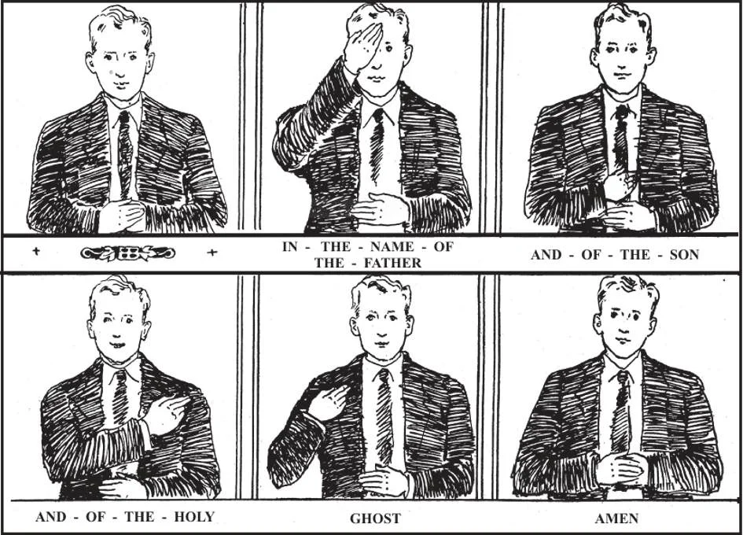

# 182. The Sign of the Cross

To make the sign of the cross (1) join the hands in preparation, putting yourself in the presence of God. (2) Lay the left hand on the breast, and with the extended fingers of the right hand touch the forehead, saying, "In the Name of the Father."Touch the breast, saying; "And of the Son." (4) Touch the left shoulder, saying: "And of the Holy . . then (5) the right shoulder saying; "Ghost." Finally, (6) join the hands and say: "Amen."

**How do we usually begin and end our prayers?**

—We usually begin and end our prayers with the sign of the cross.

> "God forbid that I should glory, save in the cross of Our Lord Jesus Christ, through whom the world is crucified to me, and I to the world" (Gal. 6:14).

1. Nothing in the Church is begun, carried out, or completed, without the sign of the cross. It is used in innumerable blessings and ceremonials of the Church. At Mass alone it is used fifty-one times.

> The sign of the cross is the most common way of confessing our faith. By it we can know Catholics from non-Catholics. It is believed that it had its origin in apostolic times.

2. We make the sign of the cross by touching with the outstretched fingers of the right hand the forehead, then the breast, and then the left and right shoulders, saying, "In the name of the Father, and of the Son, and of the Holy Ghost. Amen."

> The sign should be made slowly, with great respect, as it is the sign of our salvation. The left hand should be laid across the breast.

3, Another way of making the sign of the cross is used at the two Gospels of the Mass. Then small signs of the cross are made with the thumb of the right hand on the forehead, on the lips, and on the breast. This was the sign the early Christians used under persecution, to avoid detection.

> The sign on the forehead is intended to show our will to carry out Our Lord's teaching. The sign on the lips is intended to express our wish to profess God. And the sign on the breast is a symbol of the love for Him that fills our heart.

4. In countries under Spanish and Portuguese influence, this sign of the cross is the one used:

> With the thumb of the right hand a small cross is made on the forehead, meanwhile saying: "By the sign of the holy Cross"; then a small cross is made on the lips, while saying: "from our enemies"; then a small cross is made on the breast, while saying: "deliver us, O Thou Lord our God"; and finally with index and middle fingers a large sign of the cross is made, touching forehead, breast, and shoulders, saying: "In the name of the Father, and of the Son, and of the Holy Ghost " All these words are from the Roman Missal.

5. We should make the sign of the cross especially upon arising in the morning and retiring at night; before and after our prayers, meals and principal actions; and whenever we are tempted or in danger. Whenever we are blessed, at Mass, at Benediction, or elsewhere, we should make it.

> It is customary to ask for a priest's blessing when he visits our home. We should then kneel and make the sign of the cross. An indulgence is attached to the sign of the cross. Every time we make it we gain 100 days indulgence; if made with holy water, 300 days indulgence.

**Why do we make the sign of the cross?**

— We make the sign of the cross to express two important mysteries of the Christian religion, the Blessed Trinity and the Redemption. 1. When we say, "In the name," we express the truth that there is only one God; when we say, "of the Father, and of the Son, and of the Holy Ghost," we express the truth that there are three distinct Persons in God. And when we make the form of the cross on ourselves, we express the truth that the Son of God, made man, redeemed us by His death on the cross.

> By this sign we confess that we belong to the religion of the crucified Saviour. By it a Catholic makes a clear confession of faith; by it he is known.

2. By means of the sign of the cross we obtain God's blessing and protection from dangers both spiritual and physical.

> Of Itself the sign of the cross is a blessing, besides a prayer for God's blessing. Since it is a sign of God and His crucified Son, the devil fears it, and it is a shield against temptation. The saints used to make the sign of the cross when evil thoughts assailed them; many Catholics today follow their example and we should do the same. In doing so, we put a seal on our foreheads that proclaims, "I belong to Christ, the King of all."

3. The Church holds the sign of the cross in great reverence and honour. All our churches, schools and other institutions, altars, graves, and sacred vestments bear this sign. Churches are usually built in the form of the cross.

> St. John Damascene said: "The sign of the Cross is a seal, at sight of which the destroying angel passes on, and does us no harm." It is the Christian counterpart of the blood of the lamb marking the door posts of the Israelites. It is the sign of Christ, the symbol of our redemption.

**What are the prayers that every Catholic should know by heart?**

— The prayers that every Catholic should know by heart are: the Our Father, the Hail Mary, the Apostles' Creed, the *Confiteor*, the Glory be to the Father, and the acts of faith, hope, charity, and contrition.

> In addition, every Catholic should know the Angelus, the Hail Holy Queen, grace before and after meals; a prayer to the guardian angel, one to St. Joseph, and Our Lady's *Mem or are*.

1. The *Gloria Patri* (Glory be to the Father) is a prayer in honour of the Blessed Trinity. It is a prayer of praise, as well as an act of faith in the mystery of the Trinity.

> We should repeat the Glory be to the Father every time we receive a benefit from God, and in times of suffering and temptation. We should repeat it often, in acknowledgement of the chief mystery of the Catholic Faith, of the Blessed Trinity.

2. The acts of faith, hope, and charity are special prayers said in adoration of God. The act of contrition also honours God, because in asking for the pardon of sins, we acknowledge His power to condemn and to save. The *Confiteor* is the long form of the act of contrition, and is used at Mass.

> Even when we are in the midst of work, we can often send up to God the adoration we feel by making very short acts of faith, hope, charity, and contrition. We might say, for instance, "Dear God, I believe in Thee; I hope in Thee; I love Thee with all my heart. I am sorry that I have offended Thee, because Thou art so good," For other occasions, we should also know by heart the longer forms.

3. By the grace before and after meals, we ask God's blessing on our food, and we thank Him for having given it to us.

> One would think that everybody would be eager to give God this act of courtesy. Sad to say, many even among Catholics neglect to thank God for their daily food.
