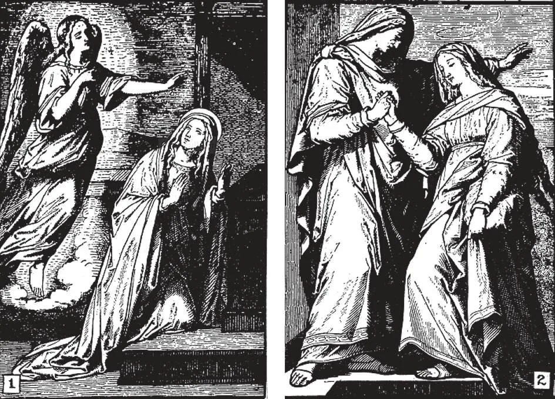

# 184. Prayers to Mary

1. "The angel Gabriel was sent from God to a 2. Mary went to visit her cousin Elizabeth: town of Galilee, called Nazareth, to a virgin "And Elizabeth was filled with the Holy Spirit, betrothed to a man named Joseph, of the house of and cried out with a loud voice, saying. Blessed David, and the virgin's name was Mary. And he art thou among women and blessed is the fruit of said. Hail, full of grace, the Lord is with thee; thy womb" (Luke 1: 41-42). When we pray the blessed art thou among women" (Luke 1: 27- "Hail Mary," these two beautiful events come to 28). mind.

**Which are the principal prayers to the Blessed Virgin?**

— The principal prayers to the Blessed Virgin are: the ''Hail Mary," the "Hail Holy Queen", the *Angelus*, the Rosary, and the Litany of the Blessed Virgin or Litany of Loretto.

**What is the first part of the Hail Mary?**

— The first part of the Hail Mary is: "Hail Mary, full of grace, the Lord is with thee; blessed art thou among women, and blessed is the fruit of thy womb, Jesus." 1. The first part of the Hail Mary is a prayer of praise. It is composed of (a) the words of the Archangel Gabriel to Mary; and (b) the words of St. Elizabeth to Mary. Because the prayer begins with the words of the Angel, the "Hail Mary" is in English termed the Angelical Salutation. It is called *Ave Maria* in Latin.

> The angel Gabriel said: "Hail, full of grace, the Lord is with thee; blessed art thou among women" (Luke 1: 28). The words of St. Elizabeth are "Blessed art thou among women, and blessed is the fruit of thy womb" (Luke 1: 42).

2. The first two words, "Hail Mary" mean: I salute thee. By this we testify our reverence for our Blessed Mother and congratulate her on her privileges.

> "He has regarded the loveliness of his handmaid; for behold, from henceforth all generations shall call me blessed" (Luke 1: 48).

3. ''Full of grace'' means that Mary is the most holy and exalted of all creatures, possessed of all graces and gifts of God.

> She is the only one of all mortals that was conceived free from all stain of original sin. This is why we speak of Mary's Immaculate Conception. "Thou art all fair, and there is not a spot in thee" (Cant. 4: 7).

4. "The Lord is with thee" signifies that although all good persons are united with God, Mary in a special manner is more closely united with Him in love and power.

> Mary was united with God even on earth in the closest union; she was like a tabernacle containing God, except that while the tabernacle only shelters Our Lord, her spirit and His were one, and even her blood and His were one.

5. ''Blessed art thou among women" means that Mary has been privileged among all women, being the Mother of the Son of God. She is therefore higher in holiness, grace, and glory than any other woman.

> Mary was blessed because the Son born of her brought her blessings. She is blessed as one who cooperated in the salvation of men; even on earth, she received the homage of angels and men.

6. ''And blessed is the fruit of thy womb Jesus" means that Mary is blessed because of her Son. All her glory and power come from Him, God who became her Son.

> Mary is like a tree that bears good fruit; can any fruit be better than the Son of God? So touched was a woman by the holiness of that Son that she raised up her voice in praise: "Blessed is the womb that bore thee, and the breasts that nursed thee" (Luke 11: 27).

**What is the second part of the Hail Mary?**

— The second part of the Hail Mary is: "Holy Mary, Mother of God, pray for us sinners now and at the hour of our death." 1. The second part of the Hail Mary is a prayer of petition and was composed by the Church. In it we entreat Mary's intercession.

> Mary, of all human beings, shared most in the bitter sufferings of her Son for the salvation of men. She cannot be deaf to our petitions to help us attain eternal salvation. She knows what her Son suffered for us.

2. "Holy Mary, Mother of God pray for us sinners." We call ourselves sinners, for no man, except the Blessed Virgin, can be free from all sin. Knowing what power a mother, and especially the Mother of God, has over her Son, we beg Mary to pray for us.

> There is no sinner fallen so low that she will refuse to entreat mercy for him if he is contrite. Mary loves sinners as Jesus, loves them, and rejoices when they return to God.

3. In the words: "Now and at the hour of our death" we ask of Mary to obtain for us during life the gift of the love of God, and at the hour of death that help we shall need to enable us to save our soul.

> The hour of death is the time above all times when we need help most. At that hour we may probably be racked by physical suffering which tempts us to forget God; we may very likely be attacked by the devil, by temptation when we are weakest. We may be overwhelmed by a fear of God. And so we plead with Mary to obtain for us the graces we shall need.

**What is the "Hail Holy Queen?"**

— The Hail Holy Queen or *Salve Regina* is one of the most common prayers to Mary, composed in the year 100 by Blessed Herman.

> St. Bernard added the words at the end: "O clement, O loving, O sweet Virgin Mary!"

**What is the "**

Angelus

**?"**

— The *Angelus* is a prayer recited morning, noon, and evening, in honour of Mary and of the mystery of the Incarnation. 1. This prayer is called the *Angelus*, because its first word in Latin is '' *Angelus* " meaning Angel. In the Easter season, the *Regina Coeli* is substituted for the *Angelus*; both prayers are richly indulgenced.

> The custom of ringing the bell for the *Angelus* dates from the eleventh century, during the Crusades, to admonish the faithful to pray for the victory of the crusaders.

2. For the *Angelus*, the bell is rung thrice three separate times, with an interval of about half a minute each, while the verse and an *Ave Maria* are being said. Then, for the longer prayer, the bell is rung continuously. The *Angelus* is supposed to be recited kneeling except from Saturday noon to Sunday evening inclusive; but this is not of obligation for gaining the indulgence.

> The words of the Angelus, with explanations, are as follows: (1) The Angel of the Lord (Gabriel the Archangel) declared unto Mary (announced to Mary the birth of the Son of God). And she conceived of the Holy Ghost (and she became, by the grace of the Holy Ghost, the Mother of Jesus). Behold the handmaid of the Lord. Be it done unto me according to thy word. (By the consent Mary gave in these words, God the Son came from heaven and became incarnate in her womb). And the Word (God the Son) was made flesh (became man). And dwelt among us (and lived on earth for thirty-three years, our Saviour and Lord).
