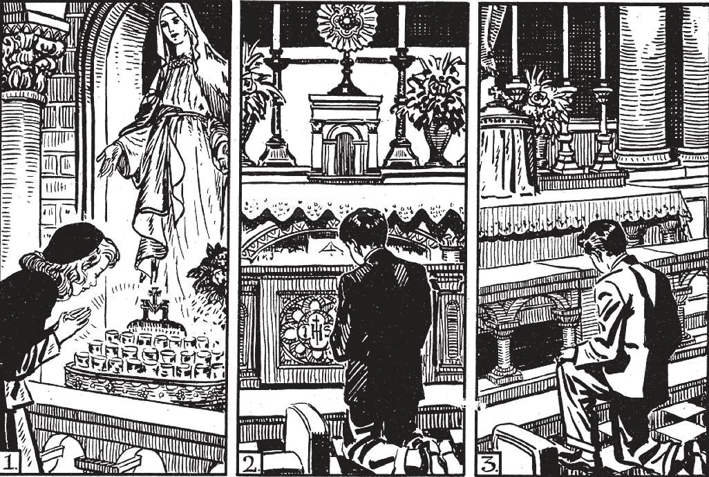

# 186. Religious Practices

1. When we pass before an image of Our Lord, our Lady, or the Saints, we should show our reverence by bowing before it. 2. Upon entering or leaving the place where the Blessed Sacrament is exposed, or while Holy Communion is being distributed, we should make a double genuflection, that is, kneel on both knees and bow, in adoration of God, there before us. 3. When we enter or leave the church, or pass before the tabernacle where the Blessed Sacrament is reserved, we should genuflect on the right knee as an act of adoration to our hidden Lord. In genuflecting, the knee should touch the floor, and not merely be bent.

**What kinds of religious practices are observed in the Church?**

— There are two kinds of religious practices observed in the Church: the ordinary and the extraordinary. 1. The ordinary practices take place at regularly appointed times. They are the regular services held in the parish church on Sundays and holydays, and during weekdays, both in the morning and in the afternoon.

> On Sundays and holy days, in all parish churches one or more Masses are said, according to the number of priests and the size of the parish. At each of those Masses a sermon is preached. In many parishes, there are special services, such as the recital of the Rosary, or benediction of the Blessed Sacrament. On weekdays one or more Masses are said. Especially in May, June, and October, there is usually exposition of the Blessed Sacrament and the recital of the Rosary. Masses are said in the afternoon with the approval of the bishop.

2. The extraordinary or special devotions take place only on special occasions. Some of them are: Benediction, exposition of the Blessed Sacrament, the Way of the Cross, processions, novenas, missions and retreats, congresses, devotion to the Sacred Heart, etc.

**In what does the devotion to the Sacred Heart of Jesus consist?**

— The devotion to the Sacred Heart of Jesus consists in acts of love and reparation for the many offences committed against Him. 1. Since Jesus Christ is both God and man. His humanity being inseparable from His divinity, is worthy of adoration. This adoration is not aimed at the human nature, but at the divine person of Christ. In a similar manner, when we kiss our mother's

Every time the Blessed Sacrament is solemnly exposed, we should spend some time in prayer before it. At the end of the exposition the Benediction with the Blessed Sacrament is given. At the moment of the benediction, we should look at the Sacred Host, and say: "My Lord and My God", then bow down in adoration and make the sign of the Cross.

hand, we do not pay our respect to her flesh, but to her as our parent.

> Although devotion to the Sacred Heart of Jesus was known in ancient times, it became widespread as a result of the revelations Our Lord made to St. Margaret Mary Alacoque, towards the end of the seventeenth century. Through her, He made twelve promises to those who should practice the devotion to His Sacred Heart.

2. Among the twelve promises of Our Lord in favour of the devotees of His Heart is: "I promise in the excess of the mercy of My Heart, that its all-powerful love will grant to all those who receive communion on the first Friday of every month for nine consecutive months the grace of final repentance, and that they shall not die under My displeasure, nor without the sacraments, and that My Heart shall be their secure refuge at that last hour."

> The First Friday devotion arose from this promise of Our Lord, especially the devotion of the nine First Fridays. When we venerate the Sacred Heart, we should remember His great love for us, flowing out of that Heart, and try to make some return for that love.

3. In order to make this devotion of the nine First Fridays well, we should make a very good confession and receive Holy Communion, offering all that we are and all that we have to the Sacred Heart of Jesus. Everybody should make this devotion at least once, for himself. The promise is made by Our Lord Jesus Christ, and He always carries out His promises.

> The whole month of June is consecrated to the Sacred Heart. In many churches every day in June, the Rosary is recited and the Litany of the Sacred Heart said. The devotion to the Sacred Heart has brought about precious results. It has encouraged the practice of frequent Communion. No Catholic home should be without an image of the Sacred Heart prominently displayed.

Other devotions to Our Lord Jesus Christ are: those to His Passion, to the Holy Name, to the Five Wounds, and to the Precious Blood.
