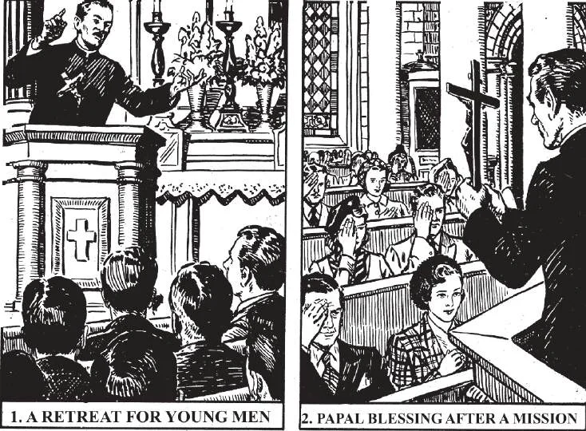

# 188. Other Practices of Devotion

During the sermons of a mission or retreat, we should listen attentively avoiding all kinds of noise such as coughing, fidgeting, whispering, etc. We should remember the motive for the mission, and act accordingly. At the end of a mission or retreat, the Papal blessing is given, by which all who attended the exercises gain a plenary indulgence. As the priest gives the blessing, the people should kneel and make the sign of the cross (2).

**What is the Way of the Cross?**

— The Way of the Cross is a kind of pilgrimage, in which we visit in our mind the most important scenes of Our Lord's Passion in Jerusalem.

> Tradition says that the Blessed Virgin originated this devotion by often walking in the steps of her Son to Calvary, pausing at the spots marked by some special incident. This devotion is called Via Crucis, Way of the Cross, or Stations of the Cross.

1. The Way of the Cross is made by stopping at fourteen stations indicating the path followed by Our Lord, bearing His cross, from the palace of Pilate to Calvary.

> The fourteen stations are marked by fourteen wooden crosses. Pictures and inscriptions are usually added, but the indulgences of the devotion are attached to the crosses.

2. In making the Way of the Cross, we visit the stations consecutively pausing at each one, and meditating on the scene which is represented by the station.

> It is advisable and usual to go from station to station in the church. It is enough to meditate on the Passion, without saying any set prayers, although it is usual to recite one Our Father, one Hail Mary, and one Glory he to the Father at each station. A favourite ejaculation said at the beginning of the mediation before each station is: "We adore Thee, O Christ, and we bless Thee. Because by Thy holy cross Thou hast redeemed the world."

3. The Way of the Cross is a most profitable devotion. Meditation on the Passion of Our Lord leads us into contrition and the practice of virtue. A plenary indulgence is attached to this devotion.

> If we are prevented by sickness, long distance from the church, or any other hindrance of sufficient nature, from making the way of the cross, we can gain the indulgence by reciting twenty times the Our Father, Hail Mary, and Glory be to the Father, holding meanwhile a crucifix properly blessed for the stations.

> The very sick gain the indulgence by just holding the crucifix and making an act of contrition, or a sign of sorrow.

**What are novenas?**

— Novenas are public or private devotions carried on for the space of nine days in honour of God or the saints or angels. 1. The first novena of the Church was held by the Apostles and disciples who with our Blessed Lady awaited the coming of the Holy Ghost after the Ascension. Following the example of the Apostles, the faithful make novenas directly to God or to Him through one of the saints, to obtain spiritual or temporal favours.

> Any suitable prayers may be used in making a novena. The best way, however, is to hear mass and receive Holy Communion daily as practices for the novena.

2. Novenas are commonly said in preparation. for a specified feast. They usually end with a general communion of those who took part.

> The novenas most often made are: for Pentecost, for Christmas, for *Corpus Christi*, for Christ the King, for the feast of Our Lady of the Most Holy Rosary, for the Immaculate Conception, for St. Joseph, for the Guardian Angels, for the patron saint of the community. The "Novena of Grace" in honour of St. Francis Xavier's canonization has been productive of innumerable and extraordinary favours. It is said from March 3 to March 11,

**What is a Mission?**

— A Mission is a series of sermons and other spiritual exercises conducted under the leadership of competent priest or priests for the purpose of renewing fervour in the spiritual life of a community.

> Missions effect an immense amount of good. Because of their rare occurrence, they make a great impression on the people. Missions are seasons of grace for a community or parish: sinners are converted and the just are incited to progress in virtue. This is because they are a sort of general check-up of the spiritual status of the community.

1. In most places Missions are held at least once a year. They usually last a week, and end in a general communion of all who have participated.

> The regular program of a Mission includes daily sermons, meditation, and congregational singing.

2. During the Mission we should, as far as possible, withdraw ourselves from worldly amusements and spend as much time as we can with Our Lord, or meditating on spiritual things, especially on the topics brought up in the sermons.

> Again and again we should think over the words of Holy Scripture; "For what does it profit a man, if he gain the whole world, but suffer the loss of his own soul?"

3. The Mission serves to remind us that our destiny is heaven, and that therefore we should not be too much immersed in earthly distractions to the exclusion of our spiritual progress.

> It serves to remind us that worldly honours and riches and pleasures are nothing, and that the only true riches are the love and service of God alone.

4. During the Mission we should examine ourselves very carefully, including our conduct during the whole year, to see where we can make improvements, and where they are most needed. Then we should make a good confession, with a firm determination to amend, and serve God better.

> The Mission is a good chance for those who are bashful about confessing to their parish priest, who knows them. During the Mission several priests from elsewhere are usually present to hear confessions. Many confess more freely to a priest who is a stranger than to their parish priest or curates.

**What are retreats?**

— Retreats are a series of spiritual exercises and religious services held in convents, schools, and similar institutions, for a certain class of persons, whether priests, nuns, schoolchildren, a laymen, or laywomen. 1. The retreat is similar to a Mission, and has about the same effect. It is better than a Mission in the sense that the retreat master can particularize his discourses, as those present are supposed to belong to only one class of individuals having similar tastes and similar problems.

> It is also better than a mission in as much as it can lead to more devotion; complete silence during the course of the retreat is usually required. Those taking part leave for the period all occupations and worldly amusements.

2. Many schools and religious houses organize special retreats for the accommodation of those in the world who wish to go in retirement for their annual spiritual exercises.
