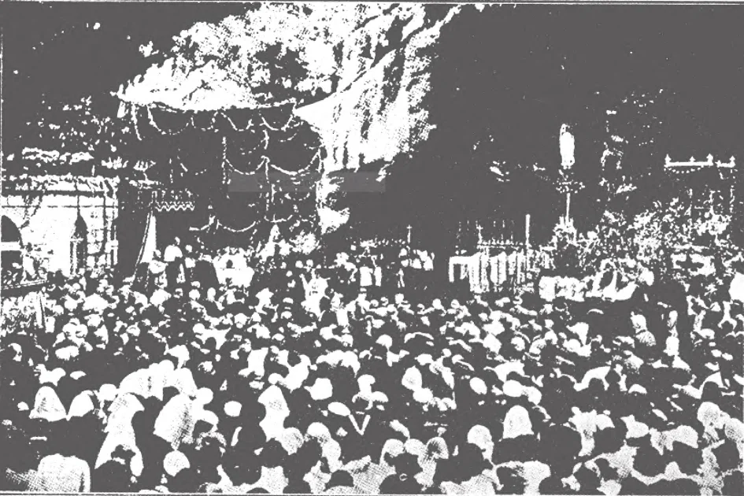

# 189. Processions and Pilgrimages

One of the most famous places of pilgrimage is the Grotto of Our Lady of Lourdes, France. In 1858, the Blessed Virgin, proclaiming herself the Immaculate Conception, appeared there to a little peasant girl named Bernadette. From then on a spring has flowed out of the grotto, the water of which has been the means of curing hundreds of thousands. Pilgrims from the remotest parts of the world going to the shrine number about a million a year. The cures are certified by a bureau of eminent physicians, most of whom are non-Catholic. At Lourdes physical cures are not the only ones made; there are also many conversions.

**What is the purpose of processions?**

— Processions are held to set before us forcibly events in the life of Christ and doctrines of our faith, or to implore the mercy of God, or as a public act of thanksgiving. 1. Processions are held in honour of God or the Saints. It is by way of an open profession of faith that Mother Church has instituted processions like those of *Corpus Christi*, Rogation Days, Christ the King, etc. Processions are also held in times of calamity, to offer united prayer to God.

> Our Lord promised that wherever two or three are gathered in His name, He would be in the midst of them. He also required us to profess Him publicly before our fellow men.

2. In a procession, a cross is always carried in front. Banners or standards are also carried, and candles are borne.

> Images are usually carried, except when the Blessed Sacrament is taken in procession. In this latter case, it is the practice not to carry images. The prayers recited or hymns sung vary according to the object of the procession.

**Which are the regularly held processions?**

— The processions regularly held are: 1. The procession of the feast of the Purification, February 2. This feast, celebrated in honour of Our Lady's Purification, is also called Candlemas; on this day candles are blessed.

> The wax tapers carried during the procession symbolize Christ, the Light of the World, whom Holy Simeon called "a light of revelation to the Gentiles" (Luke 2: 32).

2. The procession of Palm Sunday. Blessed palms are carried, in memory of Our Lord's triumphal entry into Jerusalem.

> The priest knocks three times at the door of the church with the processional cross. Then the door is opened, to show that only through trials can we enter heaven.

3. The processions on Rogation days. These take place on the three days preceding the Ascension.

> They are for the purpose of asking blessings on the fields and crops. The Litany of all the Saints is chanted.

4. The procession of *Corpus Christi*, the Thursday after Trinity Sunday. It is most solemn, the Blessed Sacrament being carried and placed on two altars specially built for the purpose, for the adoration of the people.

> The feast of *Corpus Christi* (Body of Christ) was instituted about six centuries ago as a special memorial of the love of Christ for us. In the 13th century, Pope Urban IV instituted the procession of *Corpus Christi* in order to increase faith in the Real Presence of Christ in the Blessed Sacrament. The procession is generally ended with a solemn thanksgiving, the *Te Deum*. The feast of *Corpus Christi* is a holy day of obligation in many countries. Where the procession is not made on Thursday, it is transferred to the following Sunday.

5. The procession of Christ the King, celebrated on the last Sunday in October. In this, the Blessed Sacrament is carried.

> When the Blessed Sacrament is carried in procession, it is taken in a monstrance under a canopy, and incense is burnt. It is the custom to ask important civil officials who are good practical Catholics to hold the posts of the canopy during the procession.

**What are pilgrimages?**

— Pilgrimages are journeys made to holy places with the object of giving honour to God or His saints, and as a means of devotion and penance. 1. Pilgrimages were made in the Old Law. On the three principal feasts of the year, all the men had to go up to the Temple at Jerusalem. Thus we read in the Gospel how Joseph and Mary took Jesus to the Temple when He was twelve years old.

> "And his parents were wont to go every year to Jerusalem, at the feast of the Passover" (Luke 2:41).

2. The chief places of pilgrimage are: the Holy Land where Our Lord lived and died, Vatican City with its sacred places, shrines of the Blessed Virgin, and spots sacred to the Apostles. Those on a pilgrimage must not act like curious tourists simply bent on sightseeing. They should remember their purpose of honouring God, and act accordingly, otherwise their visit to holy places loses its merit.

> In the Holy Land, the chief places of pilgrimage are the scene of the Crucifixion and the Holy Sepulchre on Mount Calvary in Jerusalem, the place of the Nativity at Bethlehem, and the place of the Annunciation at Nazareth.

3. In Rome, City of the Prince of the Apostles, the principal places visited are the four basilicas: St. Peter's, where the body of Peter rests; St. Paul's outside the walls, where one can pray at the tomb of Paul; St. John Lateran, and St. Mary Major.

> A pilgrimage is usually undertaken to obtain graces, in thanksgiving for graces received, or in fulfilment of a vow. Pilgrimages are made to Rome every jubilee year. God shows His approval of pilgrimages by granting many spiritual and temporal favours to the participants.

4. Shrines of pilgrimage in honour of the Blessed Virgin are scattered all over the world, and are so numerous as to be almost countless. But the most famous are: Lourdes in France, Loretto in Italy, Zaragoza in Spain, Czestochowa in Poland, Fatima in Portugal, Guadalupe in Mexico, Lujan in Argentina, etc. (a) At Lourdes every year a million pilgrims offer their love to Mary Immaculate, and profit by her intercession; many miraculous cures have taken place there.

> For other shrines of Saints we may also mention St. Becket's at Canterbury, St. James at Compostella, and St. Patrick's at Donegal.

(b) Since the year 1295 the holy house of Nazareth, dwelling place of the Blessed Virgin, has been located in Loretto, Italy.

> This humble home was seen by St. Louis about forty years before in Nazareth itself; then it appeared in various places in Europe until it finally made its appearance in Loretto. Since the house appeared in the various places without the help of human beings, its location in Loretto is a miracle. A great church has been built over the house, and the spot is a very famous place of pilgrimage.

5. In Canada we have Beaupre, where pilgrims seek blessings from St. Anne.

> Famous shrines in the United States are: Mother Cabrini Chapel, New York City; Shrine of the Immaculate Conception, Washington, D. C.; Shrine of the Little Flower, Royal Oak, Michigan; Our Lady of Prompt Succor, New Orleans.

In India there are the shrines of St. Thomas the Apostle and St. Francis Xavier.
