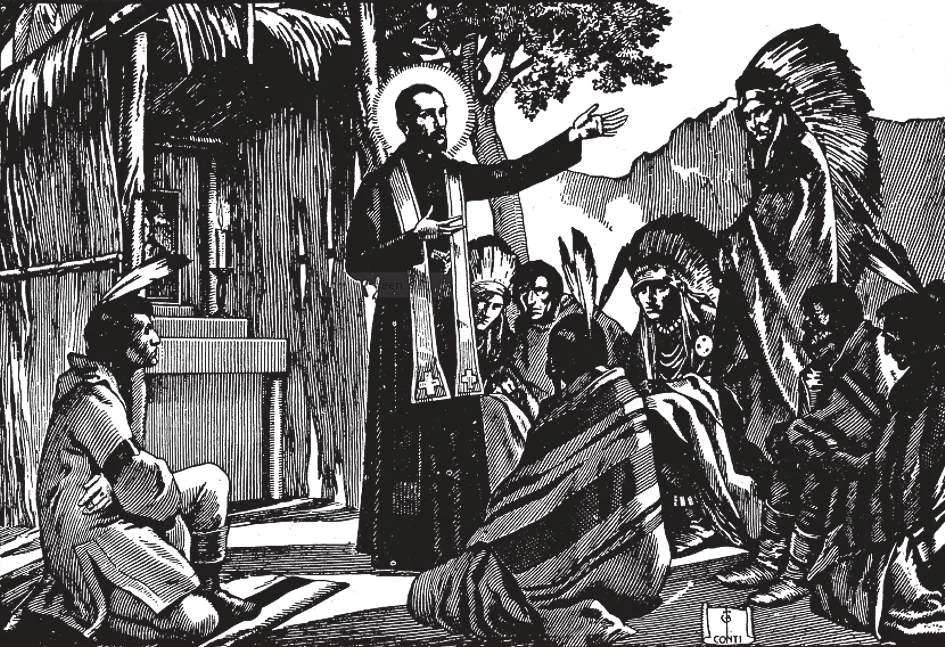

# 191. Propagation of the Faith

*It is not possible for all to go to distant missions to win souls for Christ, but one can always help by prayers and alms. Those who thus assist missionaries in their apostolic labors will be rewarded. Holy Scripture says: "Equal shall be the portion of him that went down to battle and of him that abode at the baggage; and they shall divide alike" (1 Kings 30:24).*

**How can we help the missions?**

— We can help the missions:

1. By praying for the missions home and foreign, and for missionaries that they may fulfil the command of Christ: "Go, therefore, and make disciples of all nations."

> We should include in our particular petitions each day a fervent prayer for missions and missionaries; they are the vanguard of God, making Christ known in regions darkened by paganism. "Pray therefore the Lord of the harvest, to send forth labourers into his harvest" (Luke 10:2).

2. By knowing the missions and making them known to others.

> We learn about the missions by reading mission magazines and other periodicals, by joining mission societies, by contributing to missionary appeals, by taking active part in missionary work. Let us love the missions, for it is only by them that the approximately one billion souls still unbaptised may know and love Christ our Lord.

3. By making sacrifices for the missions; that is, by helping to support them, and by personal service.

> This is best done through mission societies that we should join as members, as well as through missionaries personally known to us.

4. By fostering vocations of self-sacrificing young people for the missions.

> Many good Catholics support or help support students in seminaries, destined for the missions. Others support priests and religious serving in the missions. If we cannot imitate these good people, on account of our financial situation, we can always offer up fervent prayers and sacrifices.

**Which are the different official Church organizations intended to promote and to collect means for the propagation of the Faith?**

— The following are the most important organizations:

1. The Pontifical Society for the Propagation of the Faith.

> This Society aids missionaries at home and in foreign fields by means of prayers and the collection of alms. All money collected is distributed by the central office in Rome. The only conditions for membership are:

(a) Daily prayers of one Our Father, one Hail Mary, and the invocation, "St. Francis Xavier, pray for us"; and

(b) A membership offering, varying from One Dollar for ordinary membership to Forty Dollars for perpetual membership.

> Even deceased persons are eligible for enrolment as members, and will share in the merits of missionaries as well as in Masses offered for benefactors. In the United States, the Society has one million members, and annually 15,000 Masses are offered for benefactors. In October, the Sunday before the last is Mission Sunday, when special collections are made by the Society for the Propagation of the Faith as well as for the other Pontifical Mission Societies.

2. The Pontifical Association of the Holy Childhood.

> By this organization Catholic children through out the world make their contribution of prayer and alms for the welfare of children in mission fields; thus our children become little Apostles. Enrolment may be made as early as the day of Baptism. The conditions are:

(a) Daily prayers of one Hail Mary and the ejaculation: "Holy Virgin Mary, pray for us and for the poor pagan children," and

(b) Almsgiving to the Association.

> Members gain numerous merits: sharing in those of missionaries and of the children benefited, in Masses offered by missionaries everywhere, in the prayers of all members, etc.

3. The Pontifical Society of St. Peter the Apostle. This association was organized to help in the formation of native clergy in mission lands. This aim is accomplished in three ways:

(a) By prayers for the formation of new priests, holy and pleasing to God;

(b) By furnishing the material aid necessary for the maintenance of major and minor seminaries in the missions; and

(c) By supporting poor seminarians in their studies for the priesthood, in territories under the Sacred Congregation of the Propagation of the Faith.

> One point alone out of many shows the importance of the Society. To forward the work of the Church, the Society provides for the long and special preparation necessary (between twelve and fifteen years) for the training for the priesthood of a native clergy.

4. The American Board of Catholic Missions. This Board is composed of the United States hierarchy.

> It supervises collections by the Society for the Propagation of the Faith and divides forty percent of the amount for U. S. missions.

5. The Catholic Church Extension Society. This is a home organization, established for the purpose of building chapels and schools, supporting mission churches, distributing Mass stipends to missionaries, and educating priests for the home missions.

> The activities of the Society include the United States, Alaska, the Philippines, and Puerto Rico.

6. The Catholic Near East Welfare Association. This is a pontifical mission society organized to raise funds for the support of missions in the Near East.

> Individual membership contribution is One Dollar a year, family membership Five Dollars. Perpetual membership of individuals is Twenty Dollars, and of families One Hundred Dollars.

7. Commissariat of the Holy Land. This organization collects and distributes funds for the support of the Holy Places, as well as of educational and charitable projects in the Holy Land.

> The commissariat also supports young men studying for the Palestine missions.

8. Commission for Catholic Missions among the Coloured People and Indians. This Commission is engaged in furnishing aid to Indian and Negro missions.

> Its activities include the United States and Alaska. Of the 13 million Negroes in the United States, only some 310,000 are Catholics.

9. Catholic Students' Mission Crusade. It is engaged in promoting missionary knowledge among Catholic students, by means of a national magazine, textbooks, lectures, plays, and similar methods. Its activities include spiritual, educational, and missionary aid.

> The Mission Crusade has a membership of approximately 1,000,000, of whom about 700,000 are between the ages of 12 and 15 years.
