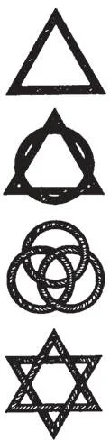

# 192. Church Symbolism

**What is symbolism?**

— Symbolism is the giving of a rather hidden meaning to external things, particularly in order to express religious ideas.

> By symbolism, man apprehends reality; art in all its forms is the symbolical expression of inexpressible ideas, the positive manifestation of absolute beauty. This is why ceremonial, which is but a symbolic representation, is vital to the life of man, whose highest desires concern a grasping at the ultimate.

1. Symbolism is invaluable, because it expresses ideas otherwise utterly inexpressible. For instance, can we express the idea of eternity in either word or picture? Yet how easily the idea is depicted by the symbol of the circle, — something without beginning, without end.

> Similarly we cannot explain in however numerous volumes the definiteness of One God in Three Persons; we cannot draw a picture of that idea. And yet let us draw an equilateral triangle, and by that symbol the idea is definitely conveyed: Three Persons co-equal, co-eternal, yet only One God.

2. By a familiar sign a symbol tells a story; it is a mark of identification. It expresses with exactness and beauty certain religious truths. It is not an end in itself, but a means to an end: a symbol uses art for the purposes of religion.

> A symbol must not be a representation of something, but rather a representative. For example, a man is not symbolical of Our Lord; but a lamb with a banner lying on a book with seven seals is. And true symbolism must always be understood as representative. For when the symbol is taken as the very thing represented, then we have idolatry, a sin against God's commandment. If we worship the lamb itself, and not Jesus Christ, then that is idolatry. It should however be clearly understood that the commandment outlaws worship of the symbol, not the symbol itself.

3. Symbolism is essential to all kinds of religious worship. The Old Testament is full of it, forming the basis of our Christian symbolism, by which we apprehend through our senses a God-given and absolute beauty and truth.

> The purpose of symbols is educational: to help man lay hold of the Infinite. Few knew how to read; books were expensive and lettered by hand. Preaching in the enormous cathedrals was not very easy, without our modern devices. The people loved God; but they could not learn about Him by oral or written instruction. And so symbolism came to the rescue, and the great churches became beautifully illustrated textbooks, for everybody to read and understand. The medieval Christian read into common objects carved, cast, painted, embroidered, or woven, a religious and mystical meaning; that was his culture, his art. We must not, however, mistake types, or even pictures, for symbols. If we confine ourselves to animals and inanimate objects, and avoid historical characters, we are safely in the realm of symbolism. Moses on Sinai is not a symbol, but a type, of Our Lord on the Mount. Similarly, Samson is a type of strength, and St. George of courage; they are not symbols.

4. From earliest times, the Church has made use of symbols, to foster devotion, or to stand for some mystery of the Faith that needed to be kept secret from pagans. For instance: the early Church used a fish to stand for Christ; a town, a ship, or a woman with uplifted arms to stand for the Church.

**Name the most common Catholic symbols.**

— The following are most common: 1. For the Most Blessed Trinity: the equilateral triangle to depict equality as well as unity; a combination of the triangle with the circle, to depict in addition the idea of eternity; the interwoven three circles of identical size; the interwoven triangles, one with apex upward and the other with apex downward, thus forming a six-pointed star, which is a symbol of creation; two interwoven triangles combined with a circle; the trefoil, which is a variation of the interwoven circles; the trefoil with triangle, another development of the three circles with an equilateral triangle; the trefoil with three points, another development.

> Other symbols for the Holy Trinity are: the triquetra, with equal arcs of the circle symbolizing equality, unity, eternity, and indivisibility; the tri-que tra with a circle; the triquetra with a triangle; the three fishes arranged in the form of a triangle.

2. For God the Father: a hand coming out of a bank of bright clouds; an eye in an equilateral triangle; a six-pointed star, termed the Creator's star; the Hebrew letters for the word Jehovah (God) , inside a triangle, and surrounded by rays; the Hebrew yod inside a triangle, or two yo ds within rays of glory. 3. For God the Holy Ghost: the descending dove, though this must not be too realistic, and must be with the three-the cloven flame of fire, or seven flames; the scroll, to show the seven gifts; the seven lamps, seven doves, seven-fold flame, seven-branched candlestick; the star with seven points, or with nine points, to depict the seven gifts or the nine fruits of the Holy Ghost. 4. For God the Son, our Blessed Saviour. These are almost too numerous to mention, the most important being the cross, with some fifty forms in use. Our Lord is represented by: the Lamb of God on a book with seven seals, or with a banner of victory, or with both; the Good Shepherd; the five-pointed star; the fish; the pelican feeding her young with her blood; the cross on an orb; the vine; the rock; the unicorn; sacred monograms.

> The "Chi Rho" symbol is an abbreviation of the word Christ, with the Greek letters X and P, the first two letters of the word in Greek. Like other monograms for Jesus, it has various forms. At times the Chi Rho is combined with the Alpha and Omega, or with the Greek cross, or with the letter N (Nik a, meaning conqueror). The I HC symbol is an abbreviation of the Greek word for Jesus. Today IHS is also used. Another variation is IC XC, to stand for Jesus Christ. IN RI means "Jesus of Nazareth, King of the Jews".

5. For the Blessed Virgin: the lily, symbol of virginity and purity; the fleur-de-lys in various forms; the rose, white or pink; the pierced heart; the crescent moon; the crown with stars; a star; her monogram, the flowering almond, the closed gate, the sealed book.

> The symbols for the four Evangelists are: a human head for St. Matthew, because his Gospel starts with a relation of the human ancestry of Christ; a lion for St. Mark, because the beginning of his Gospel relates the story of St. John the Baptist in the desert, the home of wild beasts; an ox for St. Luke, because this animal was a symbol of sacrifice, and St. Luke's Gospel begins with a relation of the priest Zachary in the Temple; an eagle for St. John, because the opening verses of his Gospel carry the reader on a flight to the Infinite.

> Other symbols are: for the Sacraments — the font, a dove, a chalice, a whip, an oil stock, clasped hands and a stole; for the Word of God, an open Bible, a burning light, a candle, two scrolls; for Penance, a priedieu; for Matrimony, two clasped hands; for Holy Orders, a stole, or a chalice on a Bible, with folded stole; for prayer, a censer with smoking incense; for sacred music, a lectern; for the Epistle and Gospel, a double lectern; for benediction, an upraised hand without nimbus. A banner symbolizes victory; a flaming sword, God's authority; a crown, sovereign authority; two tables of stone, the Commandments: a book or scroll, the Law; crossed keys, the power of the Pope.

6. For the Church we have the symbols of: the ark, the ship, the ark of the covenant; the vine; the woman with dragon underfoot; the crowned woman; the bride with chalice and book; the house on a rock; the city on a hill; the candlestick; the wheat and tares; the net. 7. Symbols still commonly used are: the olive branch for peace; the palm for martyrdom; the lily for purity; the halo for sanctity; the rose for love and beauty of soul. Faith, hope, and charity are represented by a cross, an anchor, a heart.
