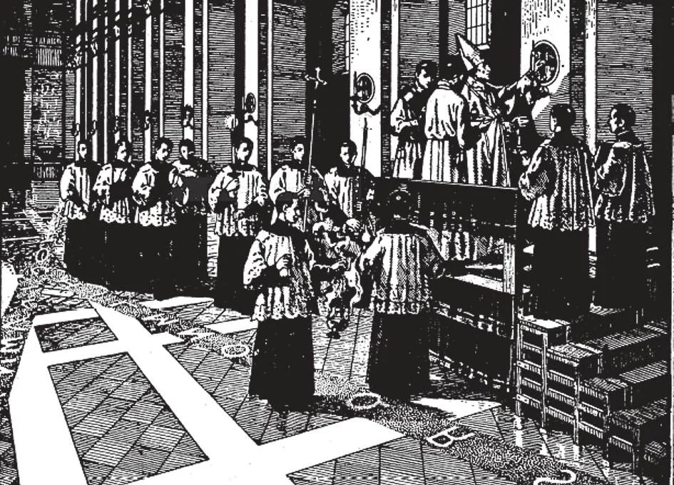

# 193. Conclusion: Why I Am a Catholic

These are the chief ceremonies in the consecration of churches, a solemn occasion. The bishop prostrates himself near the entrance, and recites the Litany of the Saints. Rising, he encircles the church building three times outside, meanwhile sprinkling the walls with holy water; each time he passes the main doorway, he knocks upon it with his crosier. Then he marks the threshold with the sign of the cross, using his crosier; after this he enters the church, kneels down, and invokes the Holy Spirit. Next the bishop traces the letters of the Greek and Latin alphabets upon the pavement, on which have been strewn ashes. He goes around the interior of the church three times, sprinkling the walls with holy water; then he goes thrice up and across the centre of the building. Then follows the anointing of the walls in twelve places, where tapers are set. Finally the altar is consecrated. The effect of these ceremonies and prayers is to set the building apart for the exclusive service of God. The sign of the cross after the knocking at the door signifies the strength of the cross of Christ whom none can resist. The letters of the alphabets signify that all nations without exception are called into the Church of God. The going up and across the interior of the church signifies honour paid to the Blessed Trinity and the crucifixion of Jesus Christ. The twelve lighted tapers stand for the twelve Apostles, who spread abroad the light of Christ's Gospel.

**How does our reason point out the truth of the Catholic religion?**

— Our reason points out the truth of the Catholic religion by these principles: 1. There is a God (see pages 6-29). We need only to look about us and contemplate the heavens and the wonders of nature, to be sure that all this order and beauty could not have come into existence except by the almighty power of an intelligent Being, God.

> Who made the heavenly bodies and set them in fixed places, and traced the paths they should follow from age to age? Who made the trees, and commanded particular plants to spring from certain seeds? Who made life? Who, if not God?

2. The soul of man is immortal (see pages 34-38). A man can reason, make abstract conclusions, distinguish between right and wrong. These are acts of a spiritual faculty, and the soul to which this faculty belongs must be spiritual and independent Of matter, and being so, is not subject to death. A man can say No to himself.

> No other being on earth can do the spiritual things man can do. In this world, man alone has intelligence and free will, therefore he alone has an immortal soul.

> Animals act only from instinct and sense, which are organs of the body; animals therefore cannot be immortal.

3. All men are obliged to practice religion (see pages 2-3, 170-171, 186-187). Man, with, his intelligent and immortal soul, can know God according to the limits God has set. He knows that he owes to God his very existence, that he is entirely dependent on Him. From this origin and dependence arises man's duty to give his Creator due honour and adoration, in other words, his duty to practice religion.

> To be faithful to God, we must serve Him by obeying His commandments and carrying out His wishes; by believing in Him, hoping in Him, and loving Him with all our hearts. All these things we learn about when we study our religion; all these we do a right when we are faithful in the practice of our religion.

4. The religion God revealed through Christ is worthy of belief (see pages 14-21, 56-59, 66-75). Our Lord announced Himself the Son of God, and as such preached His doctrines that He required us to believe. To prove that He was truly God, Our Lord worked numberless miracles.

> God alone can work miracles, and He cannot work them to approve what is false. The miracles therefore worked in favour of the Reaching of Jesus Christ are manifest proofs that His teaching is true.

5. Christ established a Church which all are obliged to join. He declared that all men must believe and be baptised, that is, belong to His Church, in order to be saved. (See pages 94-99)

> Our Lord gathered about Him a group of disciples, and called it His Church. He promised that this Church would last forever. "He who does not believe shall be condemned" (Mark 16: 16). "Go, therefore, and make disciples of all nations, baptising them in the name of the Father, and of the Son, and of the Holy Spirit, . . . and behold I am with you all days, even unto the consummation of the world" (Matt. 28: 19-20).

6. The only true Church of Christ is the Catholic Church. Only the Catholic Church possesses the marks of unity, holiness, catholicity, and apostolicity, marks of the Church established by Jesus Christ. (See pages 100-107, 132-145.)

> The history of the Catholic Church gives incontestable evidence of miraculous strength, permanence, and unchangeableness, thus showing the world that it is under the special protection of God, Who said, "The gates of hell shall not prevail against it" (Matt. 16: 18).

Let us thank God for His gifts. We can best show our gratitude to God for making us members of the only true Church of Jesus Christ by often thanking God for this great favour, by leading edifying and practical Catholic lives, by trying to lead others to the true faith, and by helping the missions.

> We thank God for the graces He showers on us in prayer and by our good lives. By following the commandments of God and the Church, and doing good works, we lead practical and edifying Catholic lives; such lives are the best way of leading others to our Faith, if we have no more direct means. such lives we say, "Deo gratias!"
