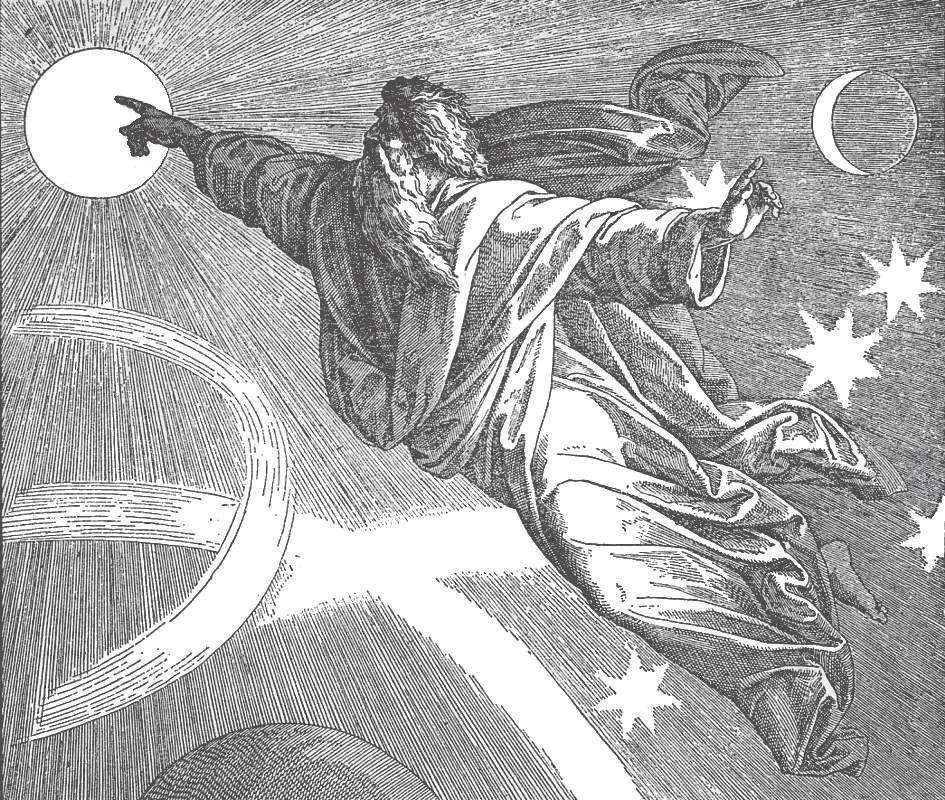

# 3. Deus, o Ser Supremo

*Deus criou o mundo em seis dias. No primeiro dia, fez a luz e as trevas, o dia e a noite. No segundo dia, fez o firmamento e dividiu as águas. No terceiro dia da Criação, Deus fez aparecer a terra seca fora das águas, e ordenou que as plantas brotassem da terra. No quarto dia, Deus fez o sol, a lua e as estrelas. No quinto dia, fez os répteis, as aves e os peixes. No sexto dia, Deus fez os animais e, finalmente, o homem. Então no sétimo dia, Deus parou de trabalhar: Ele descansou. "Os céus manifestam a glória de Deus." (Sl. 18: 2).*

(PRIMEIRO ARTIGO DO CREDO DOS APÓSTOLOS)

**Quem é Deus?**

— Deus é o Ser Supremo, infinitamente perfeito, que fez todas as coisas e as mantém na existência.

1. Deus fez tudo — homens, animais, plantas, planetas, estrelas, tudo. Não só isso; Deus mantém tudo na existência. Se Ele retirasse Sua mão do que criou, tudo desapareceria no nada mais rápido que o pensamento. Sem uma causa, não poderia haver efeitos. Sem Deus, poderia haver alguma coisa?

> "Nele vivemos, nos movemos e somos" (Atos 17: 28). "Nele foram criadas todas as coisas" (Col. 1: 16).

> "É Ele quem dá a todos os homens vida e respiração e todas as coisas" (Atos 17: 25).

2. As tradições de todas as nações e raças apoiam a ideia da existência de Deus. Todas as nações e povos têm uma convicção interior da existência de Deus; seu intelecto apoia sua confiança instintiva.

> Mesmo entre os pagãos mais selvagens, remotos e degradados, invariavelmente se encontra a adoração de alguma divindade reconhecida como suprema, da qual o homem depende. Há povos selvagens sem governante, leis ou mesmo assentamentos, mas nunca sem algum deus que adoram com oração e sacrifício.

**O que queremos dizer quando dizemos que Deus é o Ser Supremo?**

— Quando dizemos que Deus é o Ser Supremo, queremos dizer que Ele está acima de todas as criaturas, o Espírito auto-existente e infinitamente perfeito.

> "Eu sou o primeiro e Eu sou o último, e além de Mim não há deus" (Is. 44: 6). "'Eu sou o Alfa e o Ômega, o princípio e o fim', diz o Senhor Deus, 'o que é e o que era e o que há de vir'" (Apoc. 1: 8).

**O que é um espírito?**

— Um espírito é um ser que tem entendimento e livre-arbítrio, mas não tem corpo, e nunca morrerá.

1. Deus é um espírito puro. Como Deus não tem corpo, quando falamos de Seus olhos e Suas mãos, falamos apenas de maneira figurada, para nos tornarmos mais compreensíveis segundo nosso modo humano de falar.

> Nosso Senhor disse à mulher samaritana no poço: "Deus é espírito; e os que O adoram devem adorá-Lo em espírito e em verdade" (João 4: 24). Contudo Deus frequentemente assumiu formas visíveis, para ser visto pelos homens. Assim Ele Se mostrou na forma de uma pomba no batismo de Jesus, e na forma de línguas de fogo no Pentecostes. Deus não é uma pomba nem línguas de fogo; Ele apenas assumiu aquelas formas para ser visto por olhos mortais.

2. Anjos e demônios são espíritos puros. Os homens são apenas parcialmente espirituais, porque têm um corpo. A alma do homem é um espírito, absolutamente independente da matéria, e pelas criaturas indestrutível.

> Como espíritos, Deus e os homens têm isto em comum, embora em graus diferentes: todos têm entendimento, intelecto e livre-arbítrio. Pelo seu livre-arbítrio, o homem pode até desafiar seu Criador, Deus.

**O que queremos dizer quando dizemos que Deus é auto-existente?**

— Quando dizemos que Deus é auto-existente queremos dizer que Ele não deve Sua existência a nenhum outro ser.

1. Deus nos fez, mas quem fez Deus? Deus disse a Moisés: "Eu sou o que sou" (Êx. 3: 14). Ele existe de Si mesmo, não derivando Seu Ser de nenhum outro. Deus é a Primeira Causa.

> Todos os outros seres e coisas devem Sua existência a Deus. Em comparação com Ele, não somos nada.

2. O homem nunca pode ter um conhecimento completo de Deus. O homem é finito e não pode compreender plenamente o infinito. Um copo pode conter a imensidão do oceano mais facilmente do que o homem pode compreender plenamente o Deus Infinito.

> Conhecemos Deus apenas parcialmente, da ordem, harmonia e existência das coisas, de nossa consciência, e das revelações de Deus ao homem.

**O que queremos dizer quando dizemos que Deus é infinitamente perfeito?**

— Quando dizemos que Deus é infinitamente perfeito, queremos dizer que Ele tem todas as perfeições sem limite.

> Deus é imenso e eterno, "um oceano sem margem ou fundo", o Ser imutável que só Ele mesmo pode compreender plenamente: "De Sua grandeza não há fim" (Sl. 144: 3).

1. Deus é tão grande e maravilhoso que não precisa de nada para Se tornar maior ou mais maravilhoso. Ele possui todas as perfeições, incontáveis, inumeráveis, ilimitadas, sem fronteiras.

> Deus não pode ser melhor, mais santo ou mais perfeito do que já é. Está no ápice da perfeição, o incriado, o Infinito. "O céu e o céu dos céus não Te podem conter" (3 Reis 8: 27).

2. Tão perfeito é Deus que é infinitamente incompreensível, incapaz de ser completamente compreendido. A razão pode verificar a revelação que Deus fez de Si mesmo. Mas quando fazemos nossa razão ou nossas emoções a autoridade final, nos fazemos nosso próprio deus, e fechamos o caminho para o sobrenatural, o Infinito.

> Só Deus pode transpor o abismo que se abre entre o finito e o infinito. Quando aproveitamos Sua graça para buscá-Lo em amorosa confiança, Ele estende Sua mão, um Pai chamando os filhos, para atravessar o abismo em segurança até Ele.

3. O Criador está acima de todo o criado, embora algo d'Ele, alguma semelhança de Seu Ser, possa ser encontrada em toda criatura. Mas mesmo que todas as criaturas, dos serafins mais gloriosos ao mais humilde musgo, combinassem seus poderes e perfeições, as delas seriam uma sombra fraca da supremacia abrangente de Deus.

**Quais são algumas das perfeições de Deus?**

— Algumas das perfeições de Deus são: Deus é eterno, todo-bom, todo-sabedor, onipresente e todo-poderoso.

> As perfeições de Deus não existem separadamente n'Ele, mas são uma e idêntica com Si mesmo. São apenas várias manifestações de Sua única natureza e perfeição. Em Deus, por exemplo, Sua bondade é una com Sua sabedoria e poder. Suas perfeições, além de serem una e a mesma n'Ele, são também idênticas com Ele: isto é, o Próprio Deus é infinitude, sabedoria, bondade, poder.
