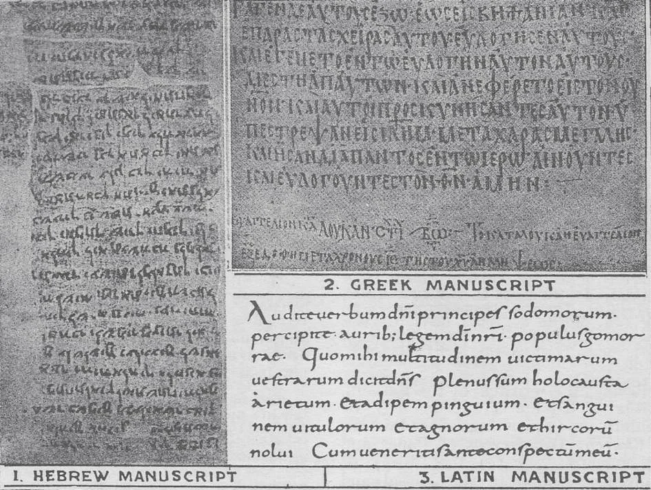

# 10. A Igreja e a Revelação Divina

*Antes da impressão ser inventada por volta de 1450, os livros podiam ser reproduzidos apenas fazendo cópias manuscritas em pergaminho ou pele de ovelha. Uma Bíblia completa custava uma fortuna, por causa do tempo e despesa necessários para copiar. Copistas cometiam erros, ou abreviações que outros não entendiam. A ilustração mostra manuscritos em hebraico, grego, e latim, as línguas mais frequentemente usadas nas primeiras cópias da Bíblia. Dão uma ideia das dificuldades antes da invenção da impressão.*

**Cristo pretendia que o Evangelho fosse proclamado pela circulação da Bíblia?**

— Não; foi principalmente pela pregação que Ele pretendia converter as nações.

> Nosso Senhor disse: "Ide, fazei discípulos de todas as nações." "Pregai o Evangelho a toda criatura." "Quem vos ouve, a Mim ouve." Cristo não disse: "Ide e fazei todas as nações lerem a Bíblia."

1. Os Apóstolos nunca circularam um único volume da Bíblia, mas "saíram e pregaram em toda parte, enquanto o Senhor trabalhava com eles" (Mar. 16:20). O Novo Testamento não foi escrito até que o Cristianismo já estava estabelecido.

> Cristo ordenou a Seus Apóstolos que ensinassem todos os homens a "observar tudo o que vos ordenei" (Mat. 28:20). Ordenou-lhes que pregassem, não necessariamente que escrevessem.

2. Deus não pretendia que a Sagrada Escritura fosse nossa regra de fé independentemente de uma Voz Viva. Mesmo sob a Lei Antiga, os judeus, apesar de sua grande veneração pela Sagrada Escritura, nunca sonharam com um apelo privado à Palavra de Deus.

> Quando uma disputa religiosa surgia, era decidida pelo sumo-sacerdote e o Conselho. Sua decisão devia ser obedecida sob pena de morte. Assim os judeus não apelavam à letra morta da lei, mas à voz viva do tribunal que Deus havia estabelecido.

3. Quando Cristo veio à terra, não mudou esta ordem de coisas. Pelo contrário, ordenou aos judeus que obedecessem a seus mestres constituídos, por mais que suas vidas privadas fossem desedificantes.

> Então Jesus falou às multidões e aos seus discípulos, dizendo: "Os escribas e os fariseus estão sentados na cátedra de Moisés. Todas as coisas, pois, que vos disserem, observai e fazei" (Mat. 23:2-3).

4. Até o surto protestante no século dezesseis (1517), nenhuma tentativa havia jamais sido feita de ter algum povo governado pela letra morta da lei em assuntos civis ou religiosos.

> Ninguém certamente pretende viver em sociedade segundo sua própria interpretação privada das leis civis. Quando casos surgem, são sempre decididos por um tribunal competente.

**Por que a Bíblia não pode ser o único guia para a salvação?**

— Não pode, porque:

1. Não está ao alcance de todos. Se fosse o único guia, deveria estar ao alcance de todo inquiridor, pois Deus deseja que todos os homens se salvem.

> Se a Bíblia fosse o único guia para a salvação eterna, os cristãos primitivos estariam em desvantagem, pois os livros que compõem a Bíblia foram reunidos apenas após a Igreja ser estabelecida. Mesmo quando as partes foram reunidas, por séculos houve muito poucas cópias manuscritas. As cópias permaneceram poucas até a invenção da impressão no século quinze. Se a Bíblia fosse o único guia para a salvação, seria de pouca ajuda para aqueles incapazes de ler, bem como para a grande massa da humanidade hoje, que não têm nem o conhecimento nem a capacidade de penetrar o significado da palavra escrita.

2. A Bíblia é difícil de entender, frequentemente cheia de obscuridades e dificuldades, mesmo para os eruditos.

> O próprio São Pedro disse das Epístolas de São Paulo, que elas têm "certas coisas difíceis de entender, que os ignorantes e inconstantes deturpam, como também as demais Escrituras, para sua própria perdição" (2 Ped. 3:16). Os Padres da Igreja, que passaram suas vidas inteiras no estudo da Bíblia, todos a declaram cheia de dificuldades, precisando de interpretação cuidadosa.

3. A Bíblia não contém todas as verdades necessárias para a salvação eterna.

> Por exemplo, todo cristão é obrigado a santificar o Domingo. Mas em nenhuma parte de toda a Bíblia, de Gênesis ao Apocalipse, há uma palavra autorizando a santificação do Domingo.

**Sobre qual autoridade aceitamos a Bíblia como a Palavra de Deus?**

— Aceitamos a Bíblia como a Palavra de Deus sobre a autoridade da Igreja Católica.

1. Por ordem de Deus, a Igreja Católica proclamou as verdades da Revelação Divina, como contidas tanto na Sagrada Escritura quanto na Tradição.

> Antes de Sua Ascensão, Nosso Senhor disse aos Apóstolos: "Todo poder no céu e na terra foi dado a Mim. Ide, pois, e fazei discípulos de todas as nações, batizando-os em nome do Pai, e do Filho, e do Espírito Santo, ensinando-os a observar tudo o que vos ordenei... e eis que estou convosco todos os dias, até a consumação dos séculos" (Mat. 28:18-20).

2. Foi a Igreja Católica, no quarto século, que declarou quais livros eram inspirados por Deus e quais não eram. Por mil e quinhentos anos a Igreja Católica foi a única guardiã da Bíblia.

> A Bíblia nem sempre foi como é agora, um livro compacto, encadernado asseadamente. Por vários séculos a Bíblia estava em fragmentos separados, espalhados pela cristandade. Ao mesmo tempo, outros livros sob o nome de Escritura eram circulados entre os fiéis.

3. É a Igreja que nos assegura que a tradução das línguas originais é fiel. A Bíblia precisa de um intérprete porque é frequentemente muito difícil de entender. Só a Igreja Católica foi empoderada por Deus para interpretar a Bíblia. Ninguém tem permissão para interpretá-la contrariamente ao ensino da Igreja.

> As denominações protestantes que favorecem a interpretação privada dividiram-se e subdividiram-se pela mesma razão. Nenhuma delas interpreta a Bíblia da mesma maneira. Se realmente devemos interpretar a Bíblia privadamente, devemos conhecer as línguas originais nas quais os livros foram escritos. Quantos podem ter esse conhecimento?

**Deus pretendeu que a Sagrada Escritura fosse nossa regra de fé?**

— Não, Deus pretendeu que nossa regra de fé fosse a autoridade ensinante da Igreja.

> Os Apóstolos e seus sucessores sempre ensinaram a humanidade, especialmente pela pregação. Assim a Igreja cumpre o mandamento de Jesus Cristo, e o cumprirá até o fim do mundo, como Ele prometeu. Se Nosso Senhor quisesse que a Bíblia fosse nossa regra de fé, por que não escreveu um livro, em vez de fundar uma Igreja?

Podemos saber o verdadeiro significado das doutrinas contidas na Revelação Divina da Igreja Católica, que foi autorizada por Jesus Cristo a explicar Suas doutrinas, e que é preservada do erro em seus ensinamentos pela assistência especial do Espírito Santo.

> "Mas ainda que nós ou um anjo do céu vos pregasse um evangelho além do que vos pregamos, seja anátema" (Gal. 1:8).
