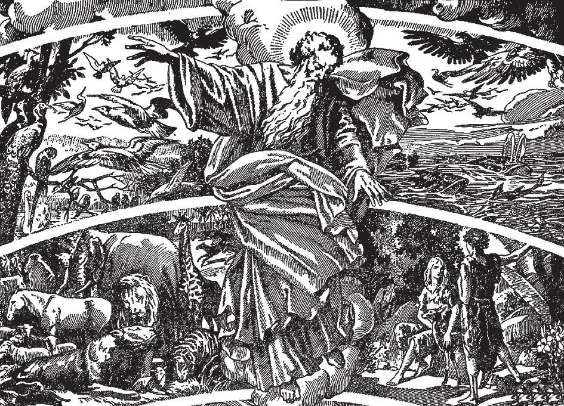

# 17. Imagem de Deus

*O Livro de Gênesis descreve a criação do primeiro homem e da primeira mulher nestas palavras: "E o Senhor Deus formou o homem do limo da terra, e soprou em seu rosto o sopro da vida; e o homem tornou-se alma vivente. Então o Senhor Deus fez cair um sono profundo sobre Adão: e quando ele estava profundamente adormecido, tomou uma de suas costelas. ... E o Senhor Deus edificou a costela que tomara de Adão em mulher" (Gên. 2:7, 21, 22). Tal foi a criação de Adão e Eva, nossos primeiros pais. Deus deu-lhes poder sobre todas as coisas criadas: a terra, os animais, as aves, os peixes, as plantas, e todas as outras coisas.*

**O que é o homem?**

— O homem é uma criatura composta de corpo e alma, e feita à imagem e semelhança de Deus.

> Antes da criação do homem, Deus disse: "Façamos o homem à Nossa imagem e semelhança; e tenha ele domínio sobre os peixes do mar, e as aves do céu, e os animais, e toda a terra, e todo réptil que se move sobre a terra" (Gên. 1:26).

1. Deus formou o corpo do homem do limo da terra; mas Ele soprou a alma no corpo do homem. Desta forma a alma veio diretamente de Deus, e indica semelhança mais próxima com Ele.

> Devemos sempre reverenciar nossa semelhança com Deus, procurando aperfeiçoá-la tornando nossa alma tão santa quanto possível. Uma vez os inimigos de um rei tentaram fazer seu filho fazer algo errado. Mas o jovem orgulhosa e resolutamente respondeu: "Não! Sou filho do rei!" Pelo Batismo o homem torna-se filho adotivo de Deus, que é infinitamente mais alto que qualquer rei terreno. Sua alma é como seu Pai no Céu.

2. A alma do homem é diferente da alma dos animais brutos. Os animais têm sentidos e instinto, mas nem razão nem livre-arbítrio. Livre-arbítrio é aquele poder da alma de escolher se age ou não age.

> Se um cavalo não comeu por um dia, e você coloca feno diante dele, ele comerá, porque seu instinto o move a fazê-lo. Mas um homem faminto pode jejuar por dias, e ainda recusar comer por mais faminto que esteja, se não quiser comer. A diferença entre o livre-arbítrio do homem e o instinto animal é que o homem pode dizer "Não" a si mesmo.

3. A alma e o corpo não são partes frouxamente conectadas do homem; estão unidas numa união substancial. A alma não está localizada em nenhum membro particular do corpo, mas é toda e inteira em cada parte.

**Esta semelhança com Deus está no corpo ou na alma?**

— Esta semelhança com Deus está principalmente na alma. O homem continua nesta semelhança com Deus apenas quando permanece na graça de Deus, pois então é "participante da natureza divina" (2 Ped. 1:4).

1. Como Deus, a alma do homem é um espírito imortal, com entendimento e livre-arbítrio. Alguns negam a existência da alma, porque não pode ser vista; contudo as mesmas pessoas não negariam a existência da razão humana, mesmo que esta também não possa ser vista.

> Alguns afirmam que o homem tem duas almas, uma boa e uma má, lutando pelo domínio. Mas a luta que frequentemente experimentamos vem de apenas uma alma com diferentes tendências surgindo do fato de sermos feitos de corpo e alma, parcialmente material e parcialmente espiritual. Numa pessoa viva, a alma não deve ser considerada à parte do corpo; sua união é tão próxima como a relação entre um músico e seu instrumento na hora de um concerto.

2. Através de suas duas faculdades da alma, entendimento e livre-arbítrio, o homem obtém domínio sobre o mundo material, como Deus possui poder sobre todo o universo.

> Como Deus disse antes de criar o homem: "Tenha ele domínio sobre os animais e toda a terra" (Gên. 1:26). Através de sua semelhança com Deus, o homem tem o poder de conhecer o verdadeiro, o bom, o belo, até mesmo conhecer a Fonte de toda verdade, bondade e beleza, o Próprio Deus.

**Como podemos provar que a alma do homem é imortal?**

— Podemos provar que a alma do homem é imortal, porque os atos de inteligência do homem são espirituais; portanto, sua alma deve ser um ser espiritual, não dependente da matéria, e portanto não sujeita à decadência ou morte.

> Se mesmo a matéria não pode totalmente desaparecer, por menor que seja a partícula, como pode a alma do homem, de ordem muito mais alta, ser pensada como sofrendo extinção?

1. O homem tem mente e vontade. Pode refletir, raciocinar, planejar o futuro, fazer juízos, lembrar. Estes provam sua alma espiritual. Tal alma não pode morrer como o corpo.

> O homem anseia por um estado ideal de perfeita felicidade, felicidade tal como é impossível atingir na terra. Este anseio universal deve ter sido posto nas almas dos homens pelo Próprio Deus; é um desejo da felicidade infinita de uma união com o Criador. Se, portanto, a alma do homem não fosse imortal, ele não teria chance de realizar seu sonho de bem-aventurança, e Deus seria cruel ao implantar o anseio por ela em seu peito.

2. Houve muitos exemplos de mortos aparecendo aos vivos. No Evangelho, Moisés e Elias apareceram no Monte Tabor a Cristo e três de Seus Apóstolos. Na morte de Cristo, muitos que estavam mortos ressuscitaram e apareceram em Jerusalém.

> A Santíssima Virgem tem através dos séculos continuado a aparecer aos homens; tais exemplos são quase inumeráveis. Santos também retornaram à terra para consolar ou instruir os vivos; mesmo almas no purgatório retornaram, para pedir orações. Devemos, contudo, ter muito cuidado sobre crer em exemplos particulares de aparições dos mortos; o demônio pode e frequentemente usa este instrumental para enganar os crédulos.

3. A crença na imortalidade da alma e uma vida após a morte é universal entre a humanidade, incluindo os povos mais primitivos.

> Na Bíblia há muitos exemplos da crença dos judeus em outra vida, onde as almas dos mortos estariam. Por exemplo, uma de suas leis proibia ter comércio com os mortos. Os gregos e romanos criam no Tártaro e Elísio, lugares para os mortos. Outras nações têm diferentes cultos aos mortos, especialmente durante suas cerimônias de sepultamento. Tais cultos seriam sem significado se aqueles que neles tomavam parte não tivessem uma ideia de outra vida para as almas partidas.

4. Se a alma não fosse imortal, os maus que cometem o mal por toda sua vida ficariam impunes. Os justos que sofrem continuamente na terra não receberiam nenhuma recompensa. Isto seria injustiça impossível à perfeita justiça de Deus.

> Se mesmo o homem, imperfeito como é, pode ver inúmeros exemplos de injustiça na vida, não poderia Deus? Não teria Ele um modo de corrigir tal injustiça? E se assim é, já que não pode ser corrigida nesta vida, deve haver outra, onde almas imortais vão para obter perfeita justiça.

5. A Sagrada Escritura, a Palavra de Deus, ensina que a alma é imortal.

> "E muitos dos que dormem no pó da terra despertarão: uns para a vida eterna, e outros para o opróbrio, para vê-lo sempre" (Dan. 12:2). Nosso Senhor mesmo disse ao bom ladrão: "Hoje estarás comigo no Paraíso" (Luc. 23:43). "E não temais os que matam o corpo mas não podem matar a alma" (Mat. 10:28). "Ele não é o Deus dos mortos, mas dos vivos" (Mat. 22:32).
