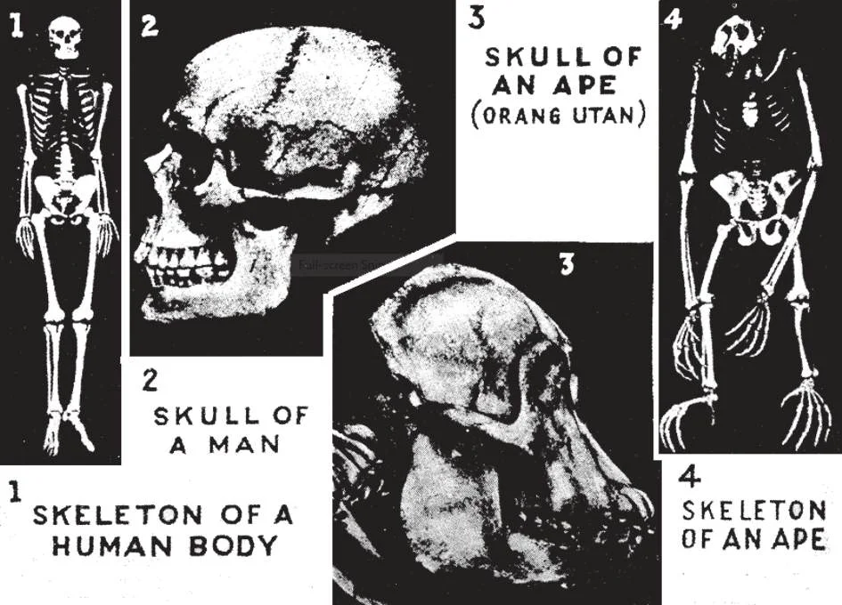

# 19. Evolução e a Bíblia

*Embora haja alguns pontos de similaridade entre os esqueletos do homem e do macaco, as diferenças são numerosas e fundamentais. Como um cientista observou, os evolucionistas poderiam igualmente afirmar que o homem descendeu de qualquer outra forma de vida, porque as diferenças entre o homem e o macaco são tão importantes quanto entre o homem e outras formas. O macaco não tem queixo nem testa. Seu pé agarra como uma mão. Seus dentes não estão dispostos em fileiras próximas. Se fosse forçado a ficar ereto, estaria olhando para cima, não para frente. O peso médio de seu cérebro comparado ao de seu corpo é de 1 para 70. Para o homem, a proporção é 1 para 35. O macaco não pode falar articuladamente.*

**Como se originou o corpo do primeiro homem?**

— Segundo a Bíblia, o corpo do primeiro homem foi feito por Deus do limo da terra.

> "E o Senhor Deus formou o homem do limo da terra" (Gên. 2: 7).

1. O significado natural e óbvio destas palavras do Livro de Gênesis é que o corpo de Adão foi feito diretamente por Deus de substância criada. Tal é a interpretação Católica tradicional.

> A Igreja ensina que o relato de Gênesis é substancialmente historicamente verdadeiro. Mas os Católicos não estão proibidos de certa liberdade de interpretação. Por exemplo, o "dia" da criação não é necessariamente — e nem provavelmente — nosso dia de 24 horas. Podemos considerar a obra feita por Deus em um "dia" como um ato imediato, ou como resultado de um longo período de desenvolvimento através do funcionamento de forças naturais.

2. A Escritura não é um manual científico para propósitos técnicos, mas nunca pode afirmar o que é falso. Acima das ciências naturais, a Escritura atua como guia de ordem superior. Isto dá aos homens um certo guia para a vida enquanto a ciência procede experimentalmente e apresenta teorias conflitantes.

**O que é a teoria da evolução?**

— Evolução é uma teoria concernente à origem e desenvolvimento de plantas, animais e homem.

1. Evolução química em rochas (geologia) ou nas estrelas (astronomia) deve ser distinguida da evolução biológica. Evolução biológica significa o desenvolvimento da vida a partir da não-vida e das espécies atuais de formas mais simples e antigas.

> A ciência explica a formação da matéria inorgânica a partir de matéria preexistente e da variação dentro das espécies, mas não pode explicar a origem nem da matéria nem da vida. Só a Revelação Divina pode explicar a origem das coisas.

2. Os cientistas originalmente ensinavam evolução biológica por seleção natural e buscavam prova num chamado "elo perdido". Nenhum elo perdido foi encontrado. Todos os esqueletos descobertos foram provados ser ou homens genuínos ou macacos reais.

> Alguns evolucionistas sustentam que o macaco e o homem ambos se desenvolveram de um ancestral comum. O primeiro homem de Darwin era um macaco altamente desenvolvido. "O homem quando estava em honra não entendeu; foi comparado aos animais insensatos, e feito semelhante a eles" (Sl. 48: 21).

3. A biologia molecular substituiu a seleção natural pela teoria da mutação gênica como mecanismo da evolução. A descoberta de grande complexidade no menor nível da vida nas coisas vivas mais simples ilustrou uma Inteligência Projetista. Esta conclusão é francamente recusada pela comunidade científica.

> A maioria dos cientistas ensina evolução como a única explicação científica das origens. Alguns cientistas distintos negaram que isto seja um fato científico. Fabre, o eminente naturalista dos tempos modernos; Millikan, o grande físico; John Burroughs, o naturalista; Professores Richet (Paris), e Henderson (Harvard); Dr. Dwight, o anatomista; Alexis Carrel, e Sir Bertram Windle. Mais recentemente, os autores Michael Behe, Stephen Meyer e Dean Kenyon explicam o design por uma causa Inteligente.

4. A Igreja Católica sempre respeitou e encorajou a ciência, mas também mostrou seus limites. Por exemplo, a ciência não pode provar seus próprios princípios, porque os próprios meios pelos quais a ciência faz suas conclusões são princípios da razão — isto é, espírito. A ciência mesma requer uma luz mais alta para trabalhar, esta é a Filosofia "perene".

> O Papa Pio XII dirigiu-se à Academia Pontifícia de Ciências muitas vezes. Mostrou como avanços na ciência moderna — tanto na escala micro-cósmica quanto na macro-cósmica — ilustravam as provas clássicas da existência de Deus e criação da matéria; como a ciência requeria uma ciência mais alta para provar suas conclusões; e insistiu sobre a necessidade de desenvolver esta ciência das leis de todo ser — que é a Filosofia Perene da Igreja Católica, representada no ensino de São Tomás de Aquino.

**Qual é a origem da alma humana?**

— Deus cria diretamente cada alma humana do nada.

1. Desde o princípio, Deus criou cada alma humana do nada.

> Assim Ele criou a alma de Adão, quando após formar seu corpo, Ele "soprou em seu rosto o sopro da vida, e o homem tornou-se alma vivente" (Gên. 2: 7). Cada alma humana é criada no mesmo momento em que se vem à vida, na concepção.

2. A alma do homem não é produzida de alguma outra alma ou matéria. É espiritual e simples. Não existia antes da pessoa viver. Não veio a existir depois que já estava viva. A vida do homem deve-se à sua alma. Assim que a alma deixa o corpo, a vida cessa.

> As investigações de cientistas descobriram uma singular universalidade e uniformidade em ideias de certo e errado, um código moral, em todas as raças e povos, por mais primitivos. Estes são universalmente considerados como errados: o assassinato injustificado de quem não é inimigo, roubar do próprio grupo, maus-tratos a crianças, irreverência, incesto, adultério. Se esta atitude resultasse de medo de represália, por que o assassinato não é considerado errado quando contra um inimigo? Por que o incesto sempre foi considerado errado, quando homens primitivos certamente não poderiam ter ideia dos males da endogamia? Deve-se concluir que esta consciência universal vem de Uma Só Fonte.

3. A alma do homem não é derivada de seus pais. Apenas seu corpo é derivado deles. Não há possível "evolução" da alma, pois é uma substância espiritual, não sujeita às leis da natureza física, e não poderia possivelmente ser desenvolvida de uma forma inferior ou material de vida.

> Manifestações da alma, como esperteza, talento, traços de caráter, etc., pelas quais crianças se assemelham a seus pais, devem-se aos atributos do corpo que derivaram de seus pais, ou ao treinamento na família. Se alguém segura um vidro colorido à luz o reflexo terá a cor do vidro. Mas o vidro não fez o sol cujo reflexo é lançado. Será mesmo a mente um produto da evolução? O homem mais primitivo é capaz de raciocínio abstrato. Os animais mais inteligentes não podem pensar em conceitos.

**Quantos séculos houve de Adão a Cristo?**

— A Igreja nunca deu uma decisão; esta questão talvez nunca seja respondida.

1. É geralmente admitido que a Bíblia não ensina nada definido sobre o assunto. A linhagem de patriarcas, que ela dá, com suas idades, provavelmente contém muitas lacunas.

> Diz-se que um homem é filho de outro, enquanto pode ser apenas um descendente remoto. Da mesma forma a Bíblia fala de Nosso Senhor como o Filho de Davi, embora Davi O tenha precedido em 1000 anos.

2. Alguns teólogos Católicos afirmam que a idade do homem pode ser estendida a dez, ou cem mil anos ou mesmo mais. Nem cientistas nem teólogos chegaram a uma solução definitiva.
