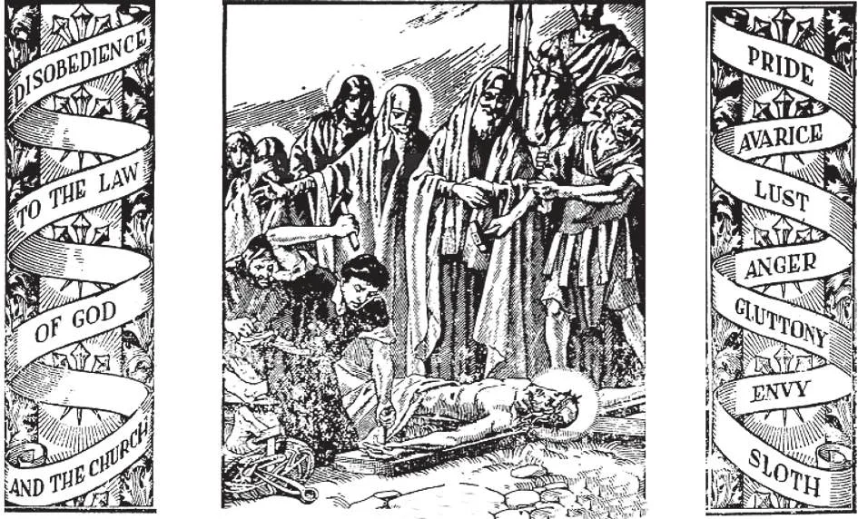

# 22. Pecado Mortal

*Pecado mortal é o maior mal do mundo. Separa-nos de Deus. Por causa de nossos pecados mortais, Jesus Cristo sofreu agônias e morreu na cruz. Para fortalecer nossa resolução de não cometer pecado, devemos lembrar também que mesmo um único pecado mortal é suficiente para nos enviar ao inferno.*

**O que é pecado mortal?**

— Pecado mortal é uma ofensa grave à lei de Deus.

1. Qualquer pensamento, palavra, ação ou omissão voluntária, em violação séria da lei de Deus, é um pecado mortal. Exemplos de pecado mortal são blasfêmia, assassinato voluntário, adultério, incêndio criminoso, roubo, etc. Pecado mortal ocorre assim que Deus não é mais nosso fim final em nossos pensamentos, palavras e ações.

> Cada pecado mortal que cometemos é um insulto tríplice ao Deus Todo-Poderoso: insulta-O por rebelião ou desobediência, por ingratidão, e por desprezo.

2. Circunstâncias de pessoa, causa, tempo, lugar, meios, objeto e consequências más aumentam ou diminuem a culpa do pecado.

> Assim pecados mortais, embora todos mortais, diferem no peso de sua culpa.

**Por que este pecado é chamado mortal?**

— Este pecado é chamado mortal, ou letal, porque priva o pecador da graça santificante, a vida sobrenatural da alma.

1. Sem graça santificante, a alma é desagradável a Deus, impura, e nunca pode contemplá-Lo ou estar com Ele no céu.

> Sem graça santificante, a alma está sem Deus; e sem Deus, o demônio faz da alma sua habitação. "Sabe e vê que é mal amargo teres abandonado o Senhor teu Deus" (Jer. 2:19).

2. O pecador perde a caridade para com Deus e seu próximo, e pelo enfraquecimento de sua vontade e obscurecimento de seu intelecto, é suscetível de cair em outros pecados mortais.

> O demônio clama a seus subordinados: "Deus o abandonou; persegui-o e tomai-o, pois não há quem o livre" (Sl. 70:11).

3. Sem graça santificante, a alma é verdadeiramente "morta"; e se um adulto morre naquele estado, sofrerá os tormentos dos condenados.

> A palavra "mortal" vem da palavra latina "mors", que significa morte. São João Crisóstomo disse: "Os pecadores estão mortos enquanto vivem, e os justos vivem após estarem mortos."

**Além de privar o pecador da graça santificante, que mais o pecado mortal faz à alma?**

— Além de privar o pecador da graça santificante, o pecado mortal faz da alma uma inimiga de Deus, tira o mérito de todas as suas boas ações, priva-a do direito à felicidade eterna no céu, e a torna merecedora de castigo eterno no inferno.

1. O homem foi feito para Deus, e que calamidade terrível seria tornar-Se Seu inimigo! Seria como se o alimento que foi feito para sustentar o homem de repente se transformasse em veneno ao invés.

> Através do pecado mortal, o pecador torna-se estranho ao amor divino, e ao amor do próximo; seu coração torna-se frio porque apagou a chama da caridade pelo pecado grave. Sua razão, um dom de Deus, é obscurecida, e ele não percebe as coisas de Deus. Assim um pecador, quanto mais peca, torna-se mais insensível ao mal; sua vontade é finalmente tão enfraquecida que toda consciência é perdida, e ele cai em pecados maiores e maiores mais e mais facilmente. "Adúlteros, não sabeis que a amizade deste mundo é inimizade com Deus? Portanto, quem quiser ser amigo deste mundo torna-se inimigo de Deus" (Tg. 4:4).

2. Durante todo o tempo que o pecador permanece em pecado mortal, todas as suas boas obras não o ajudam ao céu: não ganha méritos até que abandone seu estado de pecado mortal.

> Como diz o Apóstolo: "Se eu der meu corpo para ser queimado e não tiver caridade, de nada me serve." Quem cai em pecado mortal pode ser comparado a um mercador chegando a seu porto de origem, carregado com todos os tipos de tesouros coletados do exterior, sobre os quais gastou anos de trabalho e riqueza incalculável. Justo quando entra no porto seu navio é torpedeado, e ele não salva nada por todo seu trabalho. De maneira similar, quem morre em pecado mortal não ganha nada, por mais numerosas que sejam as boas obras que em vida tenha realizado.

3. Por mais numerosos que sejam os méritos previamente ganhos pelo pecador, por mais numerosas suas boas obras, se morrer com apenas um pecado mortal em sua alma, vai para o inferno para sempre.

> Não é isto algo a ser temido? É porque o pecado mortal pressupõe um ódio a Deus. Sejamos homens razoáveis, e consideremos a extrema loucura de vender nossa herança, Deus e o céu, pelo prato de lentilhas que é o pecado e seus efeitos. "Então dirá aos que estão à sua esquerda: Apartai-vos de Mim, malditos, para o fogo eterno" (Mat. 25:41).

**Que três coisas são necessárias para fazer um pecado mortal?**

— Para fazer um pecado mortal, estas três coisas são necessárias: Primeiro, o pensamento, desejo, palavra, ação ou omissão deve ser seriamente errado ou considerado seriamente errado. — A matéria deve ser grave, algo muito importante.

> Um leve ato de vaidade ou impaciência não é matéria grave, mas assassinato é. Coisas seriamente más são conhecidas como tais da Sagrada Escritura, Tradição, ensinamentos da Igreja, ou de sua natureza.

Segundo, o pecador deve estar ciente do mal grave. — Deve ter pleno conhecimento e reflexão ou atenção, e saber que o que faz é grave.

> A pessoa deve conhecer a malícia e mal do que está fazendo. Um homem que rouba um precioso anel de diamante na crença de que é vidro não tem pleno conhecimento. Um homem que joga descuidadamente um fósforo aceso pode jogá-lo num tanque de gasolina e causar uma explosão, mas não tem plena atenção. "Antes fui blasfemo, perseguidor e inimigo violento; mas alcancei misericórdia de Deus porque agi ignorantemente, na incredulidade" (1 Tim. 1:13).

Terceiro, o pecador deve plenamente consentir a isso. — Deve fazê-lo de sua própria livre vontade, dizendo deliberadamente: "Farei isto."

> Quando alguém percebendo o que está fazendo, ainda assim livremente o faz, dá à matéria consentimento deliberado. Portanto, crianças e idiotas não podem cometer pecado mortal; não podem perceber plenamente o que fazem.

**O pecado mortal é um grande mal?**

— Pecado mortal é um grande mal, o maior mal do mundo, um mal maior que doença, pobreza ou guerra, porque nos separa de Deus.

> "Mas os que cometem pecado e iniquidade são inimigos de sua própria alma" (Jó 12:10).

1. É uma rebelião contra e desprezo de Deus, a mais negra ingratidão para com Ele.

> Nosso Pai celestial nos deu tudo o que temos, e em retorno nós O ofendemos. Profanamos Seu templo. "Não sabeis que sois templo de Deus e que o Espírito de Deus habita em vós?" (1 Cor. 3:16). Pelo pecado mortal, uma criatura vil e insignificante ofende e insulta o infinito Criador.

2. É crucificar Cristo novamente, "pois crucificam novamente para si mesmos o Filho de Deus e O expõem ao opróbrio" (Heb. 6:6).

> Nunca podemos compreender plenamente a malícia do pecado mortal. Podemos ter uma pequena ideia dela lembrando que Deus enviou Seu próprio Filho amado para sofrer agônias indizíveis, para salvar-nos de suas consequências.

3. Pecado mortal deve ser uma coisa mais terrível de fato para fazer um Deus justo e misericordioso criar o inferno para o castigo eterno dos anjos rebeldes e dos pecadores que morrem com mesmo apenas um pecado mortal.

> Mesmo considerando apenas suas penas temporais, pecado mortal é grande loucura. Segue-se dele desassossego moral; o pecador perde a serenidade e alegria da alma justa. "Os ímpios são como o mar agitado, que não pode descansar" (Is. 57:20). Enfermidade e necessidade são frequentemente consequências do pecado, bem como perda de boa reputação.
