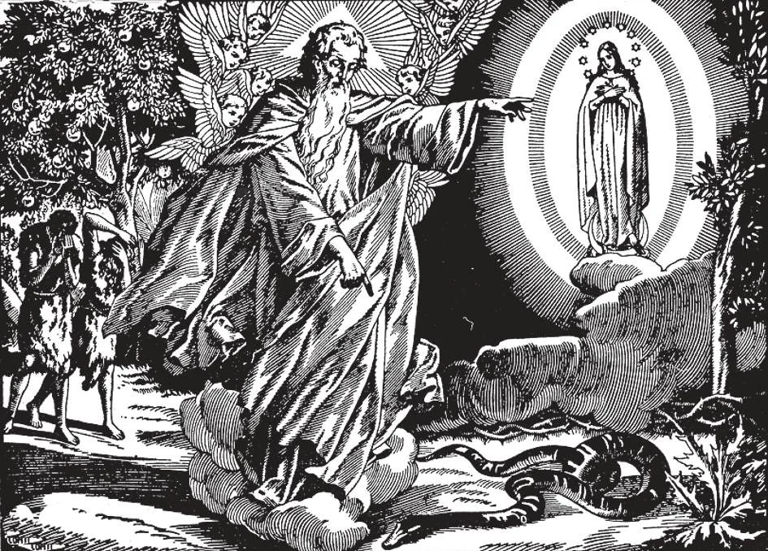

# 27. A Promessa do Redentor

*Imediatamente após a Queda, Deus prometeu um Redentor a Adão. Perdoou o homem, embora não tivesse perdoado os anjos rebeldes. Foi mais misericordioso com o homem do que com os anjos. Ao fazer a promessa, Deus falou da Santíssima Virgem, que seria a Mãe do Salvador.*

(SEGUNDO ARTIGO DO CREDO DOS APÓSTOLOS)

**Deus abandonou o homem depois que Adão caiu no pecado?**

— Deus não abandonou o homem depois que Adão caiu no pecado, mas prometeu enviar ao mundo um Salvador para libertar o homem de seus pecados e reabrir-lhe as portas do céu.

> Deus poderia ter abandonado o homem como consequência do pecado de Adão; então a raça humana teria sofrido separação eterna d'Ele.

1. A promessa foi primeiro feita a Adão antes que Deus o enviasse para fora do Paraíso. Deus disse à serpente que havia tentado Eva: "Porei inimizades entre ti e a mulher, e tua descendência e a descendência dela; ela esmagará tua cabeça" (Gên. 3: 15).

> Nesta passagem, a mulher de que se fala é a Santíssima Virgem Maria. Sua descendência é Nosso Senhor Jesus Cristo. Ele foi o Redentor prometido por Deus. Deus disse que haveria completa inimizade entre Nosso Senhor com Sua Mãe de um lado, e o demônio com seus seguidores do outro.

2. Esta promessa foi renovada várias vezes aos Patriarcas do Antigo Testamento: a Abraão, Isaac, Jacó e Davi. Porque Abraão permaneceu fiel ao culto de Deus no meio da idolatria, Deus o levou a Canaã. Como recompensa por sua obediência, Deus prometeu: "Farei de ti uma grande nação... e em ti serão benditas todas as famílias da terra" (Gên. 12: 2-3). Esta promessa foi repetida duas vezes.

> A mesma promessa "em tua descendência serão benditas todas as nações" foi repetida ao filho de Abraão, Isaac, e ao filho de Isaac, Jacó. Finalmente, centenas de anos depois, Deus ordenou ao profeta Natã que repetisse ao Rei Davi a mesma promessa: "Ele edificará uma casa ao Meu nome, e estabelecerei seu reino para sempre" (2 Reis 7: 13).

3. Mais tarde, Deus enviou os Profetas. Através deles, predisse muitas coisas sobre o Redentor: sobre Seu nascimento, Sua Pessoa, Seus sofrimentos, Sua morte e Sua glória final.

> Deus iluminou os Profetas para que pudessem falar em Seu nome aos judeus ou israelitas, os descendentes de Abraão. Havia cerca de setenta profetas, o último sendo Malaquias, que viveu uns 450 anos antes de Cristo.

4. Deus escolheu os judeus como o povo entre o qual o Salvador prometido viveria; por esta razão chamamos os judeus de "povo eleito". Deus os preparou para a vinda do Salvador: por pesadas provações, por leis severas, por milagres, por profecias.

> A seleção dos judeus não significou rejeição por Deus das outras nações. Cada renovação da promessa de Deus recordava bênçãos nas quais todos deveriam compartilhar. Mesmo entre outras nações havia homens justos. Na Grécia, Sócrates falou contra o culto de ídolos. O santo Jó viveu na Arábia. Os Magos eram do Oriente. Virgílio o poeta orou para que o Filho nascido de virgem viesse e reinasse sobre Seu povo.

**Por que Deus esperou milhares de anos antes de enviar o Redentor?**

— Deus quis que os homens percebessem a enormidade do pecado.

1. Deus quis que os homens vissem quão baixo podiam descer sem Sua ajuda. Quis que o mundo se preparasse para o Redentor.

> Os homens tornaram-se tão maus que Deus destruiu todos no Dilúvio, exceto Noé e sua família. Deus permitiu aos homens afundar na mais profunda miséria, para que pudessem ser despertados a um anseio pelo Salvador prometido. Quando o Salvador finalmente veio, todas as nações estavam afundadas na idolatria e maldade exceto os judeus. Mesmo entre os judeus havia contínua dissensão e pecado.

2. Desde o tempo de Adão, a verdadeira religião foi preservada até a vinda do Salvador prometido pelos patriarcas, profetas e outros homens santos inspirados por Deus para ensinar e guiar Seu Povo Eleito. Apesar da imperfeição da antiga religião, houve sempre apenas uma verdadeira religião. Era apenas uma sombra da perfeição que havia de vir, mas era a verdadeira religião antes de Cristo: a Fé Judaica.

**Quem é o Salvador de todos os homens?**

— O Salvador de todos os homens é Jesus Cristo.

> Os homens conheceriam o Salvador por certos sinais que Deus revelou através dos Profetas.

1. De Sua vinda os Profetas falaram:

a. O Messias deveria nascer em Belém, quando os judeus não fossem mais livres.

> "E tu, Belém Efrata, és pequena entre os milhares de Judá: de ti Me sairá Aquele que há de ser o governante em Israel: e Sua saída é desde o princípio, desde os dias da eternidade" (Miq. 5: 2). "O cetro não será tirado de Judá, nem o legislador de seus lombos, até que venha Aquele que há de ser enviado, e Ele será a expectativa das nações" (Gên. 49: 10).

b. O Messias deveria nascer de uma virgem da Casa de Davi.

> "Eis que uma virgem conceberá, e dará à luz um Filho, e Seu nome será chamado Emmanuel" (Is. 7: 14).

c. O Messias seria precedido por um precursor que pregaria no deserto.

> "Voz do que clama no deserto: Preparai o caminho do Senhor: endireitai no deserto as veredas de nosso Deus" (Is. 40: 3).

d. Uma nova estrela anunciaria o nascimento do Messias; Ele seria adorado por reis de terras distantes trazendo-Lhe presentes.

> "Uma estrela surgirá de Jacó, e um cetro se levantará de Israel" (Núm. 24: 17). "Os reis de Társis e das ilhas oferecerão presentes: os reis dos árabes e de Sabá trarão dons" (Sl. 71: 10).

e. Muitas crianças seriam mortas no tempo de Seu nascimento.

> "Uma voz foi ouvida no alto de lamentação, ou pranto, e choro, de Raquel (representando os judeus) chorando por seus filhos, e recusando ser consolada, porque já não existem" (Jer. 31: 15).

2. Da pessoa do Messias os Profetas falaram: Ele seria o Filho de Deus. Operaria grandes milagres, e ensinaria ao povo. Seria Rei de um novo reino, que não seria destruído, e incluiria todas as nações.

> "O Senhor disse-Me: Tu és Meu Filho; hoje Te gerei" (Sl. 2: 7). "Então se abrirão os olhos dos cegos, e os ouvidos dos surdos se desimpedirão. Então o coxo saltará como um cervo, e a língua do mudo será solta" (Is. 35: 5-6). "O Deus do céu suscitará um reino que nunca será destruído... e consumirá todos estes reinos, e Ele mesmo subsistirá para sempre" (Dan. 2: 44).

3. De Seus sofrimentos os Profetas falaram:

> Ele deveria entrar em Jerusalém montado num jumento. Seria traído por um que comia à mesma mesa com Ele. Seria abandonado, escarnecido, espancado, cuspido, flagelado, coroado de espinhos, e receberia fel e vinagre para beber. Sortes seriam lançadas sobre Suas vestes. Suas mãos e pés seriam traspassados com pregos. Morreria entre dois malfeitores.

4. Todas as profecias foram cumpridas em Jesus Cristo. Ele é o Redentor, o Salvador que Deus em Sua misericórdia havia prometido.

> Os anjos O anunciaram como o Redentor aos pastores quando nasceu, e a São José numa visão. "Porque Deus amou de tal maneira o mundo que deu Seu Filho unigênito" (João 3: 16).
