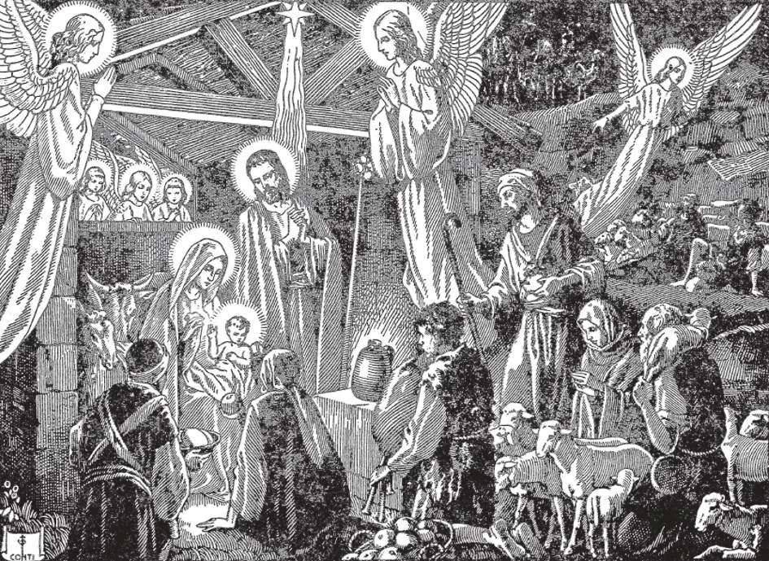

# 31. A Natividade

*"E deu à luz seu Filho primogênito, e envolveu-O em panos, e deitou-O numa manjedoura, porque não havia lugar para eles na estalagem. E havia na mesma região pastores que vigiavam e guardavam seu rebanho nos campos durante as vigílias da noite. E eis que um anjo do Senhor se lhes apresentou e a glória de Deus os cercou de claridade, e temeram em grande maneira. E o anjo disse-lhes: Não temais, pois eis que vos anuncio uma grande alegria, que será para todo o povo: é que hoje vos nasceu na cidade de Davi um Salvador, que é o Cristo Senhor"*

**Quando nasceu Cristo?**

— Cristo nasceu da Santíssima Virgem Maria no Dia de Natal, em Belém, há mais de mil e novecentos anos.

1. Quando Jesus Cristo nasceu, os judeus não eram mais independentes. Em 64 A.C. Pompeu reduziu seu reino e o sujeitou a Roma.

> Como os judeus estavam sempre tramando rebelião contra Roma, o rei judeu foi substituído por Herodes, um gentio, o primeiro não-judeu a tornar-se rei. Assim o cetro foi "tirado de Judá", e o tempo predito para o Messias havia chegado.

2. Hoje contamos as datas desde o nascimento de Cristo. Este tem sido o costume contínuo desde o tempo de Carlos Magno, embora muitos governantes desde o século V tivessem adotado a prática.

> Contudo, há um erro de uns quatro a seis anos. Geralmente, supõe-se, como matéria de fato histórico, que Cristo nasceu 7-5 A.C. Um erro no cálculo das datas em séculos posteriores produziu esta anomalia.

3. Belém é uma pequena cidade na Judeia, perto da cidade de Jerusalém. José e Maria foram lá em obediência ao Imperador em Roma, que havia ordenado a todos os seus súditos registrar-se nas cidades de seus ancestrais.

> José e Maria eram ambos descendentes do Rei Davi, cuja cidade era Belém; é por isto que foram registrar-se lá. Procuraram encontrar um lugar para ficar mesmo que apenas por uma noite, mas não puderam encontrar refúgio em lugar nenhum. E assim procuraram abrigo numa pobre estrebaria; lá Jesus nasceu.

4. Jesus nasceu numa estrebaria, um lugar pobre. Preferiu a pobreza e humilhação para sofrer mais por nós.

> Quis mostrar-Se amigo dos pobres, e ensinar que o melhor caminho para o céu é através da humildade e desapego dos bens mundanos.

5. A Igreja celebra a Natividade em 25 de dezembro. A festa é chamada Natal. Neste dia, todo padre tem o privilégio de dizer três Missas: uma em comemoração do nascimento eterno de Cristo de Deus o Pai; outra em lembrança de Seu nascimento temporal da Santíssima Virgem Maria; e uma terceira para recordar Seu nascimento espiritual nos corações dos fiéis.

> A palavra "Natal" vem de Cristo e Missa. A festa é assim chamada porque naquele dia a Missa, comemorando o nascimento de Cristo é dita.

6. Um anjo apareceu aos pastores e lhes contou da Natividade. Uma estrela guiou três Magos (Sábios) a Belém.

> Os pastores representavam os pobres. Os Magos representavam os ricos. Todos ofereceram seus presentes ao Menino Jesus. Nosso Senhor não olha o preço de nossos presentes, mas a pureza de nossos corações. A Igreja comemora a adoração dos Magos na Festa da Epifania, 6 de janeiro. "Epifania" significa manifestação. Nas pessoas dos Magos, que não eram judeus, Nosso Senhor foi manifestado a todas as nações da terra, que estavam na época perdidas no paganismo. Com os Magos, somos chamados à Verdade; o Antigo Testamento terminou, e o mundo entrou numa nova Aliança com Deus. E se, como os Magos oferecermos a Jesus Cristo o ouro de nosso amor, a mirra do auto-sacrifício, e o incenso de nossas orações, também seremos unidos a Deus.

7. Muitas igrejas e casas montam um presépio no Natal. Este costume, embora de origem muito antiga, foi popularizado por São Francisco de Assis.

> No ano de 1223, visitou o Papa Honório III e pediu aprovação de seus planos de fazer uma representação cênica da Natividade. Tendo obtido o consentimento do Papa, Francisco deixou Roma, e chegou a Greccio na Véspera de Natal. Lá na igreja construiu um presépio, agrupando ao redor imagens da Santíssima Virgem e São José, dos pastores, do boi, e do asno. Na Missa da meia-noite, São Francisco atuou como diácono. Após cantar as palavras do Evangelho, "E deitaram-No numa manjedoura", ajoelhou-se para meditar sobre o grande dom da Encarnação. E as pessoas ao redor viram em seus braços um Menino, cercado por uma luz mui brilhante. Desde então, a devoção ao presépio espalhou-se por toda parte. O presépio permanece na igreja até o dia oitavo da Epifania. No tempo apropriado, as imagens dos Três Reis e sua comitiva são adicionadas, fazendo um avanço diário em direção ao presépio.

A maioria das casas também monta uma árvore de Natal decorada. É uma lembrança da árvore da cruz. As caixas de presentes de Natal nos lembram do grande Presente que Deus nos enviou.

> Papai Noel, o alegre e amado distribuidor de presentes de Natal, é uma adoção americana de São Nicolau, Bispo de Mira, do século IV. Este Santo é popular na Alemanha, Suíça, e Holanda, onde é feito o provedor secreto de presentes às crianças em 6 de dezembro, seu dia de festa. O costume foi trazido a Nova York pelos holandeses, rapidamente espalhou-se pelos Estados Unidos e tornou-se absorvido na celebração do Natal.

**Que incidentes na vida de Nosso Senhor estiveram intimamente ligados à Natividade?**

— Os seguintes incidentes na vida de Nosso Senhor estiveram intimamente ligados à Natividade: a Circuncisão, a Apresentação, e a fuga para o Egito.

1. O Menino recebeu o nome Jesus quando tinha oito dias de idade. Foi circuncidado, segundo o costume dos judeus. Na Circuncisão, Jesus começou Seu papel de Mediador entre Deus e o homem, derramando Seu sangue pela primeira vez por nós.

> "Chamarás Seu nome Jesus, pois Ele salvará Seu povo de seus pecados" (Mat. 1:21). "Portanto Deus... Lhe outorgou o nome que está acima de todo nome, para que ao nome de Jesus dobre-se todo joelho, dos que estão no céu, na terra, e debaixo da terra" (Fil. 2:9-10). "Se pedirdes ao Pai algo em Meu nome, Ele vo-lo dará" (João 16:23). A festa da Circuncisão é celebrada no Dia de Ano Novo. Assim a Igreja nos ensina a começar tudo em nome de Jesus.

2. Quando Jesus tinha quarenta dias, Sua Mãe O apresentou no Templo em Jerusalém. Em imitação, embora o rito seja essencialmente diferente, as mães hoje após o parto buscam a bênção da Igreja numa cerimônia de ação de graças chamada "igrejamento".

> A festa da Apresentação é celebrada em 2 de fevereiro. É também chamada a purificação da Santíssima Virgem, ou Dia de Candelária. Neste dia, velas são abençoadas e carregadas em procissão, em memória das palavras do santo Simeão, quando Jesus foi apresentado no Templo. Disse que Nosso Senhor era "uma Luz de revelação aos gentios".

3. Maria e José levaram o Menino Jesus ao Egito para salvá-Lo do Rei Herodes, que queria matá-Lo.

> Um anjo apareceu a José e disse-lhe que levasse o Menino Jesus e Sua mãe para o Egito. Permaneceram no Egito até a morte do Rei Herodes. Então um anjo apareceu a José e ordenou-lhe retornar à terra dos judeus.
