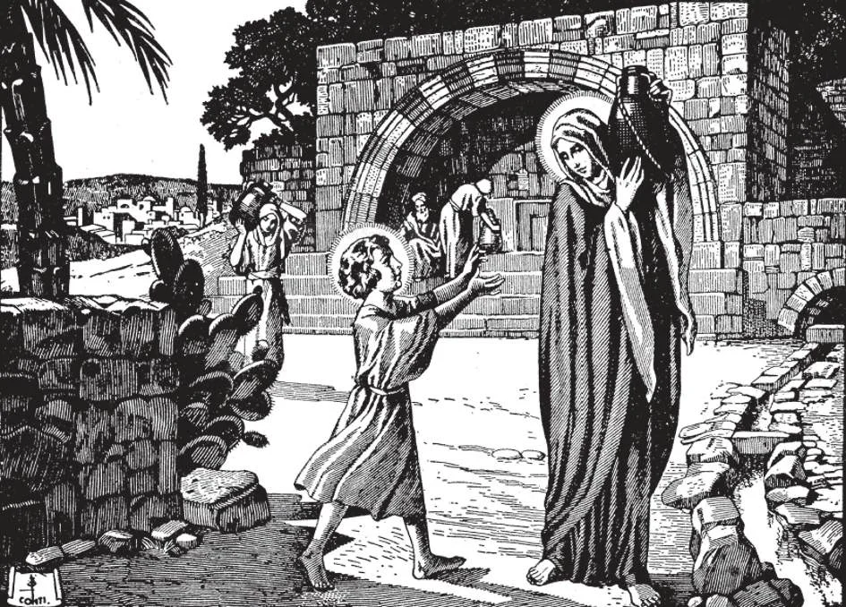

# 32. A Vida Oculta de Jesus Cristo

*Após o encontro no Templo, Jesus retornou com Maria e José a Nazaré. Lá viveu com eles, fazendo tudo o que podia para ajudar Sua Mãe e São José em seu trabalho. Jesus, o Próprio Deus, obedeceu a mortais, porque quis nos dar um exemplo. Viveu uma vida de obediência, humildade, e pobreza em Nazaré até ter cerca de trinta anos. Esta vida oculta nos ensina, entre outras coisas, o valor aos olhos de Deus, da oração, humildade e obediência.*

**Como pode a vida de Jesus Cristo ser dividida?**

— A vida de Jesus Cristo pode ser dividida em três partes: Sua infância até o tempo em que tinha doze anos; Sua vida oculta, até o tempo em que começou Seu ensino; e Sua vida pública, até o tempo de Sua morte.

1. Após o assassinato dos Santos Inocentes, o Menino Jesus viveu no Egito com Sua mãe e São José até a morte de Herodes, então retornou com eles à Terra Santa.

> Um anjo apareceu a José e disse: "Levanta-Te, e toma o Menino e sua mãe, e vai para a terra de Israel" (Mat. 2:20). Assim como São José havia obedecido sem questionar quando lhe disseram para levar o Menino ao Egito, assim agora obedeceu, sabendo que Deus que vela sobre as aves do céu velaria sobre aqueles dados a seu encargo.

2. A Sagrada Família viveu em Nazaré. De lá, todo ano Maria e José iam adorar no Templo de Jerusalém. Quando Jesus tinha doze anos, foi com Seus pais para celebrar a Páscoa em Jerusalém. Então Maria e José deixaram a cidade para retornar a Nazaré, mas Jesus permaneceu para trás sem seu conhecimento.

> "Mas pensando que estava na caravana, tinham caminhado um dia de jornada antes que lhes ocorresse procurá-Lo entre seus parentes e conhecidos. E não O encontrando, retornaram a Jerusalém em busca d'Ele" (Luc. 2:44-45). Podemos apenas imaginar a angústia de Maria e José ao terem perdido Jesus, mui precioso para eles, o Menino que havia sido confiado a seus cuidados. E qual foi sua alegria quando após três dias de busca O encontraram no Templo, no meio dos doutores, ouvindo-os e interrogando-os! Maria disse quão grande havia sido sua dor quando disse: "Filho, por que fizeste assim conosco? Eis que teu pai e eu andávamos à Tua procura, cheios de aflição" (Luc. 2:48). Mas Jesus respondeu: "Como é que Me procuráveis? Não sabíeis que devo ocupar-Me das coisas de Meu Pai?" (Luc. 2:49). Jesus amava ternamente Maria e José, mas não hesitou em causar-lhes dor e separar-Se deles, para obedecer à vontade de Seu Pai celestial. Em imitação d'Ele, muitos jovens deixam seu lar e seus queridos pais, para entrar no sacerdócio ou numa congregação religiosa, para servir a Deus completamente.

3. Alguns intérpretes não-Católicos insistem que Jesus tinha irmãos, que não era o único Filho de Maria. Aqueles de que se fala nos Evangelhos como os "irmãos" de Nosso Senhor (Mat. 13:55), eram Seus parentes de sangue; era o costume entre os judeus chamar parentes próximos de "irmãos".

> Assim Abraão chamou seu sobrinho Ló desta maneira: "Não haja contenda entre mim e ti... pois somos irmãos" (Gên. 13:8). Como escreveu São João Crisóstomo, Nosso Senhor na cruz não teria precisado encomendar Sua Mãe ao Seu Apóstolo João, se ela tivesse tido outros filhos.

**Quanto tempo durou a vida oculta de Jesus Cristo?**

— A vida oculta de Jesus Cristo durou desde Seu retorno a Nazaré aos doze anos até entrar na vida pública, aos trinta anos.

1. Desta parte da vida de Cristo tudo o que lemos diretamente da Sagrada Escritura são duas afirmações: "E desceu com eles, e veio a Nazaré, e era-lhes submisso.... E Jesus crescia em sabedoria, idade e graça diante de Deus e dos homens" (Luc. 2:51-52). Nestas duas sentenças está contida a história de dezoito anos da vida de Jesus Cristo, o Deus-Homem.

> No Templo, na tenra idade de doze, Jesus havia provado Sua sabedoria diante dos doutores da lei. Como São Lucas escreve, "E todos os que O ouviam estavam maravilhados de Sua inteligência e respostas" (Luc. 2:47). Mas continuou após este início incomum e favorável; ficou para pregar Sua doutrina? Não; ao invés, seguiu mansamente Seus pais como uma criança pequena daquela idade, e foi viver com eles na obscuridade em Nazaré.

2. As ações de Jesus Cristo são destinadas a nós como exemplos e instruções, tanto quanto Suas palavras. Como disse: "Dei-vos o exemplo, para que como Eu vos fiz, assim façais vós também" (João 13:15). A vida oculta de Jesus é para nós um modelo perfeito de humildade. Viveu na pobreza e humildade: a Mãe que escolheu foi uma mulher pobre; Seu pai adotivo era carpinteiro; a cidade na qual passou a maior parte de Sua vida era um lugar obscuro desprezado pelos judeus: "Pode algo bom sair de Nazaré?" (João 1:46).

> Por Sua vida oculta Jesus Cristo nos ensina a aprender santidade e sabedoria antes de presumirmos ensinar outros. Ensina-nos, vivendo na obscuridade, a lutar contra nossa vaidade, que nos faz desejar fazer apenas o que parece grande e importante, que nos faz desejar ser louvados e notados. Por Sua vida oculta, Nosso Senhor nos ensina a subjugar nosso orgulho, viver dia após dia sem impaciência ou queixa, desconhecido do mundo, e até desprezado, se essa é a vontade de Deus para nós; então teremos verdadeira paz de coração. E assim Jesus disse: "Aprendei de Mim, que sou manso e humilde de coração" (Mat. 11:29). Por longos anos de obscuridade em Nazaré, foi apenas "o filho de um carpinteiro".

3. A vida oculta de Jesus Cristo é para nós um modelo perfeito de obediência: "E era-lhes submisso". O Deus de todas as coisas criadas, todo-poderoso e infinito, era submisso a dois pobres e desconhecidos mortais. Obedeceu-lhes em todas as coisas, pronta, constante e alegremente, e com grande amor.

> Modelemos nossa obediência neste padrão perfeito. Obedeçamos a nossos superiores como representantes de Deus, dando-lhes devido respeito e pronta obediência. Quando nossos pais nos pedem para fazer algo, e vamos fazê-lo, mas com murmuração e sem espírito, é esta a obediência que o Menino Jesus deu em Nazaré? Quando temos que fazer alguma tarefa desagradável ou difícil, imitemos Jesus em Suas próprias palavras: "Sim, Pai, pois assim foi do Teu agrado" (Mat. 11:26). Desta forma nossa obediência será como a de Jesus, sobrenatural; obedeceremos a seres humanos por amor de Deus; estaremos realmente obedecendo ao Próprio Deus, nas pessoas daqueles que Ele colocou sobre nós. Pelo exemplo de Sua vida oculta nosso Senhor estabeleceu o princípio para a vida religiosa, particularmente para aquela em ordens contemplativas.

4. Jesus "crescia em sabedoria e graça diante de Deus e dos homens." Embora possuísse toda sabedoria e graça desde o primeiro momento de Sua vida mortal, manifestou-as apenas gradualmente e de modo que estava de acordo com Seus anos.

> Podemos obter muito mérito diante de Deus sem fazer quaisquer ações marcantes, apenas sendo humildes e obedientes no lugar da vida no qual agradou a Deus colocar-nos. Se Cristo o Filho de Deus, o Próprio Deus, contentou-Se em ser humilde, pobre e desconhecido, fazer tarefas comuns dia após dia pela maior parte de Sua vida terrena, há alguma razão pela qual deveríamos estar sempre tentando exaltar-nos, atrair admiração, sempre alimentar nossa vaidade?
