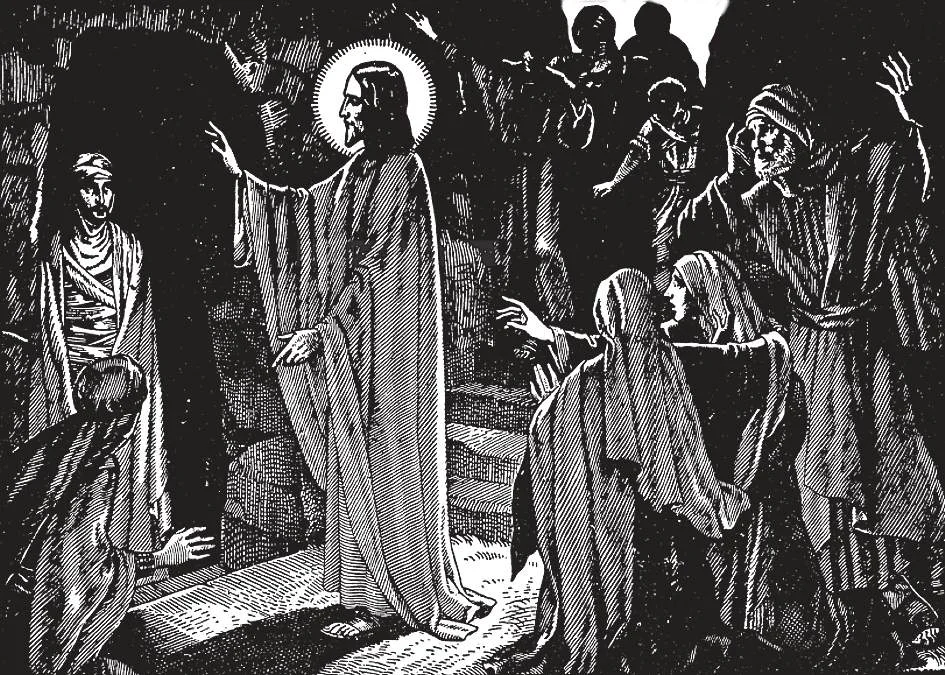

# 33. A Vida Pública de Jesus Cristo

*Nosso Senhor passou os três anos de Sua vida pública ensinando, curando os doentes, operando milagres para provar Sua missão e Divindade. Um de Seus milagres mais maravilhosos foi a ressurreição de Lázaro. Lázaro havia estado morto e sepultado por quatro dias. Mas Jesus foi ao sepulcro e ordenou que a pedra que o fechava fosse removida. Então clamou: "Lázaro, vem para fora!" E Lázaro saiu do túmulo. Por causa deste milagre, os fariseus tornaram-se mais invejosos, e até planejaram matar Lázaro, para fazer parecer que Jesus não o havia ressuscitado dos mortos.*

**Quando começou Cristo Sua vida pública?**

— Cristo começou Sua vida pública quando tinha cerca de trinta anos.

1. Após passar longos anos na obscuridade e trabalho humilde, Jesus Cristo então entrou num período de atividade, indo por toda parte e ensinando publicamente. Deixou Seu lar em Nazaré, e começou Sua vida pública por um ato de grande humildade: Seu batismo nas mãos de São João Batista no rio Jordão.

> A mãe de São João Batista era Santa Isabel, prima da Santíssima Virgem Maria. São João viveu uma vida de penitência muito rigorosa no deserto, preparando-se para seu papel de arauto ou precursor do Salvador. Cerca de dois anos antes de Cristo começar Sua vida pública, João Batista saiu do deserto, e começou a pregar penitência; batizava no Jordão todos os que criam em seus ensinamentos e desejavam começar uma nova vida. São João Batista foi o precursor de Cristo. Falou ao povo da vinda do Messias, e apontou Jesus para eles como o "Cordeiro de Deus". Foi morto por Herodes, porque repreendeu o governante por sua vida imoral. Jesus veio a João para ser batizado; imediatamente depois, quando Nosso Senhor saiu do rio, o Espírito Santo desceu sobre Ele na forma de uma pomba, e uma voz do céu foi ouvida dizendo: "Este é Meu Filho amado, em Quem Me comprazo" (Mat. 3: 17).

2. Após Seu batismo, Jesus foi ao deserto, onde jejuou quarenta dias e quarenta noites. Isto nos ensina a olhar o batismo como um chamado à penitência, e a preparar-nos para todo tipo de atividade pela mortificação e oração.

> Os quarenta dias da Quaresma destinam-se a comemorar o jejum de quarenta dias de Nosso Senhor. A Quaresma dura da Quarta-feira de Cinzas até a meia-noite do Sábado Santo.

3. Após o longo jejum de Nosso Senhor, foi permitido ao demônio tentá-Lo. Cristo repreendeu o demônio, e anjos vieram servi-Lo.

> Desta tentação de Nosso Senhor, sabemos que uma tentação não é pecaminosa. Enquanto resistirmos ao demônio, somos agradáveis a Deus, por mais forte que seja a tentação que nos assalta. "Deus é fiel e não permitirá que sejais tentados além de vossas forças, mas com a tentação vos dará também o meio de sair, para que possais suportá-la" (1 Cor. 10: 13).

**Quanto tempo durou a vida pública de Cristo?**

— A vida pública de Cristo durou cerca de três anos, durante os quais Ele ia por toda parte pregando, ensinando e fazendo o bem.

1. Após Seu retorno do jejum de quarenta dias no deserto, Jesus chamou Seus primeiros discípulos. Em poucos dias, operou Seu primeiro milagre, transformando água em vinho numa festa de casamento em Caná, a pedido de Sua Mãe, embora, como lhe disse, Sua hora ainda não havia chegado.

> Entre as obras marcantes de Jesus durante o primeiro ano de Sua vida ativa estavam: expulsou vendedores do Templo, dizendo que o fizeram um "covil de ladrões". Curou o filho de um governante, a sogra de Pedro, o paralítico na piscina, a filha de Jairo. Acalmou a tempestade.

2. Jesus começou o segundo ano de Sua vida pública por um ato de suma importância: escolheu dos muitos que O seguiam, "os Doze", Seus doze Apóstolos, Ele mesmo chamando-os Apóstolos. No Sermão da Montanha, resumiu Seus ensinamentos; é a lei do amor tomando o lugar da lei do temor.

> Durante o segundo ano de Sua missão, Cristo operou muitos milagres, entre os quais estavam: a cura do servo do centurião, do filho da viúva em Naim; a primeira multiplicação dos pães; andou sobre as águas, e mandou Pedro andar sobre elas também. Perdoou Maria Madalena, e enviou os Apóstolos em sua missão. Começou a ensinar na forma de parábolas, comparando o que queria ensinar com coisas comuns. Entre Suas parábolas deste período estavam: o semeador, o joio e o trigo, o grão de mostarda, a pérola de grande preço.

3. Em Seu terceiro ano de ensino, Jesus foi à Galileia e Fenícia, porque na Judeia onde havia estado ensinando, os fariseus por inveja e ciúme procuravam matá-Lo. Na Fenícia, cedeu às súplicas de um gentio, uma cananeia, que perseverou em pedir-Lhe que curasse sua filha.

> Na Galileia Jesus curou um homem surdo-mudo, usando sinais que a Igreja adotou em suas cerimônias batismais; operou o milagre da segunda multiplicação dos pães. No Monte Tabor, foi transfigurado na presença de Pedro, Tiago e João. Entre outras curas estavam as dos dez leprosos, e o homem cego de nascença. Prometeu o primado sobre todos a Pedro, pagou o tributo a César, perdoou a mulher pega em adultério, enviou Seus setenta e dois discípulos numa missão, chamou o jovem rico, instruiu Maria e Marta, e foi hóspede de Zaqueu. Contou as parábolas do servo sem misericórdia, o bom samaritano, a ovelha perdida, a dracma perdida, a grande ceia, o administrador injusto, o filho pródigo, Dives e Lázaro, o fariseu e o publicano, os trabalhadores na vinha.

4. Finalmente, no fim de Sua vida pública, Jesus ressuscitou Lázaro dos mortos. Por este tempo a inveja dos fariseus era tão grande que determinaram provocar a morte de Jesus; Judas veio como instrumento pronto.

> Madalena ungiu Nosso Senhor, como Ele disse, para Seu sepultamento. Entrou em Jerusalém em triunfo montado num jumento, com crianças acenando palmas e cantando. Contou a parábola dos vinhateiros e o herdeiro, para mostrar aos fariseus que sabia de seus desígnios contra Ele. E por último, comeu a Última Ceia com Seus Apóstolos, lá instituindo a Santa Eucaristia.

**Qual foi o objetivo de Cristo em Sua vida pública?**

— O objetivo de Cristo em Sua vida pública foi ensinar o que Deus requer que todos creiam e pratiquem, para que todos possam entrar no reino do céu.

1. Para este propósito reuniu cerca de setenta e dois discípulos, e deles escolheu doze Apóstolos, aos quais deu instrução e treinamento especial. Por eles estabeleceu Sua Igreja, que deveria continuar Sua obra após Sua morte, continuar ensinando o que Ele havia aberto e publicamente ensinado.

> Falou a grandes multidões, às vezes numerando quatro ou cinco mil pessoas, como quando multiplicou os pães e peixes. Cristo ensinou da maneira mais simples, para que todos pudessem entender sem dificuldade. Usou palavras simples e caseiras. Frequentemente usou sinais e parábolas, e ilustrou Seu significado com exemplos da natureza e da vida comum.

2. Nas doutrinas que ensinou, uma ideia principal é: "Buscai primeiro o reino de Deus."

> Ensinou uma nova regra de fé, e deu novos mandamentos. Ensinou o preceito do amor, mesmo para com nossos inimigos. Revelou certos mistérios: como os da Santíssima Trindade, de Sua própria divindade, do Juízo Final. Instituiu os sete sacramentos.
