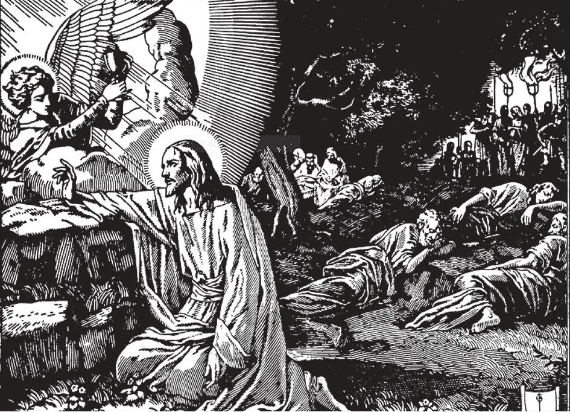

# 34. A Paixão

*Após a Última Ceia, Jesus foi com Seus Apóstolos ao Jardim do Getsêmani. E indo um pouco mais adiante, prostrou-Se sobre Seu rosto, orando: "Pai, se é possível, afasta de Mim este cálice; contudo não como Eu quero, mas como Tu queres" (Mat. 26: 39). Após orar três vezes a mesma oração, Jesus disse a Seus discípulos: "Eis que a hora está próxima, e o Filho do Homem será entregue nas mãos dos pecadores. Levantai-vos, vamos. Eis que aquele que Me trai está próximo" (Mat. 26: 45-46). Judas havia chegado.*

(QUARTO ARTIGO DO CREDO DOS APÓSTOLOS)

**Que eventos importantes marcaram o fim da vida pública de Nosso Senhor?**

— Os seguintes eventos marcaram o fim da vida pública de Nosso Senhor: Sua entrada solene em Jerusalém, a Última Ceia que comeu com Seus Apóstolos, e finalmente, Sua paixão e morte.

1. Jesus Cristo entrou em Jerusalém em triunfo, montado num jumento, com crianças acenando palmas e cantando.

> A Igreja comemora a entrada em Jerusalém no Domingo de Ramos. Naquele dia, palmas são abençoadas, e há uma procissão, em memória das palmas que o povo alegre acenou na entrada em Jerusalém de Nosso Senhor. O Domingo de Ramos é o domingo antes da Páscoa. A semana seguinte é chamada Semana Santa.

2. Na quinta-feira após Sua entrada em Jerusalém, Jesus comeu a Ceia Pascal com Seus Apóstolos. Chamamo-la Última Ceia, pois foi a última refeição que comeu antes de Sua morte.

> Os judeus celebravam a festa da Páscoa em memória de sua libertação do Egito. Haviam sido salvos pelo sangue do cordeiro pascal.

3. Após a Ceia, Nosso Senhor lavou os pés dos Apóstolos. Fez isto para nos ensinar humildade.

> Em comemoração, o celebrante da Missa de Quinta-feira Santa hoje lava os pés de doze homens, após o Evangelho.

4. Após a lavagem dos pés, Nosso Senhor instituiu a Santa Eucaristia, disse a primeira Missa, e deu a Seus Apóstolos sua primeira Santa Comunhão.

**O que se entende pela Redenção?**

— Pela Redenção entende-se que Jesus Cristo, como Redentor de toda a raça humana, ofereceu Seus sofrimentos e morte a Deus como um sacrifício apropriado em satisfação pelos pecados dos homens, e recuperou para eles o direito de serem filhos de Deus e herdeiros do céu.

> Um redentor é aquele que paga para recuperar algo perdido. Dá satisfação, compensação por uma ofensa ou injúria feita a outro.

1. Nenhuma criatura poderia, por si mesma, fazer satisfação pelo pecado. O pecado ofende um Deus infinito, e portanto precisaria de satisfação infinita. Portanto Alguém Infinito, Jesus Cristo, teve que oferecer aquela satisfação.

> Jesus Cristo sofreu e morreu como homem; como Deus não podia nem sofrer nem morrer. Sofreu excruciantemente para fazer plena reparação pelo pecado, e para imprimir em nós o grande mal do pecado. Mesmo apenas um pecado é tão abominável a Deus que não todos os dilúvios e fogos podem apagar a mancha. Apenas o sangue do Próprio Deus pode fazê-lo. "O Senhor lançou sobre Ele a iniquidade de todos nós" (Is. 53: 6).

2. Cristo morreu por todos os homens, sem exceção. É o Redentor de todos os homens. Nem todos os homens são salvos porque nem todos aceitam as graças que Cristo mereceu para nós por Sua morte. Muitos não creem n'Ele. Dos que creem, muitos levam vidas pecaminosas.

> "Cristo também nos amou e Se entregou por nós, como oferta e sacrifício a Deus" (Efés. 5: 2). Nunca podemos compreender plenamente que Deus morreu por nós. Nunca podemos recompensá-Lo nesta vida ou na próxima. O único modo que podemos mostrar nosso apreço é viver segundo Sua vontade.

**Quais foram os principais sofrimentos de Cristo?**

— Os principais sofrimentos de Cristo foram Sua amarga agonia de alma, Seu suor de sangue, Seu cruel flagelo, Sua coroação de espinhos, Sua crucificação, e Sua morte na cruz.

> Cristo havia frequentemente predito Sua Paixão. "Pois estava ensinando Seus discípulos, e dizendo-lhes: O Filho do Homem será entregue nas mãos dos homens, e O matarão; e tendo sido morto, ressuscitará ao terceiro dia" (Mar. 9: 30). Novamente: "Eis que subimos a Jerusalém, e o Filho do Homem será entregue aos principais sacerdotes e aos escribas; e O condenarão à morte, e O entregarão aos gentios; e O escarnecerão, e cuspirão n'Ele, e O açoitarão, e O matarão; e ao terceiro dia ressuscitará" (Mar. 10: 33-34).

1. Da Última Ceia, Cristo foi com Seus Apóstolos ao Jardim das Oliveiras para orar. Lá foi sobrecarregado com tristeza e agonia, de modo que suou sangue.

> Nosso Senhor olhou adiante para Sua agonia, dizendo a Seus Apóstolos: "Para que o mundo saiba que amo o Pai, e que faço como o Pai Me ordenou. Levantai-vos, vamos daqui" (João 14: 31). No Jardim, Jesus sentiu-Se tão triste pelos pecados dos homens e pelo que Lhe aconteceria que disse: "Minha alma está triste até a morte" (Mat. 26: 38). A Seu Pai, clamou em dor: "Pai, se queres, afasta de Mim este cálice; contudo não seja Minha vontade, mas a Tua, seja feita" (Luc. 22: 42). Em agonia, "Seu suor tornou-se como gotas de sangue, correndo sobre a terra" (Luc. 22: 44).

2. Jesus Cristo foi traído por Judas, preso por soldados, levado perante o sumo-sacerdote, e condenado à morte. O Sinédrio, o conselho dos judeus, chefiado por Caifás o sumo-sacerdote, condenou Jesus à morte pelo crime de blasfêmia, porque reclamou ser Cristo o Filho de Deus.

> "Então o sumo-sacerdote, levantando-se, disse-Lhe: Não respondes nada às coisas que estes homens depõem contra Ti? Mas Jesus guardava silêncio. E o sumo-sacerdote disse-Lhe: Conjuro-Te pelo Deus vivo que nos digas se és o Cristo, o Filho de Deus. Jesus disse-lhe: Tu o disseste. ... Então o sumo-sacerdote rasgou suas vestes, dizendo: Blasfemou; que necessidade temos ainda de testemunhas? Eis que agora ouvistes a blasfêmia. Que vos parece? E responderam e disseram: É réu de morte" (Mat. 26: 62-66).

3. Jesus Cristo foi levado a Pôncio Pilatos, o Governador Romano da Judeia, para ter Sua sentença confirmada. Na época os judeus estavam proibidos por seus mestres romanos de condenar alguém à morte sem a confirmação do Governador. Pilatos questionou Cristo vez após vez, mas teve que dizer a Seus acusadores: "Não acho culpa n'Ele."

> Os Sacerdotes judeus e Fariseus odiavam e perseguiam Jesus porque esperavam que o Messias fosse um rei terreno. Eram tão maus que apesar das provas da divindade de Cristo, não criam que um homem pobre pudesse ser o Messias. Odiavam Jesus; Ele os havia repreendido por seus pecados.

4. Mas Pilatos desejava agradar aos judeus, e mandou açoitar Jesus. Jesus foi amarrado a uma coluna, Suas roupas arrancadas; homens fortes com chicotes, cordas e tiras com espinhos de ferro açoitaram-n'O, e todo o corpo de Nosso Senhor foi uma grande ferida.

> "E os soldados, trançando uma coroa de espinhos, puseram-na sobre Sua cabeça, e vestiram-n'O com um manto púrpura. E vinham a Ele e diziam: Salve, Rei dos Judeus! e O feriam. Pilatos portanto novamente saiu e disse-lhes: Eis que vo-Lo trago fora, para que saibais que não acho culpa n'Ele. Jesus portanto saiu, usando a coroa de espinhos e o manto púrpura. E disse-lhes: Eis o homem!"

5. Finalmente, temendo que se não permitisse Jesus ser condenado à morte os judeus o acusariam perante César, Pilatos cedeu à insistência dos judeus e entregou-O a eles para ser crucificado.

> Cristo foi feito carregar Sua cruz pelas ruas de Jerusalém até o Monte Calvário. Foi pregado na cruz cerca do meio-dia, morrendo três horas depois, crucificado entre dois ladrões.
