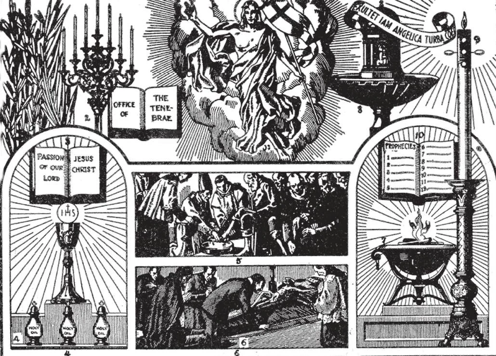

# 35. O Calvário

*Durante a Semana Santa a Igreja vive novamente a paixão e morte de Cristo. No primeiro dia, Domingo de Ramos, a entrada solene de Jesus em Jerusalém é celebrada pela bênção das palmas (1), seguida por uma procissão solene. Na Missa deste dia, como na terça, quarta e sexta, a história da Paixão (3) de cada Evangelista é lida. Na quinta, sexta e sábado da Semana Santa as Trevas são celebradas: as quinze velas são apagadas uma por uma, para simbolizar a fuga dos discípulos (2), e a morte de Nosso Senhor. Na Quinta-feira Santa de manhã uma Missa pontifical é celebrada, apenas nas catedrais; nesta os santos óleos (4) são abençoados. Comemorando a Última Ceia na qual a Santa Eucaristia e o Sacerdócio foram instituídos, a Missa de Quinta-feira Santa toma lugar à noite, com a lavagem dos pés (5) para comemorar a lavagem dos pés dos Apóstolos por Cristo. No serviço da Sexta-feira Santa, ênfase é dada à veneração da cruz (6). Os serviços do Sábado Santo são realizados à noite, começando com a bênção do novo fogo (7); disto a vela pascal é acesa (9), uma lembrança de Cristo, Luz do mundo. Os cinco grãos de incenso embutidos na vela nos lembram de Suas chagas. Quatro Lições (10) são lidas; a água batismal é abençoada e levada à pia (8). A Missa comemora a gloriosa Ressurreição de Nosso Senhor (11).*

**Quando morreu Cristo?**

— Cristo morreu na Sexta-feira Santa.

> Durante as três horas que Cristo sofreu na cruz, Ele falou sete vezes. Chamamos estas as sete palavras:

1. "Pai, perdoa-lhes, pois não sabem o que fazem." 2. "Em verdade te digo: hoje estarás comigo no paraíso." 3. "Mulher, eis aí teu filho. ... Eis aí tua mãe."

4. "Deus Meu, Deus Meu, por que Me abandonaste?" 5. "Tenho sede." 6. "Está consumado." 7. "Pai, em Tuas mãos entrego Meu espírito."

**Onde morreu Cristo?**

— Cristo morreu no Gólgota, um monte fora da cidade de Jerusalém.

> Cristo foi crucificado num monte chamado Calvário, fora da cidade de Jerusalém. Santo Agostinho diz que na cruz, Nosso Senhor inclinou Sua cabeça para nos beijar, estendeu Seus braços para nos abraçar, e abriu Seu coração para nos amar. Quão agradecidos devemos ser a Cristo por Seu amor! "Humilhou-Se a Si mesmo, feito obediente até a morte, e morte de cruz" (Fil. 2:8).

**O que ocorreu na morte de Cristo?**

— Na morte de Cristo, o sol se escureceu, a terra tremeu, o véu do Templo se rasgou, as rochas se fenderam, e muitos dos mortos ressuscitaram e apareceram em Jerusalém.

1. O rasgar do véu do Templo na morte de Cristo marcou o fim da religião judaica como a verdadeira religião. Esta religião judaica havia sido uma figura da Verdadeira Igreja, e quando a Igreja foi estabelecida, não era mais necessária: tipos e figuras tinham que dar lugar à realidade.

> O véu do Templo ocultava o Santo dos Santos, a parte mais sagrada do Templo.

2. Não devemos, contudo, cometer o erro de pensar que o Cristianismo terminou as leis morais — leis concernentes ao bem e mal que foram ensinadas pela religião judaica. Cristo veio não para destruir, mas para aperfeiçoar a Lei Antiga.

> A autoridade do Templo e seus oficiais foi agora colocada na Igreja estabelecida por Cristo, nas mãos de Seus Apóstolos. As leis cerimoniais dos judeus relativas ao culto foram abolidas.

3. A Igreja comemora a paixão e morte de Cristo na Sexta-feira Santa. Naquele dia toda a Igreja está de luto. Nenhuma Missa é dita, mas a cruz é venerada e a Comunhão é dada.

> O altar é desnudado; as luzes são apagadas, e os sinos silenciados. O Crucifixo é descoberto, e padres e fiéis adoram a cruz.

4. Após Sua morte, o corpo de Nosso Senhor foi descido da cruz e depositado no sepulcro que pertencia a José de Arimateia. Então Seus discípulos rolaram uma grande pedra para fechar o túmulo.

> Os principais sacerdotes e os fariseus foram em corpo a Pilatos, dizendo: 'Senhor, lembramo-nos de que aquele impostor disse, enquanto ainda vivia: "Depois de três dias ressuscitarei." Ordena, pois, que o sepulcro seja guardado até o terceiro dia, não suceda que venham seus discípulos e O roubem, e digam ao povo: "Ressuscitou dos mortos"; e o último embuste será pior que o primeiro.' Pilatos disse-lhes: 'Tendes uma guarda; ide, guardai-o como sabeis.' Então foram e selaram a pedra, pondo a guarda (Mat. 27:63-66).

**O que aprendemos dos sofrimentos e morte de Cristo?**

— Dos sofrimentos e morte de Cristo aprendemos o amor de Deus pelo homem e o mal do pecado, pelo qual Deus, que é todo-justo, demanda tão grande satisfação.

1. Não era necessário para Jesus sofrer tão intensamente para redimir todos os homens. Como Seus méritos são infinitos, Ele poderia ter apagado os pecados de mil mundos derramando uma gota de Seu sangue. Mas escolheu sofrer agônias porque nos ama.

> "Maior amor do que este ninguém tem, que alguém dê sua vida por seus amigos" (João 15:13). "Eu sou o bom pastor. O bom pastor dá sua vida por suas ovelhas... Eu sou o bom pastor; e conheço as Minhas e as Minhas Me conhecem... e dou Minha vida por Minhas ovelhas" (João 10:11-15).

2. Da Paixão de Cristo, aprendemos o mal que o pecado é, e o ódio que Deus lhe tem. Aprendemos a necessidade de satisfazer pela malícia e maldade que é o pecado. O pecado deve ser uma coisa horrível, para fazer Jesus Cristo o Deus-homem sofrer tanto.

> Pela obediência de Cristo Ele expiou a desobediência de Adão, pois foi obediente até a morte. "Foi traspassado por nossas iniquidades; foi moído por nossos pecados" (Is. 53:5).

3. Os sofrimentos de Cristo, além disso, servem como exemplo para nós, para fortalecer-nos nas provações.

> Cristo deu-nos um exemplo de paciência e força. Se recebemos provações, devemos aceitá-las com resignação, em imitação de Nosso Senhor, que sofreu tão voluntariamente por nossa causa. Nunca podemos ter tanto sofrimento quanto Ele teve.

Igrejas são construídas na forma de uma cruz porque dentro o sacrifício da cruz é reencenado. Dentro delas lembramos facilmente os eventos que ocorreram naquele dia há muito tempo, quando Jesus Cristo, Filho de Deus, por amor de nós sofreu e morreu na Cruz.

> As torres das igrejas nos levam a "buscar as coisas que são do alto" (Col. 3:1); são encimadas por uma cruz, o símbolo de nossa salvação; seus sinos nos chamam à oração, comunhão com Deus. O interior da igreja é dividido em três partes: o pórtico, onde nos tempos antigos os que se preparavam para o batismo e os penitentes ajoelhavam-se; a nave, que é a porção central e principal, para os que assistem ao Santo Sacrifício; e o coro ou santuário, onde nos tempos antigos os cantores ficavam, agora reservado para o clero, e separado da nave pela grade da comunhão.
