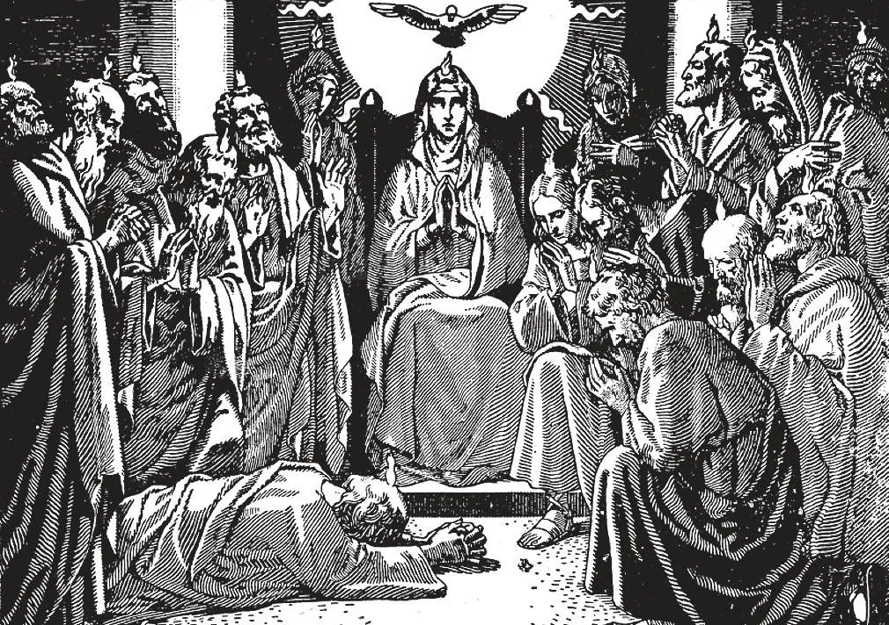

# 38. O Espírito Santo

*"E quando os dias de Pentecostes estavam chegando ao fim, estavam todos reunidos num só lugar. E subitamente veio do céu um som, como de um vento violento vindo, e encheu toda a casa onde estavam sentados. E apareceram-lhes línguas repartidas como de fogo, que pousaram sobre cada um deles. E foram todos cheios do Espírito Santo e começaram a falar em línguas estranhas, assim como o Espírito Santo lhes dava que falassem" (Atos 2:1-4).*

(OITAVO ARTIGO DO CREDO DOS APÓSTOLOS)

**Quem é o Espírito Santo?**

— O Espírito Santo é Deus e a Terceira Pessoa da Santíssima Trindade.

1. Cristo frequentemente falou do Espírito Santo.

> Uma das ocasiões mais solenes foi quando encarregou os Apóstolos: "Ide, pois, e fazei discípulos de todas as nações, batizando-os em nome do Pai, e do Filho, e do Espírito Santo" (Mat. 28:19).

2. Em certas ocasiões, o Espírito Santo apareceu em forma visível. Quando Cristo foi batizado por João Batista, o Espírito Santo apareceu na forma de uma pomba. No Pentecostes, o Espírito Santo desceu com um vento impetuoso, e repousou sobre os Apóstolos na forma de línguas de fogo.

> Estes sinais são simbólicos da ação do Espírito Santo. A forma de uma pomba simboliza a mansidão com que o Espírito Santo opera em nossas almas. O sopro de vento representa o fortalecimento da vontade. O fogo representa zelo, fervor e a iluminação da mente.

3. O Espírito Santo procede do Pai e do Filho.

> Isto não significa que o Espírito Santo começou a existir mais tarde no tempo que o Pai e o Filho. Procedeu d'Eles desde toda a eternidade; é para eles como o calor é para o fogo, existindo e procedendo ao mesmo tempo. Não pode haver fogo sem calor; se houvesse um fogo eterno, haveria um calor eterno. Assim como há o eterno Pai e Filho, há o eterno Espírito Santo. O Espírito Santo é o eterno, mútuo amor que o Pai e o Filho têm um pelo outro; mas ao invés de ser mero sentimento, é uma Pessoa, um Ser, Deus.

4. O Espírito Santo é igual ao Pai e ao Filho, porque é Deus.

> Verdadeiro Deus como o Pai e o Filho são, o Espírito Santo é eterno, todo-sabedor, todo-poderoso. A Terceira Pessoa é chamada Espírito Santo, da palavra latina *spiritus*, um sopro. Foi espirado pelo Pai e pelo Filho. Em inglês, também O chamamos de Holy Ghost. Outros nomes usados para referir-se ao Espírito Santo são: Advogado, Paráclito, Consolador, Confortador, Amor Substancial, Espírito da Verdade, etc.

**O que faz o Espírito Santo para a salvação da humanidade?**

— O Espírito Santo habita na Igreja como a fonte de sua vida, e santifica as almas através do dom da graça.

1. Embora todas as obras Divinas dependam de todas as Três Pessoas, atribuímos a obra da santificação a Deus o Espírito Santo, porque Ele é a unidade de amor do Pai e do Filho, e a santificação do homem pela graça revela aquele amor sem limites.

> "Não sabeis que sois templo de Deus e que o Espírito de Deus habita em vós?" (1 Cor. 3:16).

2. Após o Batismo, temos o Espírito Santo em nossos corações e Ele permanece conosco enquanto não tenhamos pecado mortal em nossas almas. Este é o dom da "graça santificante".

> Então dizemos que o Espírito de Deus habita em nós. Devemos portanto tratar nosso corpo com grande reverência, pois é o templo do Espírito Santo. O Espírito Santo é dado de um modo muito especial nos sacramentos da Confirmação e Ordens Sagradas.

3. O Espírito Santo é a fonte da vida da Igreja. Ele consola, guia e dá força a ela, como Cristo prometeu.

> "A Igreja era cheia da consolação do Espírito Santo" (Atos 9:31). "Ainda tenho muitas coisas a dizer-vos, mas não podeis suportá-las agora. Mas quando Ele, o Espírito da verdade, tiver vindo, ensinar-vos-á toda a verdade" (João 16:12-13).

**Quando foi a habitação do Espírito Santo primeiro visivelmente manifestada na Igreja?**

— A habitação do Espírito Santo na Igreja foi primeiro visivelmente manifestada no Domingo de Pentecostes, quando desceu sobre os Apóstolos na forma de línguas de fogo.

> Após a Ascensão, os Apóstolos juntamente com a Santíssima Virgem e discípulos, homens e mulheres, numerando cerca de 120 pessoas, reuniram-se no Cenáculo, o quarto superior em Jerusalém onde a Última Ceia havia sido tomada. Lá passaram o tempo em oração, aguardando o cumprimento da promessa de Nosso Senhor: "Esperai aqui na cidade, até que sejais revestidos de poder do alto" (Luc. 24:49).

1. Jesus havia prometido enviar o Espírito Santo aos Apóstolos. Disse na Última Ceia: "Convém-vos que Eu vá. Pois se Eu não for, o Advogado não virá a vós; mas se Eu for, vo-Lo enviarei" (João 16:7). No Pentecostes, dez dias após a Ascensão, o Espírito Santo desceu sobre os Apóstolos e discípulos.

> No Pentecostes, três mil membros foram batizados após a pregação de São Pedro. Muitos creram, porque os Apóstolos tinham o "dom de línguas", isto é, falavam numa língua, mas os de diferentes raças que ouviam ouviam o que era dito em suas próprias línguas diferentes.

2. Celebramos a descida do Espírito Santo hoje como Domingo de Pentecostes, dez dias após a Quinta-feira da Ascensão, cinquenta dias após a Páscoa. Pentecostes significa cinquenta.

> Os nove dias no Cenáculo enquanto os Apóstolos e discípulos esperavam a vinda do Espírito Santo foram passados em oração, a primeira novena na Igreja. "Todos estes com um só espírito perseveravam na oração com as mulheres e Maria, a mãe de Jesus" (Atos 1:14). Em imitação daquela primeira novena, é nosso costume hoje fazer novenas especialmente em preparação para grandes festas. Também fazemos novenas de petição ou ação de graças.

**Quanto tempo habitará o Espírito Santo na Igreja?**

— O Espírito Santo habitará na Igreja até o fim dos tempos.

> "Eu pedirei ao Pai e Ele vos dará outro Advogado para habitar convosco para sempre, o Espírito da verdade" (João 14:16-17).

1. O Espírito Santo vela sobre a Igreja, protegendo-a da destruição. Desde o princípio a Igreja espalhou-se muito rapidamente. Na morte dos Apóstolos, apesar das perseguições, era conhecida em todas as partes do então mundo civilizado. Daí espalhou-se até os confins da terra.

> São Paulo pôde dizer: "Sim, deveras, sua voz saiu por toda a terra, e suas palavras até os confins do mundo" (Rom. 10:18).

2. O Espírito Santo deu testemunho de Cristo, e fortaleceu os Apóstolos para darem testemunho de Cristo.

> Nosso Senhor disse: "Mas quando tiver vindo o Consolador, que Eu vos enviarei da parte do Pai, o Espírito da verdade que procede do Pai, Ele dará testemunho de Mim. E vós também dais testemunho" (João 15:26-27). Por Sua descida, o Espírito Santo provou que tudo o que Jesus Cristo havia dito e feito era verdade, que Ele era de fato o Filho de Deus. Após a vinda do Espírito Santo, os Apóstolos deram testemunho de Cristo indo por todo o mundo (Atos 1:8), pregando e sofrendo por Cristo, encontrando a morte alegremente (Atos 5:41; Rom. 8:18), dizendo: "Tudo posso n'Aquele que me fortalece."
