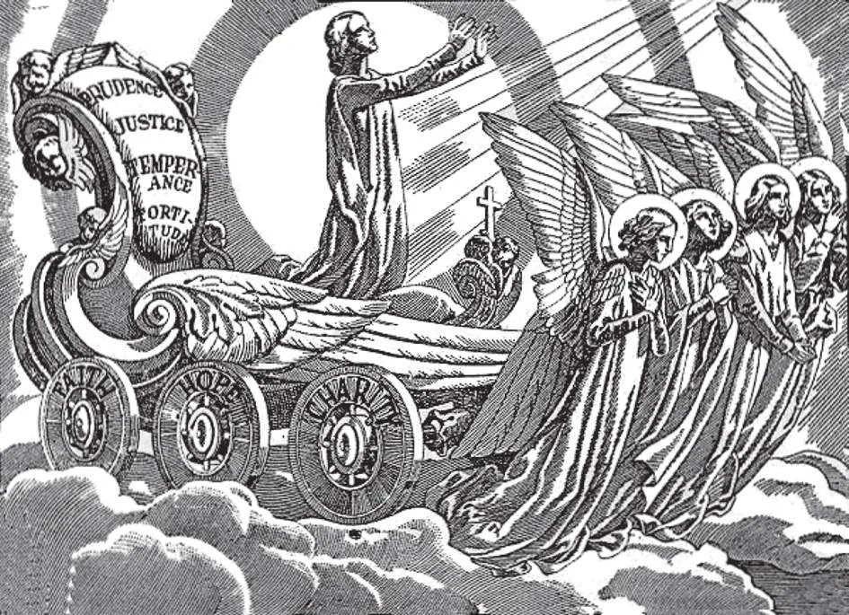

# 43. Virtudes Morais

*As virtudes teologais da fé, esperança e caridade fornecem uma base forte para todas as outras virtudes. As virtudes cardeais da prudência, justiça, fortaleza e temperança são o fundamento de todas as virtudes morais. As virtudes teologais definem nossas relações com Deus; as virtudes morais definem nossas relações conosco mesmos e nossos semelhantes. Se temos estas virtudes, estamos no caminho da perfeição.*

**Há alguma outra virtude além das virtudes teologais da fé, esperança e caridade?**

— Além das virtudes teologais da fé, esperança e caridade, há outras virtudes, chamadas virtudes morais.

1. Estas virtudes são chamadas virtudes morais porque nos dispõem a levar vidas morais, ou boas, ajudando-nos a tratar pessoas e coisas da maneira correta, isto é, segundo a vontade de Deus. Virtudes morais são opostas aos pecados capitais.

> Por exemplo, a humildade é oposta ao orgulho; a liberalidade é oposta à avareza; a castidade é oposta à luxúria; a mansidão e paciência são opostas à ira; a temperança é oposta à gula; o amor fraterno é oposto à inveja: e o zelo e diligência no que é bom são opostos à preguiça.

2. As virtudes morais são um desdobramento e complementação das virtudes teologais. As virtudes teologais aperfeiçoam nosso ser interior; as virtudes morais aperfeiçoam nosso exterior. Se sinceramente buscamos estas virtudes, estamos no caminho da perfeição.

> As virtudes teologais afetam nossas relações com Deus; as virtudes morais afetam nossas relações com nosso próximo e nós mesmos. Por exemplo, a fé nos faz crer na existência de Deus. A temperança nos faz regular nossos apetites.

**Quais são as principais virtudes morais?**

— As principais virtudes morais são prudência, justiça, fortaleza e temperança; estas são chamadas virtudes cardeais.

> Todas as outras virtudes morais brotam das virtudes cardeais. Estas são chamadas cardeais de *cardo*, a palavra latina para dobradiça, porque todas as nossas ações morais giram sobre elas como uma porta gira sobre suas dobradiças. Todas as outras virtudes morais dependem delas.

**Como a prudência, justiça, fortaleza e temperança nos dispõem a levar boas vidas?**

— Prudência, justiça, fortaleza e temperança nos dispõem a levar boas vidas, como indicado abaixo:

1. Prudência nos dispõe em todas as circunstâncias a formar juízos retos sobre o que devemos fazer ou não fazer.—Ensina-nos quando e como agir em questões relativas à nossa salvação eterna. A prudência aperfeiçoa a inteligência, que é o poder de formar juízos; para esta virtude, conhecimento e experiência são importantes.

> A prudência nos mostra como deixar as coisas terrenas para ganhar riquezas para a eternidade. É o olho da alma, pois nos diz o que é bom e o que é mau. É como uma bússola que dirige nosso curso na vida. É oposta à sabedoria mundana. "Sede, pois, prudentes e vigilantes nas orações" (1 Ped. 4:7). A prudência é uma virtude do entendimento.

2. Justiça nos dispõe a dar a cada um o que lhe pertence.—Ensina-nos a dar o que é devido a Deus e ao homem. Faz-nos dispostos a viver segundo os mandamentos. A justiça aperfeiçoa a vontade e salvaguarda os direitos do homem: seu direito à vida, liberdade, honra, bom nome, santidade do lar, e posses externas.

> O homem justo é um homem reto. Dá a cada um o que lhe é devido: dá a Deus culto; às autoridades, obediência; aos seus subordinados, recompensas e punições; e aos seus iguais, amor fraterno. "Rendei a todos o que lhes é devido: tributo a quem tributo é devido; impostos a quem impostos são devidos; temor a quem temor é devido; honra a quem honra é devida" (Rom. 13:7).

3. Fortaleza nos dispõe a fazer o bem apesar de qualquer dificuldade.—Dá-nos força para fazer o bem e evitar o mal apesar de todos os obstáculos e aflições.

> Possuímos fortaleza quando não somos impedidos por ridículo, ameaças ou perseguição de fazer o que é certo; quando estamos prontos, se necessário, a sofrer a morte. A maior fortaleza é mostrada suportando grandes sofrimentos ao invés de empreender grandes obras. Nenhum santo foi jamais covarde. Os mártires tinham fortaleza.

4. Temperança nos dispõe a controlar nossos desejos e usar corretamente as coisas que agradam nossos sentidos.—Regula nosso juízo e paixões, de modo que possamos fazer uso das coisas temporais apenas na medida em que são necessárias para nossa salvação eterna. Temos temperança quando comemos e bebemos apenas o necessário para sustentar a vida, preservar a saúde e cumprir nossos deveres.

> Devemos esforçar-nos por ser como São Francisco de Sales, que disse: "Desejo muito pouco, e esse pouco desejo pouco." Contudo, temperança não consiste em recusar ou negar a nós mesmos o que é necessário, assim nos incapacitando para boas obras.

**Quais são algumas das outras virtudes morais?**

— Piedade filial e patriotismo, que nos dispõem a honrar, amar e respeitar nossos pais e nossa pátria. É, contudo, nenhuma virtude mas um pecado se somos tão preconceituosos a favor de nossos pais que não encontramos bem nenhum nos outros; ou se somos tão "patriotas" que não vemos bem nenhum em outras nações.

> A divisão e antagonismos mútuos de nações e povos nos quais alguns professam encontrar-se como "superiores" certamente não podem agradar a Deus; deles vêm guerra e vingança. Deus é Pai de todas as nações e povos, sem exceção.

1. Obediência nos dispõe a fazer a vontade de nossos superiores. Obediência consiste não apenas em fazer o que é comandado por nosso superior, mas em estar disposto a fazer o que é comandado. Aquele que resmunga e murmura enquanto faz o que sua mãe lhe pede para fazer não é obediente.

> Obediência é uma virtude apenas quando alguém sujeita sua vontade à de outro por amor de Deus, não por motivos materiais ou naturais. Cristo é o modelo de obediência, pois obedeceu completa e amorosamente, até a morte da Cruz. "O homem obediente falará de vitória" (Prov. 21:28).

2. Veracidade, que nos dispõe a dizer a verdade.

> Devemos sempre ser verdadeiros, como filhos de Deus, Que é a Própria Verdade. Veracidade, contudo, não nos requer revelar segredos, ou responder a perguntas sobre as quais o interrogador não tem direito de perguntar. Em casos como estes, devemos ou permanecer em silêncio, ou retornar uma resposta evasiva. "Por isso, deixai a mentira e falai a verdade cada um com o seu próximo, porque somos membros uns dos outros" (Efés. 4:25).

3. Paciência, que nos dispõe a suportar provações e dificuldades.

> Na doença e infortúnio, nas dificuldades de nossas ocupações, em nossas fraquezas, tenhamos serenidade de mente, por amor de Deus: "E dai fruto em paciência" (Luc. 8:15). "Sede pacientes na tribulação, perseverando na oração" (Rom. 12:12).

Além destas, há muitas outras virtudes morais. Religião é a mais alta virtude moral, já que nos dispõe a oferecer a Deus o culto que Lhe é devido.

> Religião é classificada sob a virtude da justiça.
