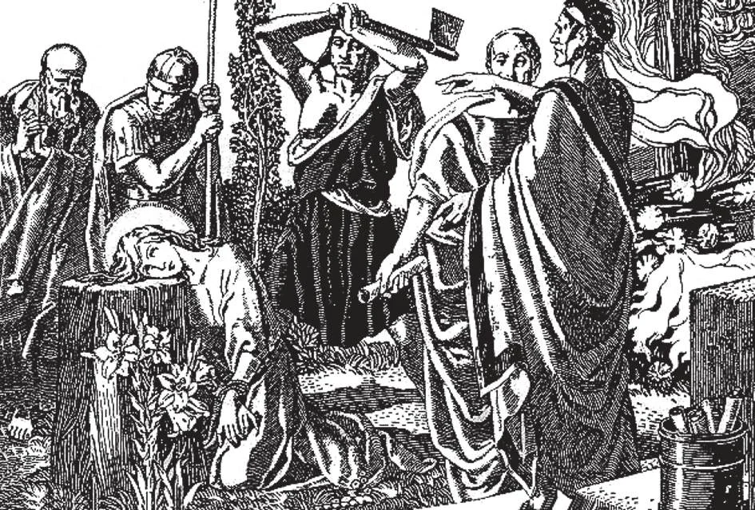

# 44. Humildade, Liberalidade, Castidade

*Em idade muito tenra, Santa Inês tinha tão alta consideração pela virtude da castidade que votou sua virgindade a Deus. As autoridades romanas, que estavam perseguindo a Igreja infante, tentaram fazer esta criança oferecer incenso aos ídolos, mas ela recusou. Vendo sua firmeza, os perseguidores tentaram ganhá-la por lisonja. Tinha apenas treze anos, bela e rica; ofereceram casá-la com o filho de um alto oficial em Roma. Mas ela respondeu que estava consagrada ao seu Esposo Celestial. Sofreu tortura e mansamente deitou sua cabeça no bloco do executor.*

**O que é humildade?**

— Humildade é aquela virtude moral que nos dispõe a apreciar e reconhecer nossa verdadeira posição com respeito a Deus e nossos semelhantes.

> Jesus Cristo frequentemente louvou e recomendou a humildade. "Se não vos converterdes e vos tornardes como criancinhas, não entrareis no reino dos céus" (Mat. 18:3). Sempre atendeu as orações dos humildes, como a do centurião (Mat. 8:11). "Se alguém quiser ser o primeiro, será o último de todos e servo de todos" (Mar. 9:34).

1. O homem humilde reconhece Deus como a fonte de todas as coisas excelentes que possa possuir. Reconhece suas limitações, seu próprio nada, e a inutilidade de todas as coisas terrenas sem Deus.

> Comparados a Deus, o que somos? Todas as coisas passam; só Deus é eterno. Estas simples verdades nos ajudarão a manter humildes; sem Deus nada somos. Pratiquemos o conselho de Nosso Senhor. "Aprendei de Mim, pois sou manso e humilde de coração" (Mat. 11:29).

2. O homem humilde sabe que as coisas terrenas têm valor apenas se nos levam a Deus. Seu desapego de todas as coisas mundanas o liberta de todo temor humano.

> Para nos tornarmos humildes, pensemos frequentemente da majestade e grandeza de Deus. Contemplemos Suas obras, ao lado das quais as nossas nada seriam. Acima de tudo, lembremo-nos de que sem Deus nem mesmo existiríamos. Sentimo-nos orgulhosos de nossa riqueza? Amanhã um incêndio, uma depressão econômica, pode apagá-la completamente. Estamos orgulhosos de nossa aparência? Um acidente, alguma doença, a faria como se nunca tivesse sido. Estamos orgulhosos de nossa inteligência? A amnésia a levaria toda.

3. O homem humilde tem seu melhor modelo no Próprio Filho de Deus, Jesus Cristo, Que Se humilhou por amor aos homens.

> "Aprendei de Mim, pois sou manso e humilde de coração" (Mat. 11:29). O Filho de Deus Se humilhou quando desceu à terra como homem. Veio como homem pobre, aos olhos do mundo o filho de um carpinteiro. Seus companheiros eram simples pescadores. Associava-Se com os humildes, com pecadores até. Na Última Ceia, lavou os pés de Seus apóstolos. Foi posto à morte na cruz, o modo de morte então mais desprezado.

4. Nosso Senhor continuamente nos exortou à humildade; como quando disse: "Aquele que é o maior entre vós será vosso servo" (Mat. 23:11).

> Na parábola do Fariseu e do Publicano Cristo exaltou a humildade; como também o fez quando, tomando uma criancinha, disse: "Qualquer, pois, que se humilhar como esta criancinha, esse é o maior no reino dos céus" (Mat. 18:4). E novamente disse, após pregar a Seus discípulos: "Quando tiverdes feito tudo o que vos foi ordenado, dizei: Somos servos inúteis'" (Luc. 17:10).

5. Humildade é oposta tanto ao orgulho quanto à auto-abjeção excessiva e afetada.

> Para ser humilde, um homem não precisa menosprezar suas habilidades. São Tomás de Aquino diz: "Que uma pessoa reconheça e aprecie suas próprias boas qualidades não é pecado." (Veja Capítulo 25 sobre Orgulho, Avareza, Luxúria)

**O que é liberalidade?**

— Liberalidade é aquela virtude moral, relacionada à virtude cardeal da justiça, que encontra expressão em generosidade para com nossos semelhantes, dispondo-nos a usar corretamente os bens materiais.

1. Ordinariamente, o termo é tomado com referência a bens materiais; mas num sentido mais amplo, também é com respeito a dons espirituais e intelectuais.

> Liberalidade consiste em dar, por amor de Deus, ajuda generosa àqueles em necessidade. Nosso Senhor disse, exortando-nos a fazer obras de misericórdia, que o que é dado aos pobres é dado a Ele. Liberalidade não depende da quantidade dada, mas no espírito. Um homem pobre pode ser muito liberal; enquanto um homem rico que dá milhões, mas o faz apenas para ser louvado não tem a virtude da generosidade.

2. Liberalidade é oposta à avareza.

> Com a liberalidade nos tornamos dispostos por amor de Deus a ajudar aqueles em necessidade material. Esta virtude não depende da quantidade ou valor material do dom, mas na bondade do coração com que é dado. (Veja Capítulo 25 sobre Orgulho, Avareza, Luxúria)

**O que é castidade?**

— Castidade é aquela virtude moral que nos dispõe a ser puros em alma e corpo.

> Aqueles que se mantêm puros em alma e corpo são como anjos na terra. Foi o casto Apóstolo João a quem Cristo deu o privilégio de recostar-se em Seu peito na Última Ceia; foi a ele que confiou Sua Mãe Virgem.

1. Castidade, oposta à luxúria, nos dispõe a preservar a mente e o corpo de tudo o que é impuro. Castidade é pureza. É chamada a virtude angélica, porque faz os homens assemelharem-se aos anjos no céu.

> Castidade dá saúde à alma e luz ao entendimento; ajuda a sabedoria e desenvolve força de caráter. Judite, uma mulher fraca, teve a coragem de ir ao acampamento inimigo, e retornou com a cabeça de Holofernes; dela a Sagrada Escritura diz: "Agiste varonilmente e teu coração foi fortalecido, porque amaste a castidade" (Judite 15:11). Milhares de mártires morreram em defesa desta virtude da santa castidade.

2. Para os solteiros, a castidade proíbe a indulgência do apetite sexual; para os casados, regula o uso daquele apetite de acordo com os ditames da reta razão. É errado supor que a castidade não é uma virtude para os casados. Deus requer castidade de todos, em todos os estados de vida. Um casamento casto é a base da família cristã.

> Nem todos os santos são virgens. Deus requer que a castidade seja praticada por todos, de acordo com o estado de vida que cada um abraçou. Pode ser absoluta (para os solteiros), ou relativa (para os casados).

3. O mero conhecimento dos fatos não destrói nossa castidade. É o consentimento deliberado e ceder à impureza que macula a castidade da mente e do corpo.

> Jesus Cristo, Nossa Senhora, São José, e outros santos certamente conheciam os fatos do sexo; mas tal conhecimento não estragou sua castidade imaculada.

4. Sejamos cuidadosos com a companhia que mantemos, e evitemos todas as ocasiões de pecado para preservar a virtude da castidade. Formemos o hábito da temperança em todas as coisas, de modo a fortalecer nosso autocontrole. Devemos frequentemente recorrer à oração e aos sacramentos, recebendo-os frequentemente. "Andai no Espírito, e não cumprireis as concupiscências da carne" (Gál. 5:16). (Veja Capítulo 25 sobre Orgulho, Avareza, Luxúria)

> Tenhamos uma devoção especial à Santíssima Virgem, e peçamos-Lhe diariamente que nos preserve em castidade. A seguinte oração em muitos casos tem sido encontrada eficaz em implorar à Santíssima Virgem preservar a castidade de alguém: "Minha Rainha, minha Mãe! Dou-me inteiramente a Vós; e para mostrar minha devoção a Vós, consagro-Vos este dia meus olhos, meus ouvidos, minha boca, meu coração, meu ser inteiro sem reserva. Portanto, boa Mãe, como sou Vosso, guardai-me, protejei-me como Vossa propriedade e posse."
