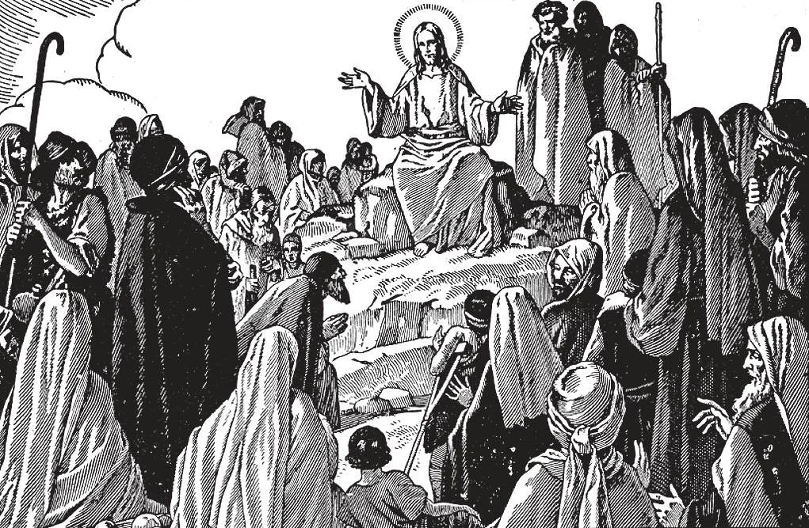

# 46. As Oito Bem-Aventuranças

*E abrindo Sua boca, ensinava-os, dizendo: "Bem-aventurados os pobres de espírito, porque deles é o reino dos céus. Bem-aventurados os mansos, porque possuirão a terra. Bem-aventurados os que choram, porque serão consolados. Bem-aventurados os que têm fome e sede de justiça, porque serão saciados. Bem-aventurados os misericordiosos, porque alcançarão misericórdia. Bem-aventurados os puros de coração, porque verão a Deus. Bem-aventurados os pacificadores, porque serão chamados filhos de Deus. Bem-aventurados os que padecem perseguição por causa da justiça, porque deles é o reino dos céus" (Mat. 5: 1-10). Estas são as bem-aventuranças; são assim chamadas, porque nos trazem felicidade na terra bem como no céu.*

**Quais são as oito bem-aventuranças?**

— As oito bem-aventuranças são:

1. "Bem-aventurados os pobres de espírito, porque deles é o reino dos céus."

a. Os pobres de espírito são aqueles que, por maiores que sejam suas riquezas, dignidade, saber, etc., reconhecem que aos olhos de Deus são pobres, e percebem que suas riquezas vêm de Deus. São desapegados em coração e mente das posses mundanas, por amor de Deus. Mesmo nesta vida estão em paz, uma antevisão do céu.

> Assim um homem rico pode de fato ser pobre de espírito, se não está apegado à sua riqueza, mas a gasta livremente para boas causas, e está disposto a separar-se dela pela vontade de Deus.

> Por outro lado, um homem pobre não é verdadeiramente pobre de espírito, se não está resignado à sua pobreza, mas inveja os ricos, se é pobre contra sua vontade, ou se orgulha de alguma qualidade sua.

b. Em geral, os pobres neste mundo de bens são também pobres de espírito. São salvos das tentações nas quais os ricos caem. Esta é uma razão para buscar a pobreza voluntariamente, segundo o conselho de Cristo.

> Nosso Senhor frequentemente enfatizou a dificuldade da salvação quando alguém é rico: "Mas ai de vós, ricos! porque já tendes vossa consolação" (Luc. 6: 24). "Se queres ser perfeito, vai, vende o que tens e dá-o aos pobres, . . . e vem, segue-Me" (Mat. 19: 21). "Dificilmente um rico entrará no reino dos céus" (Mat. 19: 23).

c. Espera-se, contudo, que sejamos industriosos. O pauperismo que é resultado da preguiça não é uma virtude. A mendicância que pode ser evitada não é benéfica nem para o indivíduo nem para a sociedade em geral. Cada um é obrigado a prover para si e para aqueles que dependem dele.

2. "Bem-aventurados os mansos, porque possuirão a terra."

a. Os mansos são aqueles que suportam pacientemente todas as contradições da vida, olhando para elas como acontecendo pela Vontade de Deus ou por Sua permissão.

> Os mansos terão paz de coração e paz de vida, amados e respeitados por todos, e na morte "possuirão a terra" dos vivos, o céu.

b. Aqueles são também mansos que, embora de disposição naturalmente ardente, dominam sua ira, impaciência ou desejos de vingança.

> O homem manso não se ira nem amaldiçoa nem busca vingança. Perdoa seus inimigos, e até os ganha com palavras gentis. Imita Cristo, Que disse: "Aprendei de Mim, pois sou manso e humilde de coração" (Mat. 11: 29).

3. "Bem-aventurados os que choram, porque serão consolados." Aqui a referência é à tristeza espiritual, pesar pelo pecado, pecados próprios ou pecados de outros. Inclui uma saudade em meio às tristezas da vida pelas alegrias e paz do céu.

> Chorar pelo pecado não é tristeza, pois não é incompatível com a alegria espiritual. Aqueles que são mais penitentes sentem mais alegria após sua libertação do pecado. Mas aos pecadores que não choram, estas palavras de Nosso Senhor devem trazer temor salutar: "Ai de vós que agora rides, porque chorareis e lamentareis" (Luc. 6: 25).

4. "Bem-aventurados os que têm fome e sede de justiça, porque serão saciados." Isto se refere àqueles que ardentemente desejam as coisas de Deus, verdade e virtude perfeita, bem como àqueles que procuram tornar-se melhores, mais humildes e puros, mais estreitamente unidos a Deus.

> Fome e sede espirituais é o anseio por crescimento em santidade, um desejo de ser mais agradável a Deus, de fazer progresso diário em fazer Sua vontade. Mesmo nesta vida provarão a alegria das consolações divinas; no céu gozarão da plena abundância da bem-aventurança celestial.

5. "Bem-aventurados os misericordiosos, porque alcançarão misericórdia." Os misericordiosos são aqueles que praticam as obras de misericórdia, corporais e espirituais, que ajudam outros não por motivos humanos ou naturais simplesmente, mas por motivos sobrenaturais, da fé, do amor de Deus.

> A tais pessoas, Cristo no dia do juízo dirá: "Vinde, benditos de Meu Pai, possuí o reino preparado para vós desde a fundação do mundo; pois tive fome e me destes de comer; tive sede e me destes de beber; era peregrino e me recolhestes . . ." (Mat. 25: 34-35).

6. "Bem-aventurados os puros de coração, porque verão a Deus." Apenas aqueles que não estão em pecado habitual são limpos de coração, e possuem virtude. Serão recompensados com a visão de Deus no céu; e mesmo na terra pela grande luz que lhes é dada.

> Há vários graus de pureza de coração: ao primeiro grau pertencem aqueles que estão livres do pecado mortal; ao segundo pertencem aqueles que estão livres do pecado venial deliberado e de toda afeição ao pecado; ao terceiro grau pertencem aqueles que estão livres da menor afeição desregrada; ao quarto pertencem aqueles que estão livres das manchas quase imperceptíveis que retardam a entrada de uma alma na casa de Deus; e ao último grau pertencem aqueles cristãos de tal pureza de vida e pensamento, de tal perfeição de zelo e intenção, que habitualmente vivem só para Deus, que estão perfeitamente unidos a Ele, de modo que quando fecham os olhos na morte voarão diretamente ao Coração de Deus.

7. "Bem-aventurados os pacificadores, porque serão chamados filhos de Deus." Homens que amam a paz e a preservam em si mesmos e entre outros são amados por Deus.

> Devemos também procurar reconciliar aqueles que não estão em bons termos uns com os outros. Isto é um grau superior da segunda bem-aventurança.

8. "Bem-aventurados os que padecem perseguição por causa da justiça, porque deles é o reino dos céus." Aqueles são bem-aventurados que sofrem por Cristo, religião, ou alguma virtude cristã. Receberão uma recompensa eterna.

> Aqueles que fielmente observam toda a lei de Deus e defendem a causa de Sua Igreja, procuram Sua glória e salvam almas. Neste mundo, aqueles que são ativos em preservar os direitos da Igreja são frequentemente ridicularizados e perseguidos; serão especialmente bem-aventurados.

Nosso Senhor pregou as Oito Bem-Aventuranças no Sermão da Montanha. Neste sermão, ensinou algo novo no mundo. Onde as pessoas sempre haviam buscado riquezas, honras e prazeres, Cristo louvou os pobres, os humildes, os sofredores. Se praticarmos fielmente a doutrina das oito bem-aventuranças, encontraremos o verdadeiro caminho da perfeição e seremos felizes além disso na terra. ***As Bem-Aventuranças contêm em substância a lei de Deus e toda a perfeição evangélica.***
