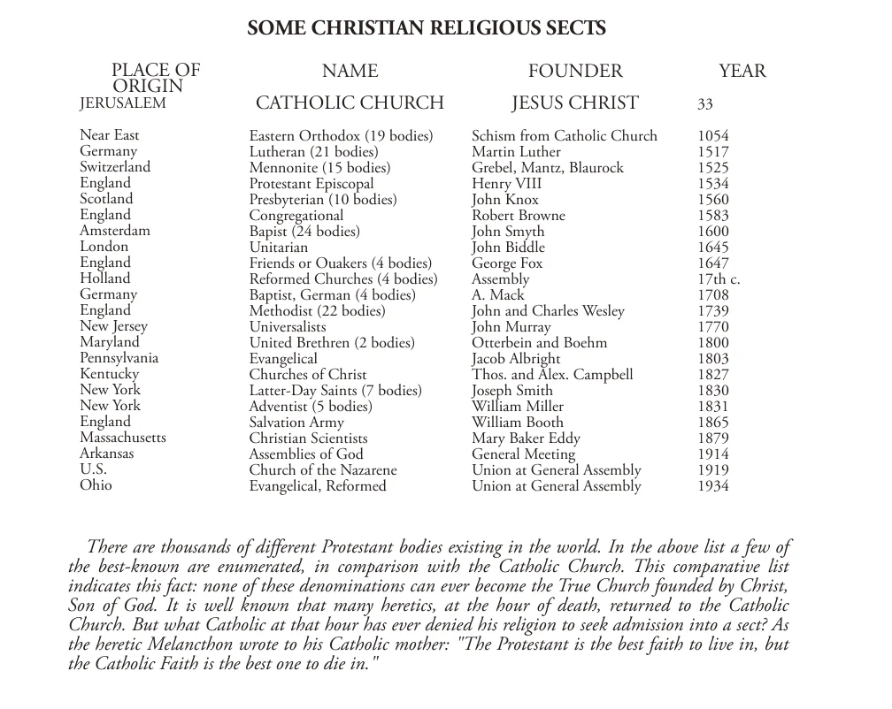

# 51. A Única Verdadeira Igreja

## Algumas Seitas Religiosas Cristãs

| Nome | Fundador | Ano | Local de Origem |
|------|---------|------|------------------|
| Igreja Católica | Jesus Cristo | 33 | Jerusalém (Oriente Próximo) |
| Ortodoxa Oriental (19 corpos) | Cisma da Igreja Católica | 1054 | — |
| Luterana (21 corpos) | Martinho Lutero | 1517 | Alemanha |
| Menonita (15 corpos) | Grebel, Mantz, Blaurock | 1525 | Suíça |
| Protestante Episcopal | Henrique VIII | 1534 | Inglaterra |
| Presbiteriana (10 corpos) | John Knox | 1560 | Escócia |
| Congregacional | Robert Browne | 1583 | Inglaterra |
| Batista (24 corpos) | John Smyth | 1600 | Amsterdã |
| Unitária | John Biddle | 1645 | Londres |
| Quakers ou Amigos (4 corpos) | George Fox | 1647 | Inglaterra |
| Igrejas Reformadas (4 corpos) | Assembleia | séc. 17 | Holanda |
| Batista, Alemã (4 corpos) | A. Mack | 1708 | Alemanha |
| Metodista (22 corpos) | John e Charles Wesley | 1739 | Inglaterra |
| Universalistas | John Murray | 1770 | Nova Jersey |
| Irmãos Unidos (2 corpos) | Otterbein e Boehm | 1800 | Maryland |
| Evangélica | Jacob Albright | 1803 | Pensilvânia |
| Igrejas de Cristo | Thos. e Alex. Campbell | 1827 | Kentucky |
| Santos dos Últimos Dias (7 corpos) | Joseph Smith | 1830 | Nova York |
| Adventista (5 corpos) | William Miller | 1831 | Nova York |
| Exército de Salvação | William Booth | 1865 | Inglaterra |
| Cientistas Cristãos | Mary Baker Eddy | 1879 | Massachusetts |
| Assembleias de Deus | Reunião Geral | 1914 | Arkansas |
| Igreja do Nazareno | União na Assembleia Geral | 1919 | EUA |
| Evangélica, Reformada | União na Assembleia Geral | 1934 | Ohio |

Há milhares de diferentes corpos protestantes existentes no mundo. Na lista acima alguns dos mais conhecidos são enumerados, em comparação com a Igreja Católica. Esta lista comparativa indica este fato: nenhuma destas denominações pode jamais tornar-se a Verdadeira Igreja fundada por Cristo, Filho de Deus. É bem conhecido que muitos hereges, na hora da morte, retornaram à Igreja Católica. Mas qual católico naquela hora jamais negou sua religião para buscar admissão numa seita? Como o herege Melanchthon escreveu à sua mãe católica: "A fé protestante é a melhor fé para viver, mas a Fé Católica é a melhor para morrer."

**O que é a Igreja?**

— A Igreja é a congregação de todas as pessoas batizadas unidas na mesma verdadeira fé, no mesmo sacrifício, e nos mesmos sacramentos, sob a autoridade do Soberano Pontífice e dos bispos em comunhão com ele.

1. Mesmo considerando-a apenas como uma sociedade visível, a Igreja é um corpo religioso perfeito.

> Todos os membros estão sujeitos à mesma autoridade religiosa, possuem doutrinas religiosas idênticas, vivem uma vida religiosa comum, e usam os mesmos meios de graça, os sacramentos.

2. A Igreja divide-se em "Igreja ensinante" e "Igreja ouvinte;" pois para cada uma Cristo estabeleceu poderes e deveres.

> Os sacerdotes, com seus bispos e o Papa, compõem a "Igreja ensinante;" os fiéis, que creem e obedecem, e são admitidos na membresia através do Sacramento do Batismo, compõem a "Igreja ouvinte."

**Como é a Igreja capacitada a levar os homens à salvação?**

— A Igreja é capacitada a levar os homens à salvação pela habitação do Espírito Santo, que lhe dá vida.

1. Deus Pai e Deus Filho enviaram o Espírito Santo para habitar na Igreja. A habitação do Espírito Santo capacita a Igreja a ensinar, santificar, e governar os fiéis em nome de Cristo.

> O Espírito Santo desceu sobre os Apóstolos para iluminar, fortalecer, e santificá-los, de modo que pudessem pregar o Evangelho e espalhar a Igreja por todo o mundo. Na Festa de Pentecostes, em memória de Deus o Espírito Santo, celebramos um mistério que é para sempre renovado na Igreja e em nossas almas: o mistério da habitação de Deus, o reinado da lei do amor que sucedeu a lei da servidão e temor (Rom. 8:15).

2. O Espírito Santo guia os governantes da Igreja, especialmente o Papa, e os ajuda em seus deveres.

> Antes da descida do Espírito Santo, os Apóstolos eram tímidos e medrosos. Após Sua vinda, saíram para ensinar, quaisquer que fossem as dificuldades; lembraram-se e compreenderam todo o ensino de Cristo.

3. O Espírito Santo preserva a Igreja de todo erro em seu ensino; em tempos de perigo, Ele suscita capazes defensores de suas doutrinas.

> Santo Atanásio defendeu a Igreja no tempo dos hereges arianos; Papa Gregório VII durante um período de grande desordem; São Domingos, durante o tempo dos albigenses; e Santo Inácio de Loyola, após a explosão protestante.

4. O Espírito Santo suscita Santos na Igreja através de todas as gerações.

> Os membros da Igreja esforçam-se por imitar seu Divino Fundador, e em todos os países e todos os tempos produziu santos, canonizados e não-canonizados, mártires, confessores, almas ocultas que ardem com o amor de Deus e de seus semelhantes.

**Não são todas as religiões as mesmas?**

— Não, pois verdade e erro não são a mesma coisa; fé e descrença não são a mesma coisa.

1. Deus não é dividido. Ele revelou apenas uma religião. Ou cremos naquela religião, ou não cremos. Não há caminho do meio. "Quem não está comigo está contra Mim" (Mat. 12:30).

> Qualquer coisa que não seja a verdade inteira não é verdade. Cristo disse: "Eu sou o caminho, e a verdade e a vida. Ninguém vem ao Pai senão por Mim" (João 14:6). Ninguém afirmará que vidro é tão bom quanto diamantes, nem que latão é tão bom quanto ouro. Ninguém reclama que uma imitação é tão boa quanto a coisa autêntica. Mais irracional então seria reclamar que uma religião estabelecida por um homem é tão boa quanto aquela fundada pelo Deus Encarnado.

2. Desde o próprio princípio da humanidade, tem havido uma única verdadeira religião. De Adão até a vinda de Cristo, esta religião foi preservada pelos patriarcas, profetas, e outros escolhidos por Deus para manter o conhecimento do Redentor prometido intacto.

> Antes da vinda de Cristo, esta verdadeira religião não era universal, mas limitada a um povo, os Judeus, o "povo escolhido". Todas as outras nações haviam degenerado e adoravam ídolos, deuses falsos. Apesar das imperfeições da velha religião preservada entre os Judeus; era sempre a verdadeira religião, a única verdadeira religião. Prefigurava a vinda da religião perfeita, aquela estabelecida pelo Filho de Deus, Jesus Cristo, Que então ab-rogou a Fé Judaica, a Antiga Lei, em favor da Nova Fé, a Nova Lei.

3. É absurdo supor que Deus não se importa se os homens denunciam Seu Filho como um impostor e blasfemador, ou O adoram como Deus.

> Por que deveriam Cristo, e após Ele os Apóstolos, e após eles uma longa linha de crentes, ter sofrido tanto e resistido à perseguição tão firmemente, se não fosse de importância o que um homem cria? O Apóstolo disse: "Não há outro nome debaixo do céu dado aos homens, pelo qual devamos ser salvos" (Atos 4:12).

**Como podemos provar que a única verdadeira Igreja de Cristo é a Igreja Católica?**

— Podemos provar que a única verdadeira Igreja de Cristo é a Igreja Católica, porque:

1. Apenas a Igreja Católica possui as marcas da Igreja estabelecida por Cristo; isto é, Unidade, santidade, catolicidade, e apostolicidade. (Veja Capítulo 73 sobre As Portas do Inferno)

> De fato, apenas a Igreja Católica reivindica ter todas estas quatro marcas da Verdadeira Igreja, as marcas tão evidentemente estabelecidas por Cristo.

2. A história da Igreja Católica dá evidência de força miraculosa, permanência e imutabilidade, mostrando assim ao mundo que está sob a proteção especial de Deus. A Igreja Católica provou-se indestrutível por quase dois mil anos, contra toda variedade e número de formidáveis inimigos. A Igreja sofreu perseguição e ataques de fora, e de cisma e heresia dentro de suas próprias fileiras, contudo ainda vive.

> Apesar de corrupção e perseguição, apesar das forças combinadas do erro e do mal, a Igreja Católica continuou a viver e a levar adiante seu propósito, como seu Fundador prometeu. A indestrutibilidade da Igreja, como foi provado pela história, é só suficiente para marcá-la como divina. Só Deus poderia tê-la preservado por tanto tempo. A Igreja é a única instituição que provou ser uma exceção à lei de decadência e morte. Assistiu ao nascimento e decadência de todo governo na terra por quase 2000 anos. Após todo ataque contra ela, levanta-se, a Esposa de Cristo, sempre fresca e bela.
