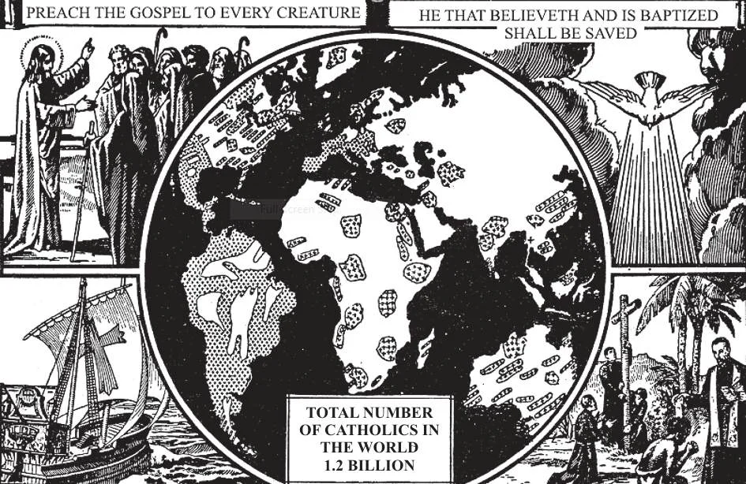

# 54. A Igreja Viva

*Apesar de todos os tipos de perseguições, a Igreja, sob a guia do Espírito Santo, continuou a espalhar-se por todo o mundo. Obedeceu estritamente ao comando de Nosso Senhor aos Apóstolos: "Ide e fazei discípulos de todas as nações." Em toda parte os homens ouviram sua voz, crendo no aviso de Cristo, "Aquele que não crer será condenado."*

**Dai um breve resumo da história da Igreja pelos últimos dois mil anos de sua existência**

— O seguinte é um breve resumo: Os primeiros 400 anos: Os Apóstolos dispersaram-se para diferentes países a fim de levar adiante o comando de Cristo de ensinar. Os Apóstolos batizavam, pregavam, e governavam em vários países aos quais eram enviados. Nomeavam bispos e sacerdotes para governar e ministrar aos fiéis.

Apesar de sofrimentos e perseguições perseveraram, até que finalmente selaram sua fé pelo martírio. Pedro e Paulo eram especialmente interessados na conversão do Império Romano, o mais poderoso e também mais ímpio império dos dias antigos.

> A moral dos Romanos era extremamente devassada; o mal espalhava-se da Cidade Imperial de Roma através do vasto império. Só em Roma cerca de 30.000 diferentes "deuses" e "deusas" eram adorados, muitos deles por sua própria imoralidade. Tão próxima era a união da religião pagã e o império que atacar a religião era ser considerado um traidor de Roma. Por esta razão, toda a força do império foi posta contra a nova religião dos Cristãos. Mas o Pescador não vacilou: Pedro batalhou com todas as suas forças. Ele e Paulo foram ambos martirizados; mas outros levantaram-se para continuar a batalha por Cristo, que durou cerca de 300 anos.

> Perseguição seguiu-se à perseguição, numerando dez insuperáveis em ferocidade. As mais severas foram as de Nero (64-68) e Diocleciano (303-305). Este último condenou à morte cerca de dois milhões de Cristãos. Mas quanto mais eram perseguidos, mais rápido aumentavam. Tertuliano diz: "O sangue dos mártires é a semente do Cristianismo." Finalmente, em 313 d.C., as bandeiras do Cristianismo foram lançadas em vitória; a paz foi concedida pelo Édito de Milão. Mais tarde, Constantino o Grande fez do Cristianismo a religião do Estado (324 d.C.) Foi levado a este passo quando conquistou em batalha após ver nos céus uma cruz luminosa com as palavras: *In hoc signo vinces* (Neste sinal vencerás). Sua santa mãe, Santa Helena, também teve grande influência em sua conversão.

Os segundos 400 anos. Antes de sessenta anos passarem após o Édito de Milão, hordas de bárbaros Hunos, Godos, Vândalos, e Visigodos, numerando milhões, começaram a mover-se do norte para os países europeus civilizados. Cidade após cidade rendeu-se até que Roma mesma foi tomada, e a escuridão da barbárie cobriu o continente. Mas os missionários e mestres da Igreja misturaram-se com os bárbaros, retornaram com eles a seus países, e trouxeram luz mais uma vez da escuridão.

> São Patrício foi enviado à Irlanda, e converteu aquela nação ao Cristianismo. Santo Agostinho na Inglaterra e São Bonifácio na Alemanha mudaram aquelas nações em seguidores da cruz de Cristo. Os Francos idólatras seguiram seu rei Clóvis ao redil cristão. Ao fim de quatro séculos, os cruéis e selvagens bárbaros da Itália, Espanha, França, Alemanha, Inglaterra, e Irlanda eram cristãos, civilizados, progressivos, estabelecidos em cidades pacíficas, construindo igrejas, levando adiante o comércio.

Os terceiros 400 anos. No sétimo século Maomé havia começado a propagar suas doutrinas entre as tribos árabes. Sua foi uma conversão pela espada: uma grande parte da Ásia, Norte da África, Espanha, e as ilhas do Mediterrâneo foram invadidas e conquistadas para o Alá de Maomé. Finalmente o Maometanismo irrompeu na França.

> Numa memorável batalha de nove dias em 732 d.C., os cristãos franceses sob Carlos Martel derrotaram os maometanos em Tours, e assim detiveram suas incursões na França. Mas no século seguinte, os maometanos entraram e saquearam Roma mesma, até mesmo São Pedro. Contudo, a Igreja levou adiante e finalmente repeliu o invasor. A queda de Jerusalém nas mãos dos maometanos no décimo primeiro século deu ímpeto às Cruzadas, durante as quais exércitos cristãos foram libertar os Lugares Santos dos infiéis. Houve sete Cruzadas no total, de 1095 d.C. a 1254 d.C. Entre os líderes notáveis podemos mencionar: Godofredo de Bulhão, Frederico Barbaroxa, Ricardo Coração de Leão, e São Luís da França.

Os quartos 400 anos. Os governantes cristãos da Europa, ao tornarem-se mais poderosos, começaram a olhar com inveja a autoridade do Papa, e usurpá-la. Embora as Cruzadas tivessem tido bons efeitos, interesse demais em preparações materiais causou um relaxamento na vida espiritual; a heresia frequentemente atacava a Igreja. Berengário negou a Presença Real; seguiu-se o cisma Grego, a heresia albigense, e as heresias de Wycliff e Huss, que negaram a autoridade da Igreja. Finalmente, no décimo sexto século, a frouxidão geral e espírito de revolta culminaram em aberta rebeldia contra a autoridade da Igreja, e a Revolta Protestante varreu a Europa.

> Um monge Agostiniano, Martinho Lutero, em 1517 fez um aberto ataque à doutrina das Indulgências. Quando foi efetivamente refutado pelo Doutor João Eck num argumento público, Lutero enfureceu-se, e tornou-se mais ativo em propagar seus erros. Porque suas doutrinas apelavam à vaidade e fraqueza humanas, atraiu muitos seguidores. Os príncipes que invejavam a autoridade papal, lançaram sua sorte com Lutero. A Bíblia foi declarada a única regra de fé, assim, que ninguém mais seria dependente da autoridade da Igreja, mas poderia interpretar a palavra de Deus como lhe agradasse para si mesmo. Os viciosos foram prontamente ganhos pela doutrina de que o homem não pode prevenir o pecado por causa da corrupção natural e ausência de livre-arbítrio. Revolta espalhou-se da Alemanha para outros países. Na Suíça, João Calvino seguiu os passos de Lutero, e começou o Calvinismo. Na Escócia, John Knox foi o propagador do Protestantismo. Na Inglaterra, o desejo de Henrique VIII de trocar esposas foi a causa imediata para o estabelecimento da Igreja Anglicana. Dinamarca, Holanda, Noruega, e Suécia foram todas varridas à heresia por seus governantes. Mas das dores da revolta protestante, a Igreja saiu mais forte e purificada. Enquanto isto, países recém-descobertos foram convertidos. Os Portugueses e Espanhóis foram os pioneiros nesta empresa missionária. As descobertas de novas terras, às quais missionários Católicos foram, resultaram no ganho de mais milhões para a Igreja do que haviam sido perdidos para o Protestantismo.

Os últimos 400 anos: Muitos na Europa retornaram à Igreja; mais foram ganhos nas Américas. O Protestantismo continuou a atacar a Igreja; o paganismo gerado do espírito de frouxidão e revolta é outro inimigo. Guerra aberta prossegue na Rússia e países satélites. Ainda a Igreja continua a crescer, o maior único corpo religioso na história.

> Em 1953 missionários da Igreja Mãe podem ser encontrados nas porções mais remotas do globo, trabalhando pacientemente para trazer almas a Cristo. Vão onde nenhum outro estrangeiro iria. No presente há cerca de 30.000 sacerdotes, 12.000 irmãos leigos, e 60.000 Irmãs trabalhando nas missões estrangeiras. As missões são supervisionadas e apoiadas pelas Sociedades para a Propagação da Fé e da Santa Infância (veja Capítulo 191 sobre Propagação da Fé)

> No presente, a Igreja tem uma membresia de cerca de 1,2 bilhão em todas as partes do mundo. Estão sob a direção de cerca de 420.000 sacerdotes, 2.200 Prelados, e um Cabeça, o Papa. Formam o maior corpo tendo uma única fé religiosa. As diferentes denominações protestantes numeram cerca de duzentos milhões todos juntos. Os cristãos orientais cismáticos totalizam cerca de 150 milhões.
