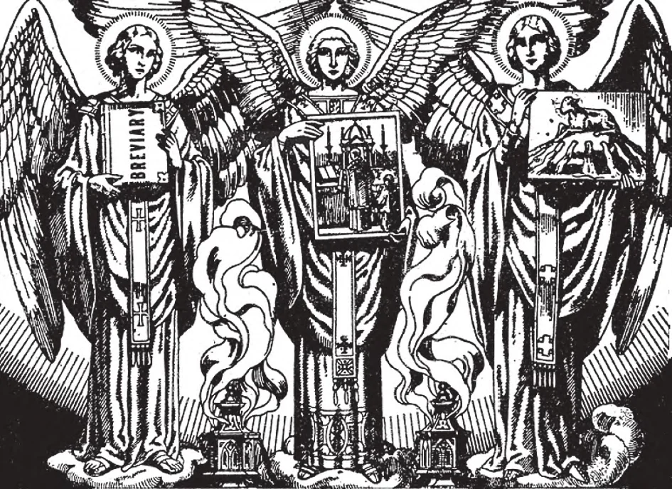

# 55. A Igreja Católica Oriental; Ritos

*Os atos essenciais da Liturgia são três: as orações do sacerdócio no Ofício Divino (representado pelo primeiro anjo), a Missa (representado pelo segundo anjo), e os sacramentos (representado pelo terceiro anjo). O termo "rito" é algumas vezes usado para referir-se à liturgia segundo algum costume e língua definidos. "Rito" pode também designar num sentido estreito alguma cerimônia litúrgica particular; deste modo temos o "rito do Batismo", etc.*

**O que é a Igreja Católica Oriental?**

— É aquela parte da Igreja no Oriente que, embora usando liturgias e ritos diferentes daqueles da Igreja Latina (ou Ocidental) centrada em Roma, subscreve às mesmas doutrinas, e reconhece o mesmo Soberano Pontífice, pertencendo assim à mesma Igreja Universal e Verdadeira.

> A Igreja Católica Oriental inclui os seguintes: Bizantinos, Sírios, Coptas, Etíopes, Caldeus, Armênios, Malabarenses e Maronitas.

1. No princípio do quarto século, havia uma Igreja, una em doutrina bem como em obediência ao Soberano Pontífice, o Bispo de Roma. Mesmo então, contudo, não havia uniformidade em observâncias, cerimônias, ritos.

> Nosso Senhor havia enviado os Apóstolos a diferentes partes, e seus seguidores haviam se mantido às doutrinas, mas variado as observâncias e ritos, de acordo com as inclinações particulares do povo na região. As línguas usadas eram naturalmente extremamente variadas; a Missa era o mesmo Sacrifício instituído por Nosso Senhor (em Aramaico), mas deve ter sido dita em uma variedade de línguas.

2. Então dissensão política dentro do Império Romano levou à sua divisão em Oriente e Ocidente. A organização religiosa, seguindo desenvolvimentos políticos, levou à separação primeiro da Grega, depois da Igreja Ortodoxa Russa. (Veja Capítulo 71 sobre Cisma e Heresia)

> Estas igrejas cismáticas negaram a autoridade do Papa, que vivia no Ocidente como Bispo de Roma. Caso contrário continuaram a praticar a Verdadeira Religião assim como Cristo e os Apóstolos haviam ensinado. Administravam os sacramentos, celebravam Missa, e seguiam outras observâncias.

3. Dentro da Igreja Católica Oriental, apenas a Igreja Maronita nunca esteve em cisma. Com o passar dos séculos, aqueles em cisma dividiram-se e subdividiram-se.

Então, chiefly desde os séculos 16 e 17, a maioria deles retornou à unidade da Verdadeira Igreja.

> A Igreja Católica Oriental continua a usar diferentes ritos e observâncias, alguns dos quais até antecederam aqueles de Roma, como tendo estado lá, muito antes dos cismas. Assim hoje, os grupos na Igreja Oriental têm sua própria disciplina e costumes, o mais notável dos quais é que com eles a Missa (chamada "Santa Liturgia") é dita na língua peculiar à igreja em que está sendo dita: seja Eslavo, Romeno, Sírio, Árabe, Armênio, Grego, Copta, Etíope ou Georgiano. Outras diferenças de prática são: administração da Santa Eucaristia aos fiéis em ambas as formas de pão e vinho, o uso de pão fermentado para a Santa Missa, Batismo por imersão, inclinar-se da cintura com um movimento do braço ao invés de uma genuflexão diante do Santíssimo Sacramento.

4. Grupos na Igreja Oriental são principalmente aqueles sob a jurisdição dos Patriarcas de Alexandria, Antioquia, Jerusalém e Constantinopla. No quinto século, havia cinco patriarcados: estes quatro compondo a Igreja Oriental, e o Patriarcado de Roma sozinho no Ocidente.

> Naqueles dias, havia divisões geográficas claras de patriarcados; um Católico Oriental nascia dentro dos limites de seu patriarcado. Hoje alguém pertence ao seu rito onde quer que vá, e seus filhos herdam seu rito.

5. A Igreja Católica Oriental é uma prova viva da universalidade da Igreja Católica. A matéria (incluindo doutrinas, fé e moral) é imutável; mas o modo (incluindo rubricas e ritos, costume e prática, os externos) pode mudar. A organização da Igreja é maleável; mas os fundamentos e essenciais, as doutrinas, são imutáveis em qualquer lugar.

> O Natal, para os Ucranianos, embora também 25 de dezembro, cai em nosso 7 de janeiro, porque usam um calendário diferente. Nas Igrejas Orientais, o clero casado pode ser encontrado tão frequentemente quanto o celibatário, porque homens casados podem ser ordenados e reter suas esposas. Se a esposa de um sacerdote casado morre, ele não pode casar novamente; um solteiro que é ordenado não pode casar depois. Bispos são requeridos ser ou viúvos ou solteiros. Unidade de religião não significa uniformidade de rito. Mesmo na Igreja Latina sob o Patriarca de Roma, há variações, todas datando não depois do décimo quarto século. Como o Papa Bento XIV disse: "Cristãos Orientais devem ser Católicos; não precisam tornar-se Latinos." Externos podem variar; mas o núcleo é um.

**O que é liturgia, e o que é rito?**

— Liturgia compreende um ato público destinado ao culto de Deus; rito é o modo de observar o ato.

> No presente, contudo, os dois termos são usados indiscriminadamente e de modo intercambiável. Estritamente falando, "liturgia" agora refere-se ao rito da Santa Missa.

1. O Rito Romano é para todos os propósitos práticos, o rito universal usado na Igreja Ocidental. Nele o Latim é usado.

> Durante o período de perseguições, e por conta da dificuldade de comunicação, variedade em práticas era a coisa natural e comum. Quando a Igreja tornou-se melhor organizada, práticas tornaram-se mais uniformes. Na Igreja Latina, ritos praticamente tornaram-se uniformes em 1570 com a publicação do Missal Romano; até hoje algumas poucas variações permanecem.

2. O Rito Bizantino, após o Romano, é o mais amplamente usado na Igreja, sendo encontrado na Rússia, Grécia, Balcãs e sul da Itália. Grego é a língua principalmente empregada, mas Georgiano, Eslavo e Romeno são igualmente usados.

> A Igreja Ortodoxa Oriental pertence a este rito. Originalmente, era de Constantinopla; é baseado no rito de São Tiago de Jerusalém, e foi reformado por São Basílio e São João Crisóstomo. Modificado para uso na Rússia, este Rito é denominado Ruteniano.

3. Outros Ritos Asiáticos são: o Antioqueno, Caldeu e Armênio; em sua totalidade ou modificados, são empregados no Oriente.

> O Rito Antioqueno é a fonte de muitos ritos derivados; traça sua origem a São Tiago de Jerusalém. Os Sírios, Caldeus, Malabarenses e Maronitas usam derivações. O Rito Caldeu é usado pelos Caldeus e Malabarenses. Sírio é a língua principal usada em ambos estes ritos. O Rito Armênio está em uso entre Armênios, encontrados no Levante, Itália e Áustria. A língua Armênia é usada. É a Liturgia Grega de São Basílio.

4. Nas igrejas Católicas do Norte da África, o rito principal usado é o Alexandrino. Este é chamado "Liturgia de São Marcos"; mas o original foi grandemente modificado. As Igrejas Copta e Etíope o usam.

> Os Coptas Católicos estão sob o Patriarca de Alexandria, vivendo no Cairo. Copta Antigo e Árabe são as línguas usadas em sua liturgia. A Igreja Etíope usa uma versão da Liturgia de São Marcos; é como um todo a mesma que a dos Coptas.

As cerimônias destes Ritos podem de fato parecer estranhas a nós do Rito Latino. Mas os bispos e sacerdotes são verdadeiros bispos e sacerdotes, embora paramentados diferentemente; a Missa e Sacramentos são genuínos, embora realizados com um ritual desconhecido. A Igreja no Oriente é a mesma Igreja no Ocidente, a mesma fundada por Jesus Cristo, a Una Verdadeira Igreja Católica.
