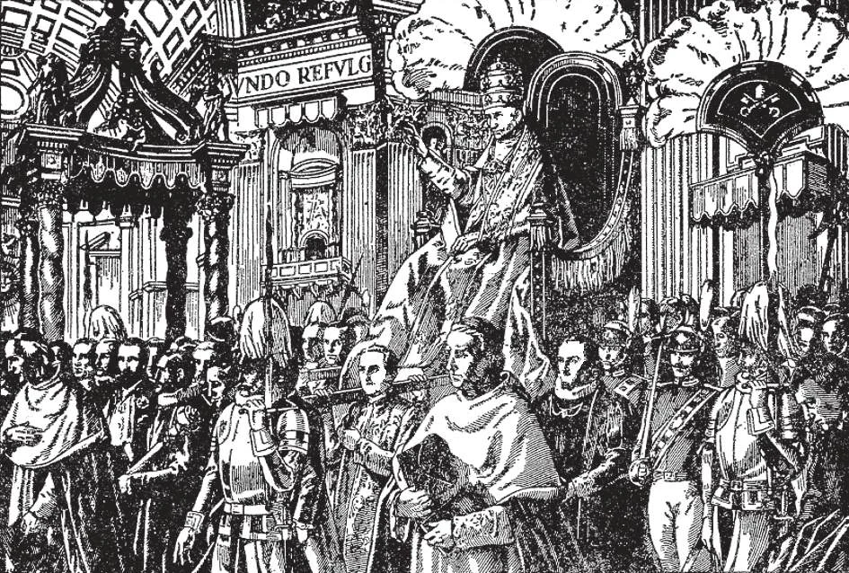

# 56. O Bispo de Roma

*É vontade de Cristo que veneremos Seus ministros como a Ele Mesmo. Por isto os Católicos prestam a maior veneração ao Vigário de Cristo, o Papa, seu Pai universal. Por esta razão, o título "Sua Santidade" é dado a ele. Por respeito ao seu ofício, o Santo Padre recebe privilégios não concedidos a outros bispos. Como soberano temporal tem uma Corte e guardas. Tem um estandarte e selo. Tem embaixadores. Em ocasiões solenes é carregado na cadeira papal chamada sedia gestatoria.*

**Cristo pretendeu que o poder especial de principal mestre e governante de toda a Igreja fosse exercido apenas por Pedro?**

— Cristo não pretendeu que o poder especial de principal mestre e governante de toda a Igreja fosse exercido apenas por Pedro, mas pretendeu que este poder fosse transmitido a seu sucessor, o Papa, Bispo de Roma, que é o Vigário de Cristo na terra, e o Cabeça visível da Igreja.

1. São Pedro viveu por um curto tempo em Antioquia; depois foi a Roma e lá fixou sua residência oficial permanentemente. Foi lá, e como Bispo de Roma, que morreu como mártir cerca de vinte anos depois.

> A Igreja não deveria morrer com Pedro. Portanto seu posto oficial e dignidade e poderes deveriam ser transmitidos a seus sucessores de geração a geração. Do mesmo modo, sucessores de um ofício civil adquirem todos os poderes ligados ao ofício.

2. Assim o Bispo de Roma, o legítimo sucessor de São Pedro, é o que Pedro era, Vigário de Cristo e cabeça visível da Igreja. Cristo é o verdadeiro e invisível Cabeça da Igreja. Mas seu cabeça visível é o Bispo de Roma, nosso Santo Padre o Papa, porque é o sucessor de São Pedro.

> Ninguém além do Bispo de Roma jamais reivindicou autoridade suprema sobre toda a Igreja. Portanto, ou ele é sucessor de São Pedro, ou São Pedro não tem sucessor, e a promessa de Cristo falhou.

3. A supremacia do Bispo de Roma sobre toda a Cristandade tem sido disputada por causa da perversidade dos homens e do poder do mal. Tem sido negada por filhos indóceis. O próprio fato de ser disputada mostra que existia.

> Do mesmo modo até a autoridade do Próprio Deus tem sido questionada; Sua própria existência tem sido negada. Desde o princípio, também, a autoridade parental tem sido desafiada. A autoridade de governantes legítimos sempre foi atacada. As negações, rebeliões e ataques não destruíram a existência de tal autoridade. Morre Deus porque os homens negam Sua existência? "O tolo disse em seu coração: Não há Deus" (Sl. 52).

**O Bispo de Roma sempre foi considerado o cabeça da Igreja?**

— Sim, o Bispo de Roma desde os tempos apostólicos tem sido considerado o cabeça universal da Igreja.

1. Desde os primeiros tempos, os títulos "sumo sacerdote" e "bispo dos bispos" têm sido dados ao Bispo de Roma. Apelos eram feitos a ele, e disputas eram resolvidas por ele.

> O terceiro sucessor de São Pedro foi o Papa São Clemente. Uma disputa na Igreja em Corinto foi referida a ele para decisão. Escreveu cartas de remonstrância e admoestação aos Coríntios, e eles submeteram-se à sua correção. Naquele tempo, muito perto de Corinto o Apóstolo João ainda vivia. Por que os Coríntios, ao invés de apelar à distante Roma e Clemente, não referiram seu problema ao Apóstolo João, Bispo de Éfeso? Evidentemente porque a autoridade de Roma era universal, enquanto a de Éfeso era local.

Houve numerosos casos de apelo através da longa história da Igreja; todos foram referidos a Roma.

> No quinto século quando Teodoreto, Bispo de Ciro no Oriente, foi deposto, apelou ao Papa Leão, e o Papa ordenou que fosse reinstalado. O Papa era em toda parte reconhecido como cabeça da Igreja não apenas no Ocidente, mas no Oriente, até o grande cisma do nono século.

2. Com uma voz, os Padres da Igreja prestam homenagem ao Bispo de Roma como seu superior.

> Todos eles reconheceram o Papa como Cabeça Supremo. Santo Ambrósio disse no quarto século: "Onde está Pedro, lá está a Igreja."

3. Concílios gerais não eram realizados sem a presença do Bispo de Roma ou seu representante. Nenhum concílio era aceito como universal ou geral a menos que seus atos recebessem a aprovação do Bispo de Roma.

> No Concílio de Calcedônia no ano 451, a carta do Papa foi lida à assembleia de bispos, e clamaram com uma voz: "Pedro falou por Leão; seja anátema quem crê diferentemente!" Tão tarde quanto o ano 1439, no concílio de Florença, os Gregos que desejavam retornar à Igreja reconheceram o primado do Bispo de Roma, o Papa.

4. Toda nação convertida do paganismo recebeu a fé de missionários especialmente enviados pelo Papa, ou por bispos reconhecendo o Papa como seu Cabeça.

> São Patrício foi enviado pelo Papa Celestino à Irlanda. São Paládio foi enviado pelo mesmo Papa à Escócia. Santo Agostinho foi enviado pelo Papa Gregório à Inglaterra. São Remígio foi à França sob a proteção da Sé de Roma. São Bonifácio foi enviado pelo Papa Gregório II à Alemanha e Baviera. E assim por diante.

## Decorações Pontifícias

> A Santa Sé confere vários títulos, ordens, condecorações e outras honras a certas pessoas, geralmente leigos, que de algum modo especial distinguiram-se em promover o bem-estar da humanidade e da Igreja. Estão listadas aqui na ordem de importância. A Suprema Ordem de Cristo foi iniciada pelo Papa João XXII em 1319. Hoje é a suprema Ordem pontifícia de cavalaria, conferida apenas em ocasiões muito raras. A Ordem da Espora de Ouro segue a Ordem de Cristo como condecoração pontifícia. Tem uma classe de 100 cavaleiros, e é concedida apenas àqueles que promoveram a causa da Igreja por feitos notáveis. É concedida também a não-católicos. A Ordem de Pio IX tem três classes, Cavaleiros da Grã-Cruz, Comendadores e Cavaleiros. É concedida também a não-católicos. A Ordem de São Gregório Magno foi fundada pelo Papa Gregório XVI em 1831. Tem duas divisões, civil e militar, cada uma das quais divide-se em três classes: Cavaleiros da Grã-Cruz, Comendadores e Cavaleiros.

> A Ordem de São Silvestre, instituída em 1841, como a Ordem de São Gregório, tem três classes de cavaleiros. A Ordem do Santo Sepulcro é considerada uma das mais antigas honras pontifícias; é hoje altamente prezada na Europa. Tem sido concedida a reis e nobres, a chefes de repúblicas, a pessoas notáveis em artes, letras e ciências, àqueles que de modo especial serviram a Igreja. Diferente de outras ordens, esta é concedida além disso a clérigos e mulheres. A medalha "Pro Ecclesia et Pontifice" foi instituída por Leão XIII, aquele grande "Papa do Operário" em 1888. É concedida em reconhecimento a serviços especiais à Igreja e ao Papa. A medalha "Benemerenti" foi instituída em 1832 por Gregório XVI, de duas classes, civil e militar, em reconhecimento a ousadia ou coragem notáveis.
