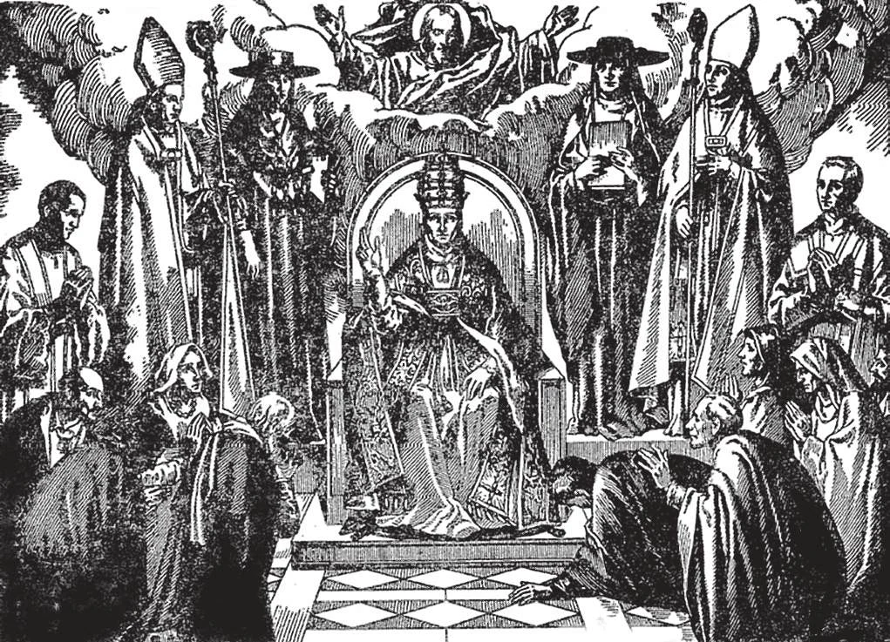

# 59. A Hierarquia

*A Igreja é uma sociedade estreitamente organizada e unida, incluindo a hierarquia e os fiéis. Todos os membros prestam obediência amorosa ao Vigário infalível de Cristo. O Papa não governa como um monarca orgulhoso, mas como um Pai, o representante de Deus; como um bom Pastor, solícito por cada membro do grande rebanho. A obediência sem questionamentos dos fiéis é responsável pela maravilhosa unidade entre os membros da Igreja através do mundo. Há cerca de quatrocentos e vinte e cinco milhões de Católicos, todos submetendo-se à hierarquia, à cabeça da qual está o Papa.*

**O que é a hierarquia?**

— A hierarquia é a organização em graus sucessivos dos poderes governantes da Igreja.

1. A hierarquia é a "Igreja ensinante," o corpo governante composto dos sacerdotes com seus bispos e o Papa acima de todos. É um exército de líderes tendo cuidado e controle das coisas santas e sagradas da Igreja.

> Sob este exército da "Igreja ensinante" está a "Igreja ouvinte"; os fiéis, os leigos.

2. Os membros da hierarquia diferem de dois modos: no poder de ordens, e no poder de jurisdição.

> O poder de ordens é dado pelo sacramento da ordenação. É o poder de santificar, um poder espiritual permanente que nenhuma autoridade terrestre pode tirar. O poder de jurisdição é dado por um superior, para capacitar um súdito a exercer sua autoridade espiritual legitimamente. Este poder pode ser limitado e revogado por autoridade legítima.

**Como os membros da hierarquia diferem em seu poder de ordens?**

— Os membros da hierarquia dividem-se em três classes com diferente poder de ordens: diáconos, sacerdotes e bispos.

> Esta ordem de grau e poder tem estado em vigor na Igreja desde o tempo dos Apóstolos. Estas três classes foram prefiguradas no sumo sacerdote, sacerdotes e levitas da Antiga Lei. Também tiveram contrapartes em Nosso Senhor, os Apóstolos e os discípulos. Nosso Senhor deu plenos poderes aos doze Apóstolos, mas apenas poder limitado aos discípulos.

1. Diáconos podem batizar, pregar e dar a Santa Comunhão.

> Os Apóstolos ordenaram os primeiros diáconos. Os diáconos foram nomeados pelos Apóstolos para distribuir esmolas e foram consagrados pela imposição das mãos acompanhada de orações (Atos 6: 6).

2. Sacerdotes têm ordens mais altas que diáconos. Podem oferecer o santo sacrifício da Missa, e perdoar pecados no Sacramento da Penitência. Podem administrar todos os sacramentos exceto aqueles da Crisma e Ordens Sagradas. Com faculdades especiais, podem até administrar a Crisma. Nos Ritos Orientais Católicos sacerdotes administram a Crisma imediatamente após o Batismo.

> Sacerdotes foram prefigurados nos setenta e dois discípulos de Nosso Senhor. A palavra "sacerdote" é derivada do grego *presbyter*, que significa "o ancião," um termo usado pelos primeiros judeus convertidos.

3. Bispos têm pleno poder de ordens; são os sucessores dos Apóstolos. Um bispo administra todos os sacramentos; só ele administra as Ordens Sagradas. Consagra óleos santos, igrejas, cálices, etc.

> Arcebispos, primazes, patriarcas e até o Próprio Papa não têm poder de ordens mais pleno que um bispo de uma diocese missionária.

**Como os membros da hierarquia diferem no poder de jurisdição?**

— Os membros da hierarquia dividem-se em muitos graus segundo o poder de jurisdição, sendo os principais graus aqueles de Papa, bispos e párocos.

> Estas diferenças de grau e poder são necessárias para o próprio governo da Igreja assim como há diferenças de grau e poder no governo civil. Sem elas, a Igreja seria uma sociedade sem organização.

1. Em organização, a Igreja é como um vasto exército com o Papa, seu cabeça visível, como o comandante-em-chefe. Tem jurisdição e poder e autoridade supremos e soberanos sobre toda a Igreja. É formalmente tratado "Vossa Santidade."

> É assim que alguém pode facilmente encontrar a Verdadeira Igreja: "Onde está Pedro, lá está a Igreja." Para mostrar a variedade e extensão dos interesses da Igreja, em 1953 no Vaticano há representantes diplomáticos de quarenta e quatro nações.

2. Os Cardeais são os conselheiros e assistentes do Papa; são seus ministros. Ele os nomeia, e o número não deve exceder setenta. Juntos formam o Colégio Apostólico ou Sagrado; é este corpo que, em solene conclave, escolhe um novo Papa quando a Sé fica vacante.

> Os cardeais formam as várias congregações ou comitês na corte Papal, como as Congregações dos Religiosos, dos Ritos, dos Sacramentos, etc. No passado, muitos cardeais apenas tinham as ordens de diácono. Os cardeais são distinguidos por um chapéu vermelho e manto, como sinal de que serão leais ao Papa ao custo de seu sangue. Um cardeal é tratado "Vossa Eminência."

3. Núncios, internúncios, legados e delegados apostólicos são representantes ou embaixadores do Papa a diferentes países, cortes ou ocasiões.

> Representantes menores da Santa Sé, enviados para alguns propósitos especiais a diferentes lugares, são denominados Visitadores Apostólicos. Em alguns lugares há Delegados Apostólicos. Além dos poderes ordinários que tem como Delegado Apostólico, a Santa Sé delegou-lhe poderes extraordinários.

4. Um patriarca é um bispo, sucessor dos Apóstolos, que tem o mais alto grau após o Papa, em jurisdição. Patriarcas são independentes de qualquer autoridade eclesiástica salvo a do Papa, que não é apenas Patriarca de Roma, mas Soberano Pontífice, sucessor de Pedro.

> Um patriarca ordena todos os bispos de seu patriarcado, convoca sínodos, legisla sobre jejum e abstinência, recepção dos sacramentos, liturgia e ritual, e outras observâncias. No presente há apenas cinco patriarcas maiores ou Patriarcas Maiores; aqueles de Roma, Jerusalém, Constantinopla, Antioquia e Alexandria. O título "Patriarca" é contudo dado como um título honorário a arcebispos de certos lugares.

5. Arcebispos, bispos e vigários apostólicos possuem jurisdições variadas. Governam sobre arquidioceses, dioceses, vicariatos.

> Um arcebispo e bispo têm direito a "Muito Reverendo," e formalmente tratados "Vossa Excelência." O termo Primaz é agora apenas um título honorário; antigamente um Primaz exercia jurisdição sobre países inteiros ou várias províncias.

Ordinariamente um abade é o superior de uma abadia de Beneditinos, Cistercienses ou outros monges. É eleito para a vida, e tem autoridade completa na abadia de acordo com as regras de sua ordem.

> Hoje o título "abade" é também concedido como sinal de honra; o benefício é alguma fundação extinta.

6. Um Monsenhor é um que por algum mérito especial foi elevado acima dos graus do clero ordinário, e assim junta-se aos prelados; o título é honorário.

> O termo Monsenhor é frequentemente usado ao dirigir-se a diferentes graus de prelados. Mas dos Monsenhores próprios há vários graus: protonotários apostólicos, prelados domésticos, etc. Estes são tratados "Reverendíssimo"; graus inferiores, "Muito Reverendo."
