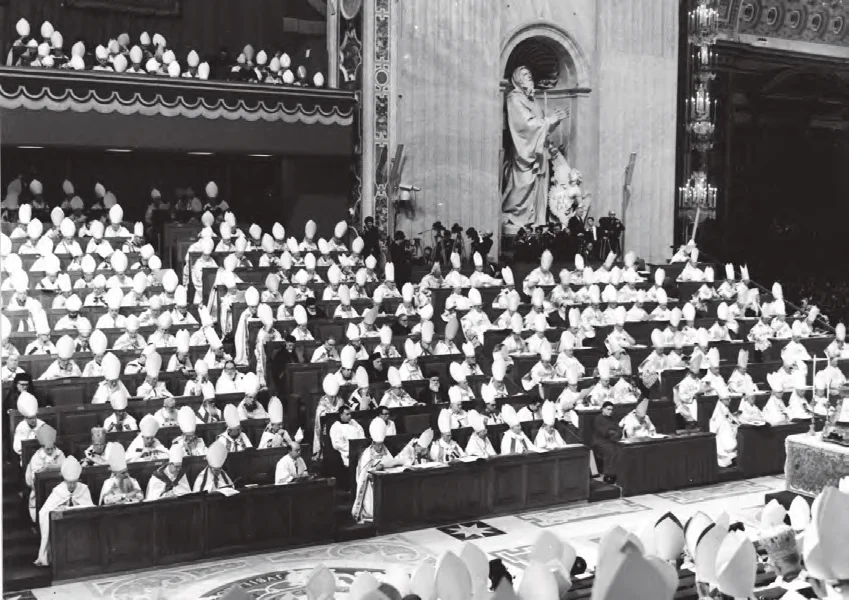

# 61. O Papa, Bispos e Concílios

*Na história da Igreja, houve 21 concílios convocados pelo papa. Todos estes foram doutrinais e jurídicos. O último concílio, chamado Vaticano II, não foi um concílio doutrinal mas pastoral. Dentre estes 21 concílios os mais notáveis dos Concílios Gerais seguindo o Concílio de Jerusalém foram: o Concílio de Niceia (325), o Concílio de Éfeso, (425), o Concílio de Niceia (787), o Concílio de Trento, (1545-1563), o Primeiro Concílio do Vaticano, (1870). (Veja também pgs. 136-137)*

**O Papa é o cabeça da Igreja universal?**

— Sim.

**Os Bispos estão sujeitos ao Papa?**

– Sim, contudo, deve ser mantido em mente que os Bispos são verdadeiramente os pastores de suas dioceses. Este direito eles têm de Nosso Senhor Jesus Cristo. Pertence ao seu episcopado.

**Pode um bispo diocesano ser superior sobre outro bispo em outra diocese?**

– Não. Um bispo não pode comandar outro bispo, a menos que o outro seja seu bispo auxiliar.

> Quando uma diocese é grande demais para um bispo controlar, o bispo pode ter outro bispo para ajudá-lo. Em tal caso, o bispo auxiliar está sujeito ao anterior.

**O que é um Concílio Diocesano?**

– Bispos de dioceses vizinhas reunir-se-ão num espírito de caridade para compartilhar suas dificuldades e preocupações. Podem formar algumas diretrizes pastorais comuns a fim de ajudar-se mutuamente.

**Tal concílio tem autoridade sobre os bispos individuais?**

– Um colégio de bispos nunca pode ter autoridade sobre o bispo individual. Tal colégio é um colégio moral e nunca pode ser um colégio jurídico. Nunca existiu e não pode ser provado existir mesmo pela teologia, tradição ou na história da Igreja.

**O que é um colégio jurídico?**

— "Jurídico" implicaria que o colégio de bispos, ou para usar o termo mais moderno, a "conferência dos bispos", tem poder de lei sobre o bispo individual. O bispo individual teria então que obedecer à "conferência dos bispos".

**Quais seriam as consequências?**

— Um passo lógico que seguiria é que uma "Conferência dos Bispos" pode exercer poder de lei mesmo sem o papa.

> Estabelecer uma colegialidade permanente forçaria até o Papa a agir apenas quando cercado por um senado compartilhando de seu poder de modo habitual e permanente. Isto irá, de fato, diminuir o exercício do poder do Papa.

Isto traria o desaparecimento gradual do caráter essencial dos bispos, nomeadamente que são "verdadeiros pastores, cada um dos quais alimenta e governa seu próprio rebanho, confiado a ele de acordo com um poder próprio apenas a ele, direta e plenamente contido em sua Ordem." As assembleias nacionais com suas comissões logo — e inconscientemente — estariam alimentando e governando todos os rebanhos, de modo que os sacerdotes bem como os leigos encontrariam-se colocados entre estes dois pastores: o bispo, cuja autoridade seria teórica, e a assembleia com suas comissões, que, de fato, deteria o exercício daquela autoridade.

> Outra consequência mais perniciosa seria, seguindo o mesmo ensino novel, que um pároco seria obrigado a obedecer a um conselho paroquial. Isto é manifestamente absurdo. Isto sempre foi condenado pela Igreja. A Igreja não é democrática.

**Mas os grandes Concílios da Igreja, compostos de Bispos, definiram doutrina e fizeram leis?**

— Quando um concílio é convocado pelo Papa, e continua a operar sob o poder do Papa, tal concílio pode definir e fazer leis. Deve também ser acrescentado que o papa deve pretender que tal concílio seja doutrinal e jurídico. Se ele explicitamente convoca um concílio por razões pastorais apenas, tal concílio não pode ter força de lei.

> Sem a autoridade do Papa, um concílio pode apenas ser moral; isto é; consultivo. Concílios desta natureza foram eventos excepcionais na história da Igreja.

**O que a Tradição e a Escritura nos ensinam?**

— Segundo o Evangelho, São Pedro e os outros Apóstolos fundaram um Colégio, instituído pelo Próprio Nosso Senhor, na medida em que permaneceram em comunhão entre si sob a autoridade de São Pedro. Similarmente, o Pontífice Romano, sucessor de Pedro, e os bispos, sucessores dos Apóstolos, estão unidos entre si.

A Sagrada Escritura e a Tradição da Igreja ensinam-nos que apenas em casos extraordinários os Apóstolos e seus sucessores reuniram-se em Concílios, e agiram como um corpo colegiado sob a autoridade de Pedro ou dos Pontífices Romanos. Os Apóstolos, de fato, cumpriram sua missão pessoalmente e transmitiram seu poder a seus sucessores como eles mesmos o haviam recebido de Nosso Senhor.

O ***Santo Concílio de Trento***, baseando-se nestas tradições sagradas, confirma que o Pontífice Romano apenas possui em sua própria pessoa um pleno, Ordinário poder Episcopal sobre a Igreja universal. Quanto aos bispos, os sucessores dos Apóstolos, como verdadeiros pastores, alimentam e governam seu próprio rebanho confiado a eles, cada bispo com um poder pessoal, direto e completo, derivando de sua sagrada consagração.

> Assim às vezes os bispos também, ou alguns deles ou totalmente, sobre uma convocação de ou com a aprovação do Pontífice Romano, reúnem-se como um verdadeiro e próprio Colégio, agindo com uma única autoridade para definir e governar os interesses da Igreja universal ou de igrejas individuais.

Tal é a constante e unânime Tradição da Igreja Católica e ninguém pode questioná-la. Tal é a inefável e maravilhosa Constituição da Igreja. que permaneceu imutável até o presente dia e está destinada a permanecer assim até o fim dos tempos, de acordo com as promessas de Nosso Senhor.

**É aconselhável unir-se em concílio?**

— É verdade que as circunstâncias presentes tornam aconselhável que os bispos se reúnam mais frequentemente, unidos na caridade de Cristo, a fim de compartilhar em comum seus pensamentos, desejos, decisões, e cuidados pastorais, mantendo sempre perfeita unidade, contudo, sem diminuir o poder do Pontífice Romano, ou aquele de cada bispo individual.
